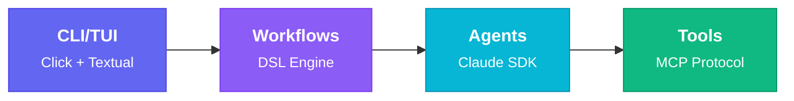

# Part 2: Architecture Overview

Understanding Maverick's Layered Design

<!--
This section covers Maverick's four-layer architecture, project structure, and core constitutional principles. Understanding this architecture is essential for extending Maverick and reasoning about how components interact.
-->

---
layout: default
---

# Four-Layer Architecture

<div class="mt-4">



</div>

<div class="grid grid-cols-4 gap-6 mt-6 text-sm">
  <div class="border-l-4 border-indigo-500 pl-3">
    <div class="font-bold text-indigo-400">CLI/TUI</div>
    <div class="text-slate-400 mt-1">Display-only layer. No business logic, no subprocess calls.</div>
  </div>
  <div class="border-l-4 border-purple-500 pl-3">
    <div class="font-bold text-purple-400">Workflows</div>
    <div class="text-slate-400 mt-1">Knows WHAT and WHEN. Orchestrates agents via YAML DSL.</div>
  </div>
  <div class="border-l-4 border-cyan-500 pl-3">
    <div class="font-bold text-cyan-400">Agents</div>
    <div class="text-slate-400 mt-1">Knows HOW. Claude SDK for judgment-based tasks.</div>
  </div>
  <div class="border-l-4 border-emerald-500 pl-3">
    <div class="font-bold text-emerald-400">Tools</div>
    <div class="text-slate-400 mt-1">External systems: GitHub, git, validation, ntfy.</div>
  </div>
</div>

<div class="mt-6 text-xs text-slate-500 text-center" v-click>
  <span class="px-2 py-1 bg-slate-800 rounded">Agents provide judgment</span>
  <span class="mx-2">|</span>
  <span class="px-2 py-1 bg-slate-800 rounded">Workflows own execution</span>
  <span class="mx-2">|</span>
  <span class="px-2 py-1 bg-slate-800 rounded">TUI renders state</span>
</div>

<!--
Maverick's architecture follows a strict layered design with clear separation of concerns:

1. CLI/TUI Layer: Handles all user interaction via Click commands and Textual-based UI. No business logic here - only display and input capture.

2. Workflow Layer: Orchestrates multi-step processes. Workflows know WHAT to do and WHEN, coordinating agents and managing state. This layer uses the YAML-based DSL engine for workflow execution, with FlyWorkflow and RefuelWorkflow as the primary orchestrators.

3. Agent Layer: Implements HOW tasks are done. Agents interact with Claude via the SDK, using specialized system prompts and tool permissions. Each agent has a specific purpose (code review, implementation, fixing issues, etc.).

4. Tool Layer: Wraps external systems using the MCP protocol. Tools provide a safe, structured interface to GitHub CLI, git operations, validation commands, and notifications.

This separation enables independent testing, parallel development, and clear reasoning about system behavior.
-->

---
layout: default
---

# Project Structure

<div class="grid grid-cols-2 gap-8 mt-4">

<div>

### Core Modules

<div class="space-y-2 mt-4">
  <div v-click class="flex items-start gap-2">
    <code class="text-purple-400">agents/</code>
    <span class="text-sm text-slate-400">Agent implementations</span>
  </div>
  <div v-click class="flex items-start gap-2">
    <code class="text-purple-400">workflows/</code>
    <span class="text-sm text-slate-400">Workflow orchestrators (Fly, Refuel)</span>
  </div>
  <div v-click class="flex items-start gap-2">
    <code class="text-purple-400">dsl/</code>
    <span class="text-sm text-slate-400">Workflow DSL engine</span>
  </div>
  <div v-click class="flex items-start gap-2">
    <code class="text-purple-400">tools/</code>
    <span class="text-sm text-slate-400">MCP tool definitions</span>
  </div>
  <div v-click class="flex items-start gap-2">
    <code class="text-purple-400">tui/</code>
    <span class="text-sm text-slate-400">Textual application</span>
  </div>
  <div v-click class="flex items-start gap-2">
    <code class="text-purple-400">library/</code>
    <span class="text-sm text-slate-400">Built-in components</span>
  </div>
</div>

</div>

<div>

### Supporting Infrastructure

<div class="space-y-2 mt-4">
  <div v-click class="flex items-start gap-2">
    <code class="text-cyan-400">git/</code>
    <span class="text-sm text-slate-400">Async GitPython wrapper</span>
  </div>
  <div v-click class="flex items-start gap-2">
    <code class="text-cyan-400">hooks/</code>
    <span class="text-sm text-slate-400">Safety & logging hooks</span>
  </div>
  <div v-click class="flex items-start gap-2">
    <code class="text-cyan-400">runners/</code>
    <span class="text-sm text-slate-400">External command execution</span>
  </div>
  <div v-click class="flex items-start gap-2">
    <code class="text-cyan-400">logging/</code>
    <span class="text-sm text-slate-400">Structured logging (structlog)</span>
  </div>
  <div v-click class="flex items-start gap-2">
    <code class="text-cyan-400">utils/</code>
    <span class="text-sm text-slate-400">Shared utilities</span>
  </div>
  <div v-click class="flex items-start gap-2">
    <code class="text-cyan-400">cli/</code>
    <span class="text-sm text-slate-400">CLI helpers & validators</span>
  </div>
</div>

</div>

</div>

<div class="mt-8" v-click>

### Entry Points

```python
src/maverick/
├── main.py              # CLI entry point (Click commands)
├── config.py            # Pydantic configuration models
└── exceptions.py        # Custom exception hierarchy (MaverickError base)
```

</div>

<!--
The project structure reflects the architectural layers:

agents/ contains all agent implementations:
- base.py: MaverickAgent abstract base class
- Concrete agents: code_reviewer, implementer, fixer, issue_fixer
- generators/: Template generators for PR bodies, commit messages, etc.
- Shared utilities for context building and result extraction

workflows/ contains workflow orchestrators:
- base.py: Base workflow class
- fly/: Full spec-based development workflow (FlyWorkflow)
- refuel/: Tech-debt resolution workflow (RefuelWorkflow)
- validation.py: Validation-only workflow

dsl/ is the workflow DSL engine (YAML-based):
- serialization/: YAML workflow loading, executor, and registry
- discovery/: Workflow discovery from project, user, and built-in locations
- steps/: Step types (agent, generate, parallel, conditional, etc.)
- checkpoint/: State persistence for resumption
- visualization/: Workflow graph rendering (ASCII, Mermaid)
- expressions/: Template expression parsing and evaluation

tools/ contains MCP tool wrappers:
- github.py: PR and issue management
- git.py: Branch, commit, and sync operations
- validation.py: Format, lint, build, test
- notification.py: Push notifications via ntfy

tui/ contains the Textual application:
- app.py: Main app and router
- screens/: All screen implementations
- widgets/: Reusable UI components

library/ contains built-in reusable components:
- workflows/: Pre-built workflow templates
- templates/: YAML workflow templates (basic, full, parallel)
- actions/: Reusable workflow actions
- scaffold_service.py: Workflow scaffolding from templates

Supporting infrastructure modules:
- git/: Async GitPython wrapper with AsyncGitRepository for all git operations
- hooks/: Safety and logging hooks for agent execution
- runners/: External command execution with CommandRunner
- logging/: Structured logging via structlog with get_logger()
- utils/: Shared utilities (github_client, secrets detection, etc.)
- cli/: CLI helpers and validators for Click commands

The separation enables parallel development, clear dependencies, and easy testing.
-->

---
layout: center
class: text-center
---

# The Constitution

8 Core Principles Governing Maverick Development

<div class="text-slate-400 text-sm mt-2">
Source: <code>.specify/memory/constitution.md</code>
</div>

<!--
Maverick is governed by a formal constitution that defines core principles, technology choices, and code conventions. These principles are non-negotiable and supersede all other practices. Let's examine each principle.
-->

---
layout: default
---

# Core Principles (1/2)

<div class="grid grid-cols-2 gap-2 mt-4">

<div class="space-y-2">
  <PrincipleCard
    number="1"
    title="Async-First"
    description="All agent interactions and workflows MUST be async."
    color="indigo"
    v-click
  />

  <PrincipleCard
    number="2"
    title="Separation of Concerns"
    description="Components have distinct, non-overlapping responsibilities."
    color="purple"
    v-click
  />

  <PrincipleCard
    number="3"
    title="Dependency Injection"
    description="Receive configuration and dependencies, not global state."
    color="cyan"
    v-click
  />

  <PrincipleCard
    number="4"
    title="Fail Gracefully"
    description="One agent failing MUST NOT crash the entire workflow."
    color="emerald"
    v-click
  />
</div>

<div class="space-y-2">
  <PrincipleCard
    number="5"
    title="Test-First"
    description="Every public class and function MUST have tests."
    color="amber"
    v-click
  />

  <PrincipleCard
    number="6"
    title="Type Safety"
    description="Complete type hints required. Use Pydantic or @dataclass."
    color="rose"
    v-click
  />

  <PrincipleCard
    number="7"
    title="Simplicity"
    description="No over-engineering. Start simple, add complexity when justified."
    color="blue"
    v-click
  />

  <PrincipleCard
    number="8"
    title="Relentless Progress"
    description="Forward progress at all costs during unattended operation."
    color="teal"
    v-click
  />
</div>

</div>

<!--
These eight principles form the foundation of Maverick's design:

Principle 1 - Async-First: Everything is async to maintain TUI responsiveness during long-running agent operations. Workflows yield progress updates as async generators, enabling real-time display without blocking the event loop.

Principle 2 - Separation of Concerns: Clear boundaries between layers. Agents know HOW (system prompts, tools, SDK usage), Workflows know WHAT and WHEN (orchestration, sequencing), TUI handles display only, and Tools wrap external systems. No business logic in the TUI. Agents don't orchestrate themselves.

Principle 3 - Dependency Injection: All dependencies are explicit and injected at construction time. MCP tool servers, configuration objects, and external service clients are passed in, not created internally. This enables testing with mocks and makes dependencies visible.

Principle 4 - Fail Gracefully, Recover Aggressively: Parallel agent execution means partial success is valuable. Retry operations with exponential backoff. Continue processing remaining work when some items fail. Aggregate partial results rather than discarding successful work. The enhanced version adds "Recover Aggressively" to emphasize forward progress.

Principle 5 - Test-First: TDD is mandatory, not optional. Write tests before implementation (Red-Green-Refactor). Use pytest fixtures for common setup. Mock external dependencies. TUI tests use Textual's pilot fixture. All async tests marked with pytest.mark.asyncio.

Principle 6 - Type Safety: Complete type annotations on all public functions. Use TypeAlias for complex types. Prefer @dataclass or Pydantic BaseModel over plain dicts. Use Protocol for duck-typed interfaces. Use frozen=True for immutable value objects and slots=True for frequently instantiated objects.

Principle 7 - Simplicity: YAGNI - You Aren't Gonna Need It. No global mutable state. No god-classes; prefer composition. No hardcoded paths; use pathlib and config. No premature abstractions; three similar lines are better than a bad abstraction. Simple code is easier to understand, test, and maintain.

Principle 8 - Relentless Progress: NEW in v1.1.0. The paramount principle for autonomous operation. Never give up silently - exhaust all recovery options. Checkpoint state after significant operations for resumption. Degrade gracefully to slower but reliable alternatives. Isolate failures so one task doesn't block others. Preserve partial work by committing before risky operations. This principle enables Maverick to operate unattended for extended periods without human intervention.
-->

---
layout: default
---

# Relentless Progress in Action

<div class="mt-4">

<span class="text-sm text-slate-400">Recovery hierarchy for autonomous operation:</span>

<FlowDiagram
  direction="horizontal"
  :steps="[
    { name: '1. Retry', class: 'bg-emerald-600 text-white' },
    { name: '2. Alternative', class: 'bg-cyan-600 text-white' },
    { name: '3. Skip & continue', class: 'bg-amber-600 text-white' },
    { name: '4. Checkpoint', class: 'bg-rose-600 text-white' }
  ]"
/>

</div>

<div class="mt-4 grid grid-cols-2 gap-4">

<div v-click>

### Checkpoint Example

```python
workflow.checkpoint({
  "completed": ["task-1", "task-2"],
  "remaining": ["task-3", "task-4"]
})
```

</div>

<div v-click>

### Recovery Example

```python
for attempt in range(3):
    try:
        return await operation()
    except TransientError:
        await asyncio.sleep(2 ** attempt)
```

</div>

</div>

<!--
Principle 8 - Relentless Progress - is the newest and most critical principle for autonomous operation.

The recovery hierarchy defines the order of preference when operations fail:

1. Retry the exact operation with exponential backoff (default: 3 attempts). This handles transient failures like network issues or API rate limits.

2. Try an alternative approach to achieve the same goal. For example, if the CodeRabbit CLI fails, fall back to architectural review only.

3. Skip the failing component and continue with remaining work. Isolate failures so one task doesn't block others. Aggregate partial results.

4. Checkpoint state and surface an actionable error for user intervention. This is the last resort when all recovery options are exhausted.

Checkpoints are critical for resumption. After each significant operation, persist enough state to allow manual or automatic retry. This includes completed tasks, in-progress work, and remaining items.

Examples show practical implementation:
- Checkpoint after each task with structured state
- Retry with exponential backoff for transient errors
- Fallback from fast path to reliable alternative

This principle enables Maverick to operate unattended for hours or days, recovering from transient failures without human intervention. It's the key to autonomous agent orchestration.
-->
