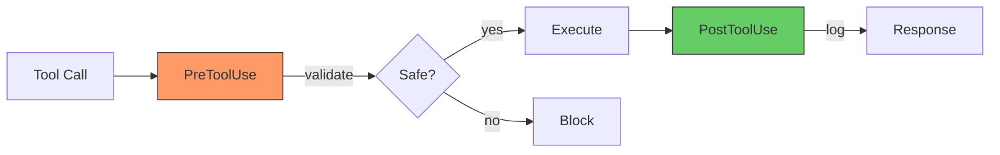

# Part 6: Safety & Observability

Building trust through validation and visibility

---
layout: default
---

# Safety Hooks: PreToolUse Validation

Defense-in-depth approach to preventing dangerous operations

<div class="grid grid-cols-2 gap-8 mt-8">

<div>

## Bash Command Validation

<v-click>

**Blocked Patterns:**
```bash
# Recursive delete of root/home
rm -rf /
rm -rf $HOME

# Fork bombs
:(){ :|:& };:

# Disk operations
mkfs.ext4 /dev/sda
dd if=/dev/zero of=/dev/sda

# System control
shutdown -h now
kill -9 -1
```

</v-click>

<v-click>

**Blocked Paths:**
- `/etc/`, `/usr/`, `/bin/`
- System directories
- Password files

</v-click>

</div>

<div>

<v-click>

## File Write Validation

**Sensitive Path Protection:**
```python
# Blocked patterns
.env*
secrets/
~/.ssh/
~/.aws/
credentials.json
```

</v-click>

<v-click>

## Smart Parsing

- Compound commands: `&&`, `||`, `;`, `|`
- Variable expansion: `$HOME`, `${VAR}`
- Symlink resolution
- Quote handling

</v-click>

<v-click>

## Fail-Closed Design

Hook exceptions **block** operations by default

</v-click>

</div>

</div>

<v-click>

```python
# Example: Custom blocklist
config = SafetyConfig(
    bash_blocklist=["git push --force"],
    path_blocklist=["production.db"],
)
```

</v-click>

---
layout: default
---

# Logging & Metrics: PostToolUse Observability

<div class="grid grid-cols-2 gap-4 mt-4">

<div>

## Logging Hook

<v-click>

```python
{"tool_name": "bash", "duration_ms": 245.3,
 "status": "success",
 "inputs": {"command": "git commit...",
            "api_key": "***REDACTED***"}}
```

</v-click>

<v-click>

**Auto-Redaction:** `ghp_xxx`, `sk-xxx`, `AKIA...` all sanitized

</v-click>

</div>

<div>

## Metrics Collection

<v-click>

```python
# Rolling 24h stats per tool
ToolMetrics(call_count=142, success=138,
  avg_ms=156.7, p95_ms=453.1)
```

</v-click>

<v-click>

**Tracked:** Success rates, latency percentiles, error trends

</v-click>

</div>

</div>

<v-click>

## Hook Flow



</v-click>

