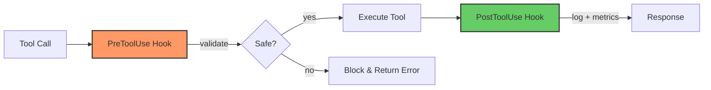

# Part 6: Safety & Observability

Building trust through validation and visibility

---
layout: default
---

# Safety Hooks: PreToolUse Validation

Defense-in-depth approach to preventing dangerous operations

<div class="grid grid-cols-2 gap-8 mt-8">

<div>

## Bash Command Validation

<v-click>

**Blocked Patterns:**
```bash
# Recursive delete of root/home
rm -rf /
rm -rf $HOME

# Fork bombs
:(){ :|:& };:

# Disk operations
mkfs.ext4 /dev/sda
dd if=/dev/zero of=/dev/sda

# System control
shutdown -h now
kill -9 -1
```

</v-click>

<v-click>

**Blocked Paths:**
- `/etc/`, `/usr/`, `/bin/`
- System directories
- Password files

</v-click>

</div>

<div>

<v-click>

## File Write Validation

**Sensitive Path Protection:**
```python
# Blocked patterns
.env*
secrets/
~/.ssh/
~/.aws/
credentials.json
```

</v-click>

<v-click>

## Smart Parsing

- Compound commands: `&&`, `||`, `;`, `|`
- Variable expansion: `$HOME`, `${VAR}`
- Symlink resolution
- Quote handling

</v-click>

<v-click>

## Fail-Closed Design

Hook exceptions **block** operations by default

</v-click>

</div>

</div>

<v-click>

```python
# Example: Custom blocklist
config = SafetyConfig(
    bash_blocklist=["git push --force"],
    path_blocklist=["production.db"],
)
```

</v-click>

---
layout: default
---

# Logging & Metrics: PostToolUse Observability

Track, measure, and monitor agent behavior

<div class="grid grid-cols-2 gap-8 mt-8">

<div>

## Logging Hook

<v-click>

**Sanitized Logging:**
```python
{
  "tool_name": "bash",
  "duration_ms": 245.3,
  "status": "success",
  "inputs": {
    "command": "git commit -m '...'",
    "api_key": "***REDACTED***"
  },
  "output": "Created commit abc123..."
}
```

</v-click>

<v-click>

**Automatic Redaction:**
- GitHub tokens: `ghp_xxx` → `***GITHUB_TOKEN***`
- API keys: `sk-xxx` → `***API_KEY***`
- AWS keys: `AKIA...` → `***AWS_KEY***`
- Passwords, secrets, tokens

</v-click>

</div>

<div>

## Metrics Collection

<v-click>

**Rolling Window Stats (24h):**
```python
metrics = await collector.get_metrics("bash")
# ToolMetrics(
#   call_count=142,
#   success_count=138,
#   failure_count=4,
#   avg_duration_ms=156.7,
#   p50_duration_ms=98.2,
#   p95_duration_ms=453.1,
#   p99_duration_ms=892.4
# )
```

</v-click>

<v-click>

**Per-Tool Statistics:**
- Success/failure rates
- Duration percentiles (P50, P95, P99)
- Call frequency
- Error trends

</v-click>

</div>

</div>

<v-click>

## Hook Flow Diagram


```mermaid
graph LR
    A[Tool Call] --> B[PreToolUse Hook]
    B -->|validate| C{Safe?}
    C -->|yes| D[Execute Tool]
    C -->|no| E[Block & Return Error]
    D --> F[PostToolUse Hook]
    F -->|log + metrics| G[Response]
    style B fill:#f96,stroke:#333,stroke-width:2px
    style F fill:#6c6,stroke:#333,stroke-width:2px
```

</v-click>

