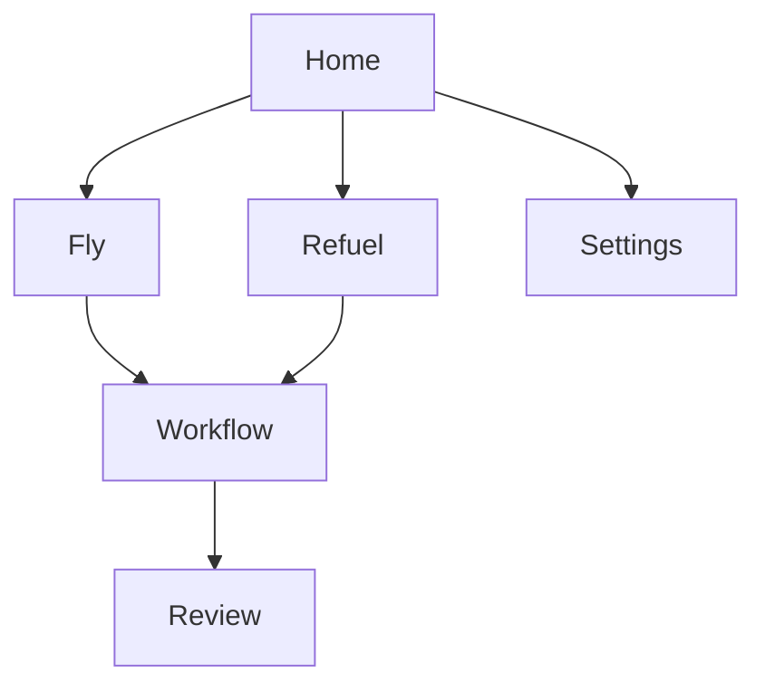

# Part 7: Terminal User Interface

Textual-powered interactive TUI

---
layout: default
---

# TUI Layout & Components

<div class="grid grid-cols-2 gap-4">
<div>

## Architecture Overview

Built with **Textual 0.40+** framework:

- Reactive state management
- CSS-like styling
- Keyboard-first navigation
- Component composition

<div class="text-sm text-slate-400 mt-2">Minimum terminal: 80x24</div>

</div>
<div>

## Core Layout

```
┌───────────────────────────────────┐
│  Header: Maverick | Workflow      │
├────────┬──────────────────────────┤
│Sidebar │  Main Content Area       │
│- Home  │  (HomeScreen, FlyScreen) │
│- Fly   │                          │
│- Refuel│                          │
├────────┴──────────────────────────┤
│  Log Panel (Ctrl+L toggle)        │
├───────────────────────────────────┤
│  Footer: Keybindings              │
└───────────────────────────────────┘
```

</div>
</div>

<v-click>

<div class="mt-2 text-sm">

**Key Features**: Dynamic header (workflow + timer), collapsible log panel with filtering, responsive sidebar with state indicators

</div>

</v-click>

---
layout: default
---

# Workflow Widgets

<div class="grid grid-cols-2 gap-4">
<div>

## 1. WorkflowProgress

Vertical stage list with live status

```
○ Pending   ◠ Active   ✓ Complete   ✗ Failed
```

<div class="text-sm mt-2">

- Duration display (12s, 1m 30s)
- Expandable details
- Keyboard nav (up/down/enter)

</div>

## 2. AgentOutput

Streaming messages with syntax highlighting

<div class="text-sm">

**Types**: TEXT, CODE, TOOL_CALL, TOOL_RESULT

**Features**: Auto-scroll, search (Ctrl+F), agent filtering, 1000-msg buffer

</div>

</div>
<div>

## 3. ReviewFindings

Code review results by severity

<div class="text-sm">

- **Errors** (red), **Warnings** (yellow), **Suggestions** (cyan)
- Multi-select, expandable details
- Clickable file:line links
- Bulk actions (dismiss, create issue)

</div>

## 4. ValidationStatus

Compact horizontal step indicators

```
✓ Format │ ✓ Lint │ ✗ Build │ ○ Test
```

<div class="text-sm">

Per-step re-run, expandable error output

</div>

## 5. PRSummary

PR metadata: number, title, branch, status checks

</div>
</div>

---
layout: default
---

# Interactive Screens

<div class="grid grid-cols-2 gap-4">
<div>

## Screen Hierarchy



## HomeScreen
- Recent workflow runs
- Quick nav: `f` Fly, `r` Refuel, `s` Settings

## FlyScreen
- Branch input with validation
- Optional task file selection

</div>
<div>

## RefuelScreen
- Label filter (default: tech-debt)
- Issue selection with parallel toggle

## ReviewScreen
- ReviewFindings widget
- Approve & Continue / Fix Issues buttons

## SettingsScreen
- GitHub, Notification, Agent settings
- Test buttons with async feedback
- Live validation indicators

</div>
</div>

---
layout: default
---

# Key Interactions & Bindings

<div class="grid grid-cols-2 gap-4">
<div>

## Global Keybindings

| Key | Action |
|-----|--------|
| `Ctrl+L` | Toggle log panel |
| `Escape` | Go back / Close |
| `q` | Quit application |
| `Ctrl+P` | Command palette |
| `Ctrl+,` | Settings |
| `?` | Show help |

</div>
<div>

## Widget Bindings

**WorkflowProgress**: `Up/Down` navigate, `Enter` expand

**AgentOutput**: `Ctrl+F` search, `PgUp/PgDn` scroll

**ReviewFindings**: `j/k` nav, `Space` toggle, `a/d` all

**ValidationStatus**: `Left/Right` nav, `r` re-run

</div>
</div>

<v-click>

<div class="mt-4 text-sm">

**Modal Dialogs**: Confirmation for destructive actions (workflow cancel, settings reset, bulk dismiss)

**Navigation**: `Escape` always goes back. `Ctrl+P` for command palette.

</div>

</v-click>

---
layout: center
class: text-center
---

# TUI Summary

<div class="grid grid-cols-3 gap-6 mt-6">
<div>

## Layout
Header/Sidebar/Content/Log/Footer

80x24 minimum, responsive styling

</div>
<div>

## Widgets
WorkflowProgress, AgentOutput, ReviewFindings, ValidationStatus, PRSummary

</div>
<div>

## Navigation
Keyboard-first, Ctrl+P palette, Escape back, modal confirmations

</div>
</div>

<div class="mt-8 text-sm text-slate-400">

Built with Textual 0.40+ for rich, interactive terminal experience

</div>
