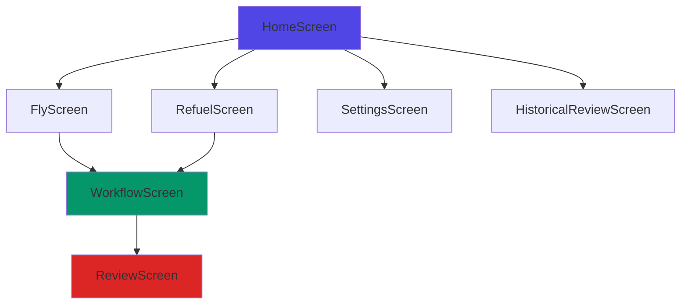

# Part 7: Terminal User Interface

Textual-powered interactive TUI

---
layout: default
---

# TUI Layout & Components

<div class="grid grid-cols-2 gap-4">
<div>

## Architecture Overview

Built with **Textual 0.40+** framework:

- **Reactive state management**
- **CSS-like styling**
- **Keyboard-first navigation**
- **Component composition**

Minimum terminal size: **80x24**

</div>
<div>

## Core Layout Structure

```
┌─────────────────────────────────────────────┐
│  Header: Maverick | Workflow | Timer       │
├──────────┬──────────────────────────────────┤
│          │                                  │
│ Sidebar  │  Main Content Area               │
│ - Home   │  (HomeScreen, FlyScreen, etc.)   │
│ - Fly    │                                  │
│ - Refuel │                                  │
│ - Review │                                  │
│ - Config │                                  │
│          │                                  │
├──────────┴──────────────────────────────────┤
│  Log Panel (Ctrl+L to toggle)               │
│  [timestamp] source: message                │
├─────────────────────────────────────────────┤
│  Footer: Keybindings                        │
└─────────────────────────────────────────────┘
```

</div>
</div>

<v-click>

### Key Features
- **Dynamic header subtitle**: Shows workflow name, branch, and elapsed timer (MM:SS)
- **Collapsible log panel**: Bottom drawer with level filtering (info, success, warning, error)
- **Responsive sidebar**: Navigation with visual state indicators

</v-click>

---
layout: default
---

# Workflow Widgets

Specialized components for real-time workflow display

<div class="grid grid-cols-2 gap-4 mt-4">
<div>

## 1. WorkflowProgress

Vertical stage list with live status updates

```python
# Status icons
○  Pending    # Gray circle
◠  Active     # Animated spinner (LoadingIndicator)
✓  Completed  # Green checkmark
✗  Failed     # Red X
```

**Features:**
- Duration display (e.g., "12s", "1m 30s")
- Expandable details via Collapsible
- Loading and empty states
- Keyboard navigation (up/down/enter)

</div>
<div>

## 2. AgentOutput

Streaming messages with syntax highlighting

**Message Types:**
- **TEXT**: Plain text with timestamps
- **CODE**: Syntax-highlighted (Rich/Pygments)
- **TOOL_CALL**: Collapsible (collapsed by default)
- **TOOL_RESULT**: Tool execution results

**Features:**
- Auto-scroll with manual override pause
- "Scroll to bottom" indicator when paused
- Search (Ctrl+F) with highlighting
- Agent filtering
- 1000-message buffer limit

</div>
</div>

<v-click>

<div class="mt-4 p-4 bg-blue-900/20 border border-blue-500 rounded">

**Auto-scroll behavior**: Pauses when user scrolls up, resumes when user scrolls to bottom. Prevents disorienting jumps during long-running operations.

</div>

</v-click>

---
layout: two-cols
---

# More Workflow Widgets

<div>

## 3. ReviewFindings

Code review results grouped by severity

**Severity Hierarchy:**
- ✗ **Errors** (red)
- ⚠ **Warnings** (yellow)
- 💡 **Suggestions** (cyan)

**Capabilities:**
- Multi-select checkboxes
- Expandable details per finding
- Clickable file:line links
- Bulk actions: Dismiss, Create Issue
- Keyboard navigation (j/k/space/a/d)

</div>

::right::

<div>

## 4. ValidationStatus

Compact horizontal step indicators

```
┌──────────┬──────────┬──────────┬──────────┐
│ ✓ Format │ ✓ Lint   │ ✗ Build  │ ○ Test   │
│          │          │ [Rerun]  │          │
└──────────┴──────────┴──────────┴──────────┘
```

**Steps:**
- Format (ruff format)
- Lint (ruff check)
- Build (pytest --collect-only)
- Test (pytest)

**Features:**
- Real-time status updates
- Expandable error output (Collapsible)
- Per-step re-run buttons (failed steps only)
- Left/right navigation

</div>

<v-click>

<div class="mt-4">

## 5. PRSummary

Pull request metadata display

- PR number, title, and state icon (●/✓/○)
- Branch info (feature → main)
- Truncated description (expandable)
- Status checks (✓/✗/○)
- Link to open in browser (o key or click)

</div>

</v-click>

---
layout: default
---

# Interactive Screens

Screen navigation and user flows

<div class="grid grid-cols-2 gap-4">
<div>

## Screen Hierarchy


```mermaid
graph TD
    Home[HomeScreen] --> Fly[FlyScreen]
    Home --> Refuel[RefuelScreen]
    Home --> Settings[SettingsScreen]
    Home --> History[HistoricalReviewScreen]

    Fly --> Workflow[WorkflowScreen]
    Refuel --> Workflow

    Workflow --> Review[ReviewScreen]

    style Home fill:#4f46e5
    style Workflow fill:#059669
    style Review fill:#dc2626
```

</div>
<div>

## Screen Details

### HomeScreen
- Recent workflow runs (WorkflowList widget)
- Navigation hub
- Keybindings: `f` (Fly), `r` (Refuel), `s` (Settings), `h` (View History)

### FlyScreen
- Branch name input (BranchInputField)
- Real-time validation (git branch format)
- Optional task file selection
- Start button transitions to WorkflowScreen

### RefuelScreen
- Label filter input (default: "tech-debt")
- Issue selection (IssueList widget)
- Parallel execution toggle
- Selected issue count display

</div>
</div>

---
layout: default
---

# Interactive Screens (continued)

<div class="grid grid-cols-2 gap-4">
<div>

## ReviewScreen

Displays code review findings after workflow completion

**Widgets:**
- ReviewFindings (main content)
- Action buttons:
  - **Approve & Continue** (green)
  - **Fix Issues** (yellow)

**Actions:**
- File:line links open code context
- Bulk dismiss/create issue
- Expandable finding details

</div>
<div>

## SettingsScreen

Configuration with test buttons

**Sections:**
1. **GitHub Settings**
   - Token, repo, base branch
   - Test button validates connection

2. **Notification Settings**
   - ntfy.sh topic configuration
   - Test button sends sample notification

3. **Agent Settings**
   - Max retries, timeout
   - Safety hook configuration

**Features:**
- Live validation indicators
- "Test" buttons with async feedback
- Save/Cancel/Reset buttons

</div>
</div>

<v-click>

<div class="mt-4 p-4 bg-amber-900/20 border border-amber-500 rounded">

**Navigation Pattern**: Escape key always goes back. Ctrl+P opens command palette for quick navigation across all screens.

</div>

</v-click>

---
layout: default
---

# Key Interactions & Bindings

<div class="grid grid-cols-2 gap-4">
<div>

## Global Keybindings

| Key | Action | Context |
|-----|--------|---------|
| `Ctrl+L` | Toggle log panel | Global |
| `Escape` | Go back / Close | Global |
| `q` | Quit application | Global |
| `Ctrl+P` | Command palette | Global |
| `Ctrl+,` | Settings | Global |
| `Ctrl+H` | Go to home | Global |
| `?` | Show help | Global |

</div>
<div>

## Widget-Specific Bindings

**WorkflowProgress:**
- `↑/↓` Previous/Next stage
- `Enter` Expand/collapse

**AgentOutput:**
- `Ctrl+F` Search
- `PageUp/PageDown` Scroll
- `Home/End` Top/Bottom

**ReviewFindings:**
- `j/k` Down/Up
- `Space` Toggle selection
- `a/d` Select/Deselect all
- `Enter` Expand/collapse

**ValidationStatus:**
- `←/→` Previous/Next step
- `r` Re-run focused step

</div>
</div>

<v-click>

<div class="mt-4">

## Modal Dialogs

Confirmation dialogs for destructive actions:
- Workflow cancellation
- Settings reset
- Bulk finding dismissal

</div>

</v-click>

---
layout: center
class: text-center
---

# TUI Summary

<div class="grid grid-cols-3 gap-8 mt-8">
<div>

## 🎨 Layout
- Header/Sidebar/Content/Log/Footer
- Minimum 80x24 terminal
- Responsive CSS-like styling
- Theme support (dark mode)

</div>
<div>

## 🎯 Widgets
- WorkflowProgress (stages)
- AgentOutput (streaming)
- ReviewFindings (grouped)
- ValidationStatus (steps)
- PRSummary (metadata)

</div>
<div>

## ⌨️ Navigation
- Keyboard-first design
- Command palette (Ctrl+P)
- Contextual keybindings
- Escape for back navigation
- Modal confirmations

</div>
</div>

<div class="mt-12">

**Built with Textual 0.40+ for a rich, interactive terminal experience**

</div>
