# Part 11: End-to-End Examples

Real-world workflow demonstrations

---
layout: default
transition: slide-left
---

# FlyWorkflow: Feature Implementation

Complete feature development from tasks to PR

<div class="text-xs text-yellow-300 mb-2">
<strong>Prerequisite:</strong> Generate tasks.md via <code>/speckit.tasks</code> (<a href="https://speckit.org">speckit.org</a>)
</div>

<div class="grid grid-cols-2 gap-8 mt-8">

<div>

### Command

```bash
maverick fly add-user-auth \
  --task-file specs/auth/tasks.md
```

<div v-click>

### Workflow Stages

<div class="space-y-2 text-sm">

<WorkflowStage stage="INIT" status="completed">
Create branch add-user-auth, sync with main
</WorkflowStage>

<WorkflowStage stage="IMPLEMENTATION" status="completed">
Execute by phase (Claude handles [P] tasks)
</WorkflowStage>

<WorkflowStage stage="VALIDATION" status="in_progress">
ruff format → ruff check → pytest
</WorkflowStage>

<WorkflowStage stage="CODE_REVIEW" status="pending">
Analyze diff for issues
</WorkflowStage>

<WorkflowStage stage="PR_CREATION" status="pending">
Generate description, create PR
</WorkflowStage>

</div>

</div>

</div>

<div v-click>

### Execution Flow


</div>

</div>

<div v-click class="mt-6">

### Phase-Level Execution

```yaml
# specs/auth/tasks.md (generated by /speckit.tasks)
## Phase 1: Core Models
- [ ] T001 Create User model with email, password fields

## Phase 2: Endpoints
- [ ] T002 [P] Add /register endpoint with password hashing
- [ ] T003 [P] Add /login endpoint with JWT generation

## Phase 3: Testing
- [ ] T004 Write integration tests for auth endpoints
```

<div class="text-sm text-gray-400 mt-2">
Each phase is executed as a single Claude invocation. Claude handles [P] parallelization.
</div>

</div>

---
layout: default
transition: slide-left
---

# RefuelWorkflow: Tech Debt Cleanup

Automated batch processing of technical debt

<div class="grid grid-cols-2 gap-8 mt-8">

<div>

### Command

```bash
maverick refuel \
  --label tech-debt \
  --limit 3
```

<div v-click>

### Workflow Stages

<Terminal lines="18">

<div v-click>

```
🔍 DISCOVERY: Fetching tech-debt issues...
   Found 12 open issues with label 'tech-debt'
```

</div>

<div v-click>

```
🎯 SELECTION: Analyzing conflicts...
   Selected 3 non-conflicting issues:
   - #123: Remove deprecated API endpoint
   - #124: Fix E501 line length violations
   - #125: Add type hints to utils module
```

</div>

<div v-click>

```
⚙️  PROCESSING: Issue #123
   ├─ Branch: fix/remove-deprecated-endpoint
   ├─ Agent: Applying fix...
   ├─ Validation: ✓ passed
   ├─ Commit: "fix: remove deprecated /v1/users endpoint"
   └─ PR: Created #142
```

</div>

<div v-click>

```
⚙️  PROCESSING: Issue #124
   ├─ Branch: fix/line-length-violations
   ├─ Agent: Applying fix...
   ├─ Validation: ✓ passed (after auto-fix)
   ├─ Commit: "fix: resolve E501 violations"
   └─ PR: Created #143
```

</div>

<div v-click>

```
⚙️  PROCESSING: Issue #125
   ├─ Branch: fix/add-type-hints-utils
   ├─ Agent: Applying fix...
   ├─ Validation: ✗ failed (3 attempts)
   └─ Status: FAILED - manual intervention needed
```

</div>

<div v-click>

```
✅ RESULTS SUMMARY:
   Success: 2/3 issues resolved
   Failed: 1 issue (manual review required)
   PRs created: #142, #143
```

</div>

</Terminal>

</div>

</div>

<div v-click>

### Processing Flow

```mermaid
flowchart TB
    Start([maverick refuel]) --> Discovery[Fetch Issues]
    Discovery --> |12 issues| Selection[Select 3 Non-Conflicting]

    Selection --> Process1[Process #123]
    Selection --> Process2[Process #124]
    Selection --> Process3[Process #125]

    Process1 --> Branch1[Create Branch]
    Branch1 --> Fix1[Apply Fix]
    Fix1 --> Val1{Validate}
    Val1 --> |Pass| Commit1[Commit]
    Commit1 --> PR1[Create PR #142]
    PR1 --> Success1[✓ Success]

    Process2 --> Branch2[Create Branch]
    Branch2 --> Fix2[Apply Fix]
    Fix2 --> Val2{Validate}
    Val2 --> |Fail| AutoFix2[Auto-Fix]
    AutoFix2 --> Val2b{Validate}
    Val2b --> |Pass| Commit2[Commit]
    Commit2 --> PR2[Create PR #143]
    PR2 --> Success2[✓ Success]

    Process3 --> Branch3[Create Branch]
    Branch3 --> Fix3[Apply Fix]
    Fix3 --> Val3{Validate}
    Val3 --> |Fail 3x| Failed3[✗ Failed]

    Success1 --> Results[Results Summary]
    Success2 --> Results
    Failed3 --> Results

    style Success1 fill:#4ade80
    style Success2 fill:#4ade80
    style Failed3 fill:#f87171
    style Results fill:#60a5fa
```



</div>

</div>

<div v-click class="mt-6">

### Key Features

<div class="grid grid-cols-3 gap-4 text-sm">

<div class="border border-gray-700 rounded p-3">
<div class="font-bold text-blue-400">Parallel Processing</div>
<div class="text-gray-400 mt-1">Each issue processed independently for maximum efficiency</div>
</div>

<div class="border border-gray-700 rounded p-3">
<div class="font-bold text-green-400">Automatic Recovery</div>
<div class="text-gray-400 mt-1">Failed validations trigger auto-fix attempts (up to 3x)</div>
</div>

<div class="border border-gray-700 rounded p-3">
<div class="font-bold text-purple-400">Graceful Degradation</div>
<div class="text-gray-400 mt-1">One failure doesn't stop other issues from being fixed</div>
</div>

</div>

</div>
