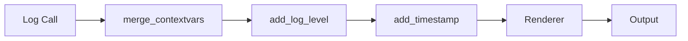

# 5. structlog - Structured Logging

<div class="text-lg text-secondary mt-4">
Modern logging for complex async applications
</div>

<div class="mt-8 flex justify-center gap-6 text-sm">
  <div class="flex items-center gap-2">
    <span class="w-2 h-2 rounded-full bg-teal"></span>
    <span class="text-muted">7 Slides</span>
  </div>
  <div class="flex items-center gap-2">
    <span class="w-2 h-2 rounded-full bg-brass"></span>
    <span class="text-muted">Key-Value Pairs</span>
  </div>
  <div class="flex items-center gap-2">
    <span class="w-2 h-2 rounded-full bg-coral"></span>
    <span class="text-muted">JSON & Console</span>
  </div>
</div>

<!--
Section 5 covers structlog - the structured logging library that Maverick uses throughout its codebase.

We'll cover:
1. Why traditional logging falls short
2. Structured logging concepts
3. structlog basics
4. Context binding
5. Processor pipelines
6. Output formats (console vs JSON)
7. Maverick's logging setup
-->

---

## layout: two-cols

# 5.1 Logging Pain Points

<div class="pr-4">

**Traditional logging** falls short for complex applications

<div v-click class="mt-4">

## The Problems

<div class="space-y-3 text-sm mt-3">

<div class="flex items-start gap-2">
  <span class="text-coral font-bold">✗</span>
  <div>
    <strong>String Concatenation</strong>
    <div class="text-muted">f"Processing {item_id} for {user}"</div>
  </div>
</div>

<div class="flex items-start gap-2">
  <span class="text-coral font-bold">✗</span>
  <div>
    <strong>No Structure</strong>
    <div class="text-muted">Logs are human-readable, not machine-parseable</div>
  </div>
</div>

<div class="flex items-start gap-2">
  <span class="text-coral font-bold">✗</span>
  <div>
    <strong>Context Loss</strong>
    <div class="text-muted">Hard to trace requests across async boundaries</div>
  </div>
</div>

<div class="flex items-start gap-2">
  <span class="text-coral font-bold">✗</span>
  <div>
    <strong>Grepping Nightmares</strong>
    <div class="text-muted">grep "workflow.*failed" | pray</div>
  </div>
</div>

</div>

</div>

</div>

::right::

<div class="pl-4 mt-8">

<div v-click>

## Traditional Logging Example

```python
import logging

logger = logging.getLogger(__name__)

# String interpolation everywhere
logger.info(
    f"Starting workflow {workflow_id} "
    f"for user {user_id} on branch {branch}"
)

# Later, in a different file...
logger.error(
    f"Workflow {workflow_id} failed: {error}"
)
```

</div>

<div v-click class="mt-4">

## The Output

```text
INFO:maverick.workflow:Starting workflow fly-123
  for user alice on branch main
ERROR:maverick.executor:Workflow fly-123 failed:
  Connection timeout
```

</div>

<div v-click class="mt-4 p-3 bg-coral/10 border border-coral/30 rounded-lg text-sm">
  <strong class="text-coral">Problem:</strong> How do you search for all logs related to <code>fly-123</code>? What if the format changes slightly in different files?
</div>

</div>

<!--
Traditional logging has served us well, but it falls short for modern async applications like Maverick.

**String Concatenation**: Every log statement becomes an f-string puzzle. If you forget a field, you lose context. If you change the format, you break log parsers.

**No Structure**: These logs are designed for humans to read in a terminal. But in production, you want to query logs programmatically - "show me all errors for workflow fly-123".

**Context Loss**: In async code, a request might spawn multiple tasks. Traditional logging loses track of which log belongs to which request.

**Grepping Nightmares**: Without consistent structure, you end up with fragile grep commands that break when someone changes a log message.
-->

---

## layout: default

# 5.2 Structured Logging Concept

<div class="text-secondary text-sm mb-4">
Treat log events as data, not strings
</div>

<div class="grid grid-cols-2 gap-8">

<div>

<div v-click>

### The Key Insight

<div class="p-4 bg-teal/10 border border-teal/30 rounded-lg mt-3">
  <div class="text-lg font-semibold text-teal mb-2">Log events are data structures</div>
  <div class="text-sm text-muted">
    Each log is a collection of key-value pairs that can be queried, filtered, and aggregated programmatically.
  </div>
</div>

</div>

<div v-click class="mt-6">

### Structured Log Event

```python
# Instead of a string...
"Starting workflow fly-123 for user alice"

# ...we have a data structure:
{
    "event": "workflow_started",
    "workflow_id": "fly-123",
    "user_id": "alice",
    "branch": "main",
    "timestamp": "2024-01-15T10:30:00Z",
    "level": "info"
}
```

</div>

</div>

<div>

<div v-click>

### Benefits

<div class="space-y-3 mt-3">

<div class="flex items-start gap-3">
  <span class="w-8 h-8 rounded-full bg-teal/20 text-teal flex items-center justify-center text-xs font-bold">1</span>
  <div>
    <strong>Machine Parseable</strong>
    <div class="text-sm text-muted">Query with jq, Elasticsearch, Datadog, etc.</div>
  </div>
</div>

<div class="flex items-start gap-3">
  <span class="w-8 h-8 rounded-full bg-teal/20 text-teal flex items-center justify-center text-xs font-bold">2</span>
  <div>
    <strong>Consistent Schema</strong>
    <div class="text-sm text-muted">workflow_id is always workflow_id</div>
  </div>
</div>

<div class="flex items-start gap-3">
  <span class="w-8 h-8 rounded-full bg-teal/20 text-teal flex items-center justify-center text-xs font-bold">3</span>
  <div>
    <strong>Easy Aggregation</strong>
    <div class="text-sm text-muted">Count errors by workflow_id, agent, step</div>
  </div>
</div>

<div class="flex items-start gap-3">
  <span class="w-8 h-8 rounded-full bg-teal/20 text-teal flex items-center justify-center text-xs font-bold">4</span>
  <div>
    <strong>Context Propagation</strong>
    <div class="text-sm text-muted">Bind context once, include in all logs</div>
  </div>
</div>

</div>

</div>

<div v-click class="mt-6 p-3 bg-brass/10 border border-brass/30 rounded-lg text-sm">
  <strong class="text-brass">Real Example:</strong> Find all errors for workflow fly-123:
  <code class="block mt-2">jq 'select(.level=="error" and .workflow_id=="fly-123")'</code>
</div>

</div>

</div>

<!--
Structured logging is a paradigm shift in how we think about logs.

**The Key Insight**: Instead of treating logs as human-readable strings, we treat them as structured data - specifically, collections of key-value pairs.

**Why This Matters**:
1. **Machine Parseable**: JSON logs can be ingested by any log aggregation tool (Elasticsearch, Datadog, CloudWatch).
2. **Consistent Schema**: The field `workflow_id` is always called `workflow_id`, making queries reliable.
3. **Easy Aggregation**: Count errors by workflow, average step duration, find slowest agents.
4. **Context Propagation**: Bind `workflow_id` once at the start, and it appears in every subsequent log.

This is why Maverick uses structlog - it makes debugging complex async workflows tractable.
-->

---

## layout: default

# 5.3 structlog Basics

<div class="text-secondary text-sm mb-4">
Getting started with structured logging in Python
</div>

<div class="grid grid-cols-2 gap-6">

<div>

### Getting a Logger

```python {1|3-4|6-10|12-16|all}
from maverick.logging import get_logger

# Get a logger (usually with __name__)
log = get_logger(__name__)

# Log with key-value pairs
log.info("workflow_started",
    workflow_id="fly-123",
    branch="main"
)

# Log levels work as expected
log.debug("verbose_detail", data=large_dict)
log.warning("rate_limited", retry_after=60)
log.error("step_failed",
    step="lint",
    error="Exit code 1"
)
```

<div v-click class="mt-4 p-3 bg-brass/10 border border-brass/30 rounded-lg text-sm">
  <strong class="text-brass">Pattern:</strong> First argument is the event name (snake_case), followed by keyword arguments for context.
</div>

</div>

<div>

<div v-click>

### Console Output (Development)

```text
2024-01-15 10:30:00 [info     ] workflow_started
    workflow_id=fly-123  branch=main

2024-01-15 10:30:01 [warning  ] rate_limited
    retry_after=60

2024-01-15 10:30:02 [error    ] step_failed
    step=lint  error=Exit code 1
```

</div>

<div v-click class="mt-4">

### JSON Output (Production)

```json
{"event": "workflow_started",
 "workflow_id": "fly-123",
 "branch": "main",
 "timestamp": "2024-01-15T10:30:00Z",
 "level": "info"}

{"event": "step_failed",
 "step": "lint",
 "error": "Exit code 1",
 "timestamp": "2024-01-15T10:30:02Z",
 "level": "error"}
```

</div>

<div v-click class="mt-4 p-3 bg-teal/10 border border-teal/30 rounded-lg text-sm">
  <strong class="text-teal">Toggle:</strong> Set <code>MAVERICK_LOG_FORMAT=json</code> for JSON output in production.
</div>

</div>

</div>

<!--
Let's see structlog in action with Maverick's logging module.

**Getting a Logger**: Use `get_logger(__name__)` to get a logger named after the current module. This helps identify where logs come from.

**Logging Pattern**: The first positional argument is the event name (use snake_case). All other arguments are keyword arguments that become key-value pairs in the log.

**Log Levels**: structlog supports all standard levels (debug, info, warning, error, critical). Use them semantically:
- debug: Verbose debugging info
- info: Normal operation events
- warning: Something unexpected but recoverable
- error: Something failed

**Output Formats**:
- Development: Pretty console output with colors
- Production: JSON for log aggregation systems
-->

---

## layout: default

# 5.4 Context Binding

<div class="text-secondary text-sm mb-4">
Carry context through your call stack automatically
</div>

<div class="grid grid-cols-2 gap-6">

<div>

### Logger Binding

```python {1-3|5-6|8-12|14-18|all}
from maverick.logging import get_logger

log = get_logger(__name__)

# Bind returns a NEW logger with context
log = log.bind(workflow_id="fly-123")

# All subsequent logs include workflow_id
log.info("step_started", step="lint")
# {"event": "step_started",
#  "step": "lint",
#  "workflow_id": "fly-123", ...}

# Chain bindings for more context
log = log.bind(step_name="lint")
log.info("validation_passed")
# {"event": "validation_passed",
#  "workflow_id": "fly-123",
#  "step_name": "lint", ...}
```

<div v-click class="mt-4 p-3 bg-brass/10 border border-brass/30 rounded-lg text-sm">
  <strong class="text-brass">Immutable:</strong> <code>bind()</code> returns a new logger. The original is unchanged.
</div>

</div>

<div>

<div v-click>

### Global Context (contextvars)

```python {1-4|6-9|11-17|19-22|all}
from maverick.logging import (
    bind_context,
    clear_context
)

# Bind context that persists across async calls
bind_context(
    workflow_id="fly-123",
    run_id="abc-456"
)

# Now ANY logger includes this context
log = get_logger("maverick.agents.reviewer")
log.info("review_started")
# {"event": "review_started",
#  "workflow_id": "fly-123",
#  "run_id": "abc-456", ...}

# Clean up when done
async def run_workflow():
    bind_context(workflow_id="fly-123")
    try:
        await execute_steps()
    finally:
        clear_context()  # Prevent leaks!
```

</div>

<div v-click class="mt-4 p-3 bg-teal/10 border border-teal/30 rounded-lg text-sm">
  <strong class="text-teal">Async Safe:</strong> <code>contextvars</code> properly isolates context between concurrent async tasks.
</div>

</div>

</div>

<!--
Context binding is one of structlog's killer features. It solves the problem of "how do I include workflow_id in every log without passing it everywhere?"

**Logger Binding**: Call `log.bind(key=value)` to create a new logger with that context baked in. All logs from that logger will include the bound context.

**Important**: `bind()` is immutable - it returns a NEW logger. The original is unchanged. This is a functional programming pattern that prevents surprises.

**Global Context with contextvars**: For context that should apply to ALL loggers (like the current workflow_id), use `bind_context()`. This uses Python's `contextvars` which properly handles async code.

**Always Clean Up**: Use `clear_context()` in a finally block to prevent context from leaking to the next request. Context leakage is a common bug in async applications!
-->

---

## layout: default

# 5.5 Processors Pipeline

<div class="text-secondary text-sm mb-4">
How structlog transforms log events
</div>

<div class="grid grid-cols-2 gap-6">

<div>

### The Pipeline Concept

```python
# Log event starts as a dict
event = {
    "event": "step_started",
    "step": "lint"
}

# Each processor transforms it
event = add_timestamp(event)
# {"event": "...", "timestamp": "2024-..."}

event = add_log_level(event)
# {"event": "...", "level": "info", ...}

event = merge_contextvars(event)
# {"event": "...", "workflow_id": "fly-123", ...}

# Final processor renders output
output = json_renderer(event)
# '{"event": "step_started", ...}'
```

<div v-click class="mt-4">



</div>

</div>

<div>

<div v-click>

### Maverick's Processor Chain

```python
from structlog import processors

SHARED_PROCESSORS = [
    # Merge bound context from contextvars
    structlog.contextvars.merge_contextvars,

    # Add log level (info, error, etc.)
    structlog.stdlib.add_log_level,

    # Add logger name (module path)
    structlog.stdlib.add_logger_name,

    # Handle positional args
    structlog.stdlib.PositionalArgumentsFormatter(),

    # Add ISO timestamp
    structlog.processors.TimeStamper(fmt="iso"),

    # Render stack traces
    structlog.processors.StackInfoRenderer(),

    # Decode bytes to strings
    structlog.processors.UnicodeDecoder(),
]
```

</div>

<div v-click class="mt-4 p-3 bg-teal/10 border border-teal/30 rounded-lg text-sm">
  <strong class="text-teal">Extensible:</strong> Add custom processors for masking secrets, adding request IDs, or any transformation you need.
</div>

</div>

</div>

<!--
Processors are the heart of structlog. They form a pipeline that transforms log events from the initial call to the final output.

**How It Works**:
1. You call `log.info("event", key=value)`
2. structlog creates a dict: `{"event": "event", "key": "value"}`
3. Each processor receives the dict and returns a transformed dict
4. The final processor (renderer) converts the dict to the output format

**Maverick's Processors**:
- `merge_contextvars`: Adds context from `bind_context()` calls
- `add_log_level`: Adds the "level" field (info, error, etc.)
- `add_logger_name`: Adds the module name (maverick.agents.reviewer)
- `TimeStamper`: Adds ISO-formatted timestamp
- `StackInfoRenderer`: Formats stack traces nicely

**Custom Processors**: You can write your own! A processor is just a function that takes and returns a dict. Use cases include:
- Masking sensitive data (passwords, tokens)
- Adding deployment metadata (version, environment)
- Rate limiting verbose logs
-->

---

## layout: default

# 5.6 Output Formats

<div class="text-secondary text-sm mb-4">
Console for development, JSON for production
</div>

<div class="grid grid-cols-2 gap-6">

<div>

### Console Output (Default)

```python
# Configured automatically when
# MAVERICK_LOG_FORMAT is not "json"

ConsoleRenderer(
    colors=True,  # Auto-detect TTY
    exception_formatter=plain_traceback,
)
```

<div v-click class="mt-4">

```text
2024-01-15 10:30:00 [info     ] workflow_started
    workflow_id=fly-123  branch=main
2024-01-15 10:30:01 [info     ] step_started
    step=lint  workflow_id=fly-123
2024-01-15 10:30:02 [error    ] step_failed
    step=lint  error=Exit code 1
Traceback (most recent call last):
  File "executor.py", line 42, in run_step
    result = await step.execute()
StepExecutionError: Lint check failed
```

</div>

<div v-click class="mt-3 p-3 bg-brass/10 border border-brass/30 rounded-lg text-sm">
  <strong class="text-brass">Smart Colors:</strong> Maverick auto-detects TTY. Colors are disabled when output is piped to a file.
</div>

</div>

<div>

<div v-click>

### JSON Output (Production)

```python
# Enable with: MAVERICK_LOG_FORMAT=json

JSONRenderer()
```

```json
{"event": "workflow_started",
 "workflow_id": "fly-123",
 "branch": "main",
 "level": "info",
 "logger": "maverick.workflows.fly",
 "timestamp": "2024-01-15T10:30:00Z"}

{"event": "step_started",
 "step": "lint",
 "workflow_id": "fly-123",
 "level": "info",
 "timestamp": "2024-01-15T10:30:01Z"}

{"event": "step_failed",
 "step": "lint",
 "error": "Exit code 1",
 "exc_info": "Traceback...",
 "level": "error",
 "timestamp": "2024-01-15T10:30:02Z"}
```

</div>

<div v-click class="mt-3 p-3 bg-teal/10 border border-teal/30 rounded-lg text-sm">
  <strong class="text-teal">Log Aggregation:</strong> JSON logs are perfect for Elasticsearch, Datadog, CloudWatch, or <code>jq</code> on the command line.
</div>

</div>

</div>

<!--
Maverick supports two output formats, automatically selected based on your environment.

**Console Output (Development)**:
- Human-readable with colors
- Key-value pairs on each line
- Nice exception formatting
- Colors auto-disabled when piping to a file (TTY detection)

**JSON Output (Production)**:
- Enable with `MAVERICK_LOG_FORMAT=json`
- One JSON object per line (JSONL format)
- Perfect for log aggregation systems
- All context included in each line

**Why Two Formats?**:
- Developers want readable logs during development
- Production systems want machine-parseable logs
- Maverick detects and adapts automatically

**TTY Detection**: Maverick checks `stderr.isatty()` to know if we're in a terminal. This means `maverick fly 2>&1 | tee log.txt` will automatically disable colors.
-->

---

## layout: default

# 5.7 Maverick Logging Setup

<div class="text-secondary text-sm mb-4">
Tour of <code>maverick/logging.py</code>
</div>

<div class="grid grid-cols-2 gap-6">

<div>

### Configuration Function

```python {1-5|7-10|12-17|19-25|all}
def configure_logging(
    *,
    force_json: bool = False,
    level: int | None = None,
) -> None:
    """Configure structlog at startup."""

    # Determine output format
    use_json = force_json or _is_json_output()
    log_level = level or _get_log_level()

    # Choose processor chain
    if use_json:
        processors = _get_production_processors()
    else:
        processors = _get_development_processors()

    # Configure structlog
    structlog.configure(
        processors=processors,
        wrapper_class=structlog.stdlib.BoundLogger,
        context_class=dict,
        logger_factory=structlog.stdlib.LoggerFactory(),
        cache_logger_on_first_use=True,
    )
```

</div>

<div>

<div v-click>

### Environment Variables

| Variable              | Values                              | Default |
| --------------------- | ----------------------------------- | ------- |
| `MAVERICK_LOG_FORMAT` | `json`, (empty)                     | Console |
| `MAVERICK_LOG_LEVEL`  | `DEBUG`, `INFO`, `WARNING`, `ERROR` | `INFO`  |

</div>

<div v-click class="mt-4">

### Usage in Maverick

```python
# main.py - Application entry point
from maverick.logging import configure_logging

@click.command()
def main():
    configure_logging()  # Call once!
    ...

# Anywhere else
from maverick.logging import get_logger

log = get_logger(__name__)
log.info("ready", version="1.0.0")
```

</div>

<div v-click class="mt-4 p-3 bg-coral/10 border border-coral/30 rounded-lg text-sm">
  <strong class="text-coral">Important:</strong> Call <code>configure_logging()</code> exactly once at application startup. Multiple calls will reconfigure and may cause issues.
</div>

</div>

</div>

<!--
Let's look at how Maverick configures structlog in `maverick/logging.py`.

**configure_logging()**:
- Called once at application startup (in `main.py`)
- Reads environment variables for format and level
- Sets up the appropriate processor chain
- Configures both structlog and stdlib logging

**Environment Variables**:
- `MAVERICK_LOG_FORMAT`: Set to "json" for production
- `MAVERICK_LOG_LEVEL`: Control verbosity (DEBUG shows everything)

**Key Points**:
1. Call `configure_logging()` once at startup
2. Use `get_logger(__name__)` everywhere else
3. Use `bind_context()` for workflow-level context
4. Always `clear_context()` when done

**Testing Tip**: In tests, you can call `configure_logging(force_json=True)` to test JSON output, or use `caplog` fixture to capture logs.
-->

---

layout: center
class: text-center

---

# structlog Summary

<div class="grid grid-cols-3 gap-8 mt-8 text-left max-w-4xl mx-auto">

<div v-click class="p-4 bg-teal/10 border border-teal/30 rounded-lg">
  <div class="text-teal font-bold mb-2">📝 Basics</div>
  <div class="text-sm space-y-1">
    <div><code>get_logger(__name__)</code></div>
    <div><code>log.info("event", k=v)</code></div>
    <div>Event name + key-values</div>
  </div>
</div>

<div v-click class="p-4 bg-brass/10 border border-brass/30 rounded-lg">
  <div class="text-brass font-bold mb-2">🔗 Context</div>
  <div class="text-sm space-y-1">
    <div><code>log.bind(key=value)</code></div>
    <div><code>bind_context(key=value)</code></div>
    <div><code>clear_context()</code></div>
  </div>
</div>

<div v-click class="p-4 bg-coral/10 border border-coral/30 rounded-lg">
  <div class="text-coral font-bold mb-2">⚙️ Config</div>
  <div class="text-sm space-y-1">
    <div><code>MAVERICK_LOG_FORMAT</code></div>
    <div><code>MAVERICK_LOG_LEVEL</code></div>
    <div><code>configure_logging()</code></div>
  </div>
</div>

</div>

<div v-click class="mt-8 p-4 bg-elevated border border-border rounded-lg max-w-2xl mx-auto">
  <div class="text-lg font-semibold mb-2">Key Takeaway</div>
  <div class="text-secondary">
    Structured logging transforms debugging from "grep and pray" to 
    <strong class="text-brass">queryable event streams</strong>. Always log with key-value pairs!
  </div>
</div>

<div v-click class="mt-6 text-muted text-sm">
  Next: Section 6 - GitPython for Git Operations →
</div>

<!--
Let's recap what we've learned about structlog:

**Basics**:
- Get a logger with `get_logger(__name__)`
- Log with event name + key-value pairs
- Use semantic log levels (info, warning, error)

**Context**:
- `log.bind()` creates a new logger with context
- `bind_context()` sets global context for all loggers
- Always `clear_context()` when a workflow/request ends

**Configuration**:
- `configure_logging()` at application startup
- Environment variables control format and level
- Console for dev, JSON for production

**Why This Matters for Maverick**:
In complex async workflows with multiple agents and steps, structured logging is essential. Being able to query "show me all errors for workflow fly-123" instead of grepping through unstructured logs saves hours of debugging time.

Next up: GitPython for programmatic Git operations!
-->
