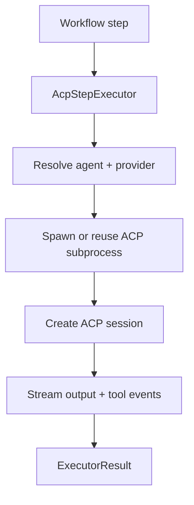

# 10. Agent Client Protocol (ACP)

<div class="text-lg text-secondary mt-4">
How Maverick executes AI agent steps in the current architecture
</div>

<div class="mt-8 flex justify-center gap-6 text-sm">
  <div class="flex items-center gap-2">
    <span class="w-2 h-2 rounded-full bg-teal"></span>
    <span class="text-muted">6 Slides</span>
  </div>
  <div class="flex items-center gap-2">
    <span class="w-2 h-2 rounded-full bg-brass"></span>
    <span class="text-muted">ACP Sessions</span>
  </div>
  <div class="flex items-center gap-2">
    <span class="w-2 h-2 rounded-full bg-coral"></span>
    <span class="text-muted">Tool Permissions</span>
  </div>
</div>

<!--
This section used to teach direct Claude Agent SDK integration.
Maverick now uses Agent Client Protocol (ACP) as the execution boundary.
Keep the MCP/tooling teaching style, but anchor it in the current ACP-based model.
-->

---
layout: two-cols
---

# 10.1 What Changed?

<div class="pr-4">

## Previous Mental Model

```text
Python process
  -> Claude SDK client
  -> Claude API
```

<div v-click class="mt-6">

## Current Mental Model

```text
Maverick
  -> AcpStepExecutor
  -> ACP subprocess (claude-agent-acp)
  -> Claude API
```

</div>

<div v-click class="mt-4 p-3 bg-teal/10 border border-teal/30 rounded-lg text-sm">
  <strong class="text-teal">Key Shift</strong><br>
  Maverick no longer drives the Claude SDK directly in-process.
  It talks to an ACP-compatible subprocess over stdio.
</div>

</div>

::right::

<div class="pl-4 mt-8">

## Why ACP?

<div class="space-y-2 text-sm mt-3">
  <div class="flex items-start gap-2">
    <span class="text-brass mt-1">✓</span>
    <span><strong>Provider boundary</strong>: executor protocol stays provider-agnostic</span>
  </div>
  <div class="flex items-start gap-2">
    <span class="text-brass mt-1">✓</span>
    <span><strong>Reusable connections</strong>: one subprocess per provider</span>
  </div>
  <div class="flex items-start gap-2">
    <span class="text-brass mt-1">✓</span>
    <span><strong>Streaming events</strong>: thoughts, output, and tool activity flow back live</span>
  </div>
  <div class="flex items-start gap-2">
    <span class="text-brass mt-1">✓</span>
    <span><strong>Safer execution</strong>: permission modes and circuit breaking are centralized</span>
  </div>
</div>

</div>

---
layout: two-cols
---

# 10.2 ACP Execution Path

<div class="pr-4">

## The Runtime Flow



<div v-click class="mt-4 text-sm text-muted">
  The workflow owns orchestration. ACP owns the live agent conversation.
</div>

</div>

::right::

<div class="pl-4 mt-8">

## Core Types

```python
class StepExecutor(Protocol):
    async def execute(...):
        ...

class AcpStepExecutor:
    async def execute(...):
        ...
```

<div v-click class="mt-4 p-3 bg-brass/10 border border-brass/30 rounded-lg text-sm">
  <strong class="text-brass">Important</strong><br>
  `StepExecutor` is the abstraction. `AcpStepExecutor` is the current implementation.
</div>

</div>

---
layout: two-cols
---

# 10.3 Provider Configuration

<div class="pr-4">

## Providers Live in Config

```yaml
agent_providers:
  claude:
    command: ["claude-agent-acp"]
    permission_mode: auto_approve
    default: true
```

<div v-click class="mt-4 text-sm text-muted">
  If no providers are configured, Maverick synthesizes a default `claude` provider.
</div>

</div>

::right::

<div class="pl-4 mt-8">

## Permission Modes

| Mode | Behavior |
|------|----------|
| `auto_approve` | allow tool requests |
| `deny_dangerous` | deny `Bash`, `Write`, `Edit`, `NotebookEdit` |
| `interactive` | reserved, not yet implemented |

<div v-click class="mt-4 p-3 bg-teal/10 border border-teal/30 rounded-lg text-sm">
  <strong class="text-teal">Current Safety Model</strong><br>
  Permission handling lives in `MaverickAcpClient`, not in ad-hoc per-agent code.
</div>

</div>

---
layout: two-cols
---

# 10.4 Streaming & Guardrails

<div class="pr-4">

## What Streams Back

- Agent output text
- Agent thinking text
- Tool-call start/progress events
- Final structured output (optional schema validation)

<div v-click class="mt-4">

```python
AgentStreamChunk(
    step_name="implement",
    agent_name="implementer",
    text="Planning change...",
    chunk_type="thinking",
)
```

</div>

</div>

::right::

<div class="pl-4 mt-8">

## Built-in Guardrails

<div class="space-y-2 text-sm mt-3">
  <div class="flex items-start gap-2">
    <span class="text-coral mt-1">•</span>
    <span><strong>Circuit breaker</strong>: abort if the same tool is called 15+ times</span>
  </div>
  <div class="flex items-start gap-2">
    <span class="text-coral mt-1">•</span>
    <span><strong>Retry policy</strong>: reconnect/retry on transient failures</span>
  </div>
  <div class="flex items-start gap-2">
    <span class="text-coral mt-1">•</span>
    <span><strong>Output validation</strong>: optional Pydantic schema enforcement</span>
  </div>
</div>

</div>

---

# 10.5 Takeaway

<div class="mt-10 grid grid-cols-3 gap-4">
  <div class="p-4 bg-raised rounded-lg border border-border">
    <div class="text-sm font-semibold text-teal">ACP is the runtime boundary</div>
    <div class="text-sm text-muted mt-2">Workflows and agents stay Python-native, but execution happens through an ACP subprocess.</div>
  </div>
  <div class="p-4 bg-raised rounded-lg border border-border">
    <div class="text-sm font-semibold text-brass">Executors stay swappable</div>
    <div class="text-sm text-muted mt-2">`StepExecutor` keeps Maverick from coupling itself to one provider implementation.</div>
  </div>
  <div class="p-4 bg-raised rounded-lg border border-border">
    <div class="text-sm font-semibold text-coral">Safety is centralized</div>
    <div class="text-sm text-muted mt-2">Permissions, retries, and circuit breaking are all handled in the ACP layer.</div>
  </div>
</div>
