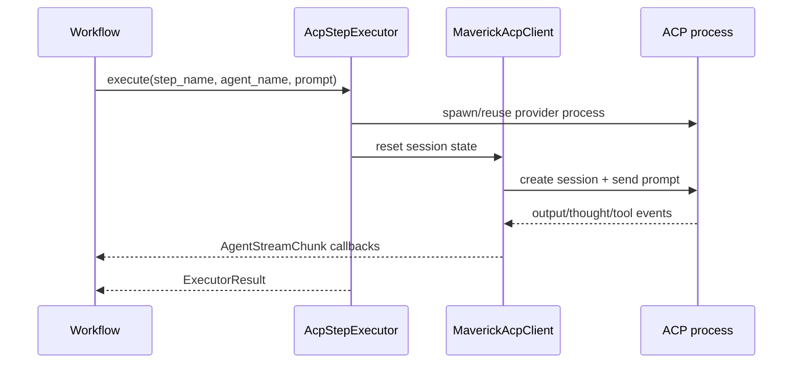

# 13. ACP Integration Layer

<div class="text-lg text-secondary mt-4">
How agent steps execute in Maverick after the move to Agent Client Protocol
</div>

<div class="mt-8 flex justify-center gap-6 text-sm">
  <div class="flex items-center gap-2">
    <span class="w-2 h-2 rounded-full bg-teal"></span>
    <span class="text-muted">6 Slides</span>
  </div>
  <div class="flex items-center gap-2">
    <span class="w-2 h-2 rounded-full bg-brass"></span>
    <span class="text-muted">Providers</span>
  </div>
  <div class="flex items-center gap-2">
    <span class="w-2 h-2 rounded-full bg-coral"></span>
    <span class="text-muted">Streaming</span>
  </div>
</div>

---
layout: two-cols
---

# 13.1 What is ACP?

<div class="pr-4">

The <strong>Agent Client Protocol</strong> is the stdio protocol Maverick uses to communicate with AI agent subprocesses.

<div v-click class="mt-6">

## Maverick's usage

1. spawn an ACP-compatible process such as <code>claude-agent-acp</code>
2. initialize a client connection
3. create a session per step execution
4. stream output, thoughts, and tool activity back to the workflow

</div>

</div>

::right::

<div class="pl-4 mt-8">



</div>

---
layout: two-cols
---

# 13.2 AcpStepExecutor

<div class="pr-4">

```python
class AcpStepExecutor:
    async def execute(
        self,
        *,
        step_name,
        agent_name,
        prompt,
        instructions,
        allowed_tools,
        cwd,
        output_schema,
        config,
        event_callback,
    ) -> ExecutorResult:
        ...
```

</div>

::right::

<div class="pl-4 mt-6 text-sm">

## Responsibilities

- resolve provider configuration
- instantiate the registered agent class
- call <code>build_prompt(context)</code>
- reuse or create ACP connections
- apply timeout + retry policy
- validate structured output when a schema is supplied

<div v-click class="mt-4 p-3 bg-teal/10 border border-teal/30 rounded-lg text-sm">
  <strong class="text-teal">Connection caching</strong><br>
  One subprocess is cached per provider and reused across step executions.
</div>

</div>

---
layout: two-cols
---

# 13.3 Provider Registry

<div class="pr-4">

## Provider lookup

```python
provider_name, provider = provider_registry.default()
```

```yaml
agent_providers:
  claude:
    command: ["claude-agent-acp"]
    permission_mode: auto_approve
    default: true
```

</div>

::right::

<div class="pl-4 mt-8">

## Why a registry?

- zero-config default provider support
- per-provider command/env overrides
- per-provider permission handling
- future alternate backends without changing workflow code

</div>

---
layout: two-cols
---

# 13.4 MaverickAcpClient

<div class="pr-4">

## Client-side session responsibilities

- translate ACP updates into <code>AgentStreamChunk</code>
- track per-session tool usage
- enforce permission-mode decisions
- accumulate final text output for extraction

</div>

::right::

<div class="pl-4 mt-8">

## Permission modes

| Mode | Behavior |
|------|----------|
| `AUTO_APPROVE` | allow all tool requests |
| `DENY_DANGEROUS` | deny `Bash`, `Write`, `Edit`, `NotebookEdit` |
| `INTERACTIVE` | not yet implemented |

<div v-click class="mt-4 p-3 bg-brass/10 border border-brass/30 rounded-lg text-sm">
  <strong class="text-brass">Circuit breaker</strong><br>
  Abort the session if the same tool is called 15 or more times.
</div>

</div>

---
layout: default
---

# 13.5 Why ACP replaced direct provider calls

<div class="grid grid-cols-2 gap-6 mt-6">
  <div class="p-4 bg-coral/10 border border-coral/30 rounded-lg text-sm">
    <div class="font-semibold text-coral">Removed approach</div>
    <div class="mt-2 text-muted">Agent classes managing direct provider conversations in-process.</div>
  </div>
  <div class="p-4 bg-teal/10 border border-teal/30 rounded-lg text-sm">
    <div class="font-semibold text-teal">Current approach</div>
    <div class="mt-2 text-muted">Agent classes build prompts; the executor layer owns subprocess management, retries, permissions, and streaming.</div>
  </div>
</div>

<div class="mt-6 p-3 bg-raised rounded-lg border border-border text-sm text-center">
  This keeps workflows and agents simpler while making the runtime boundary explicit and testable.
</div>
