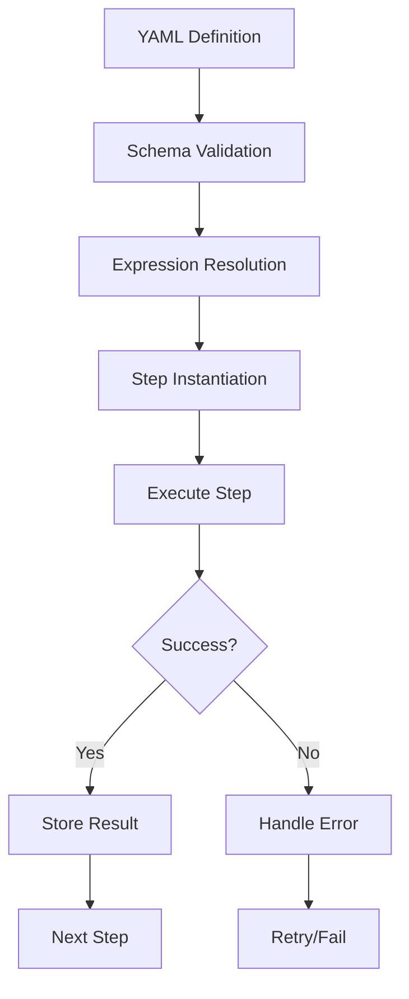
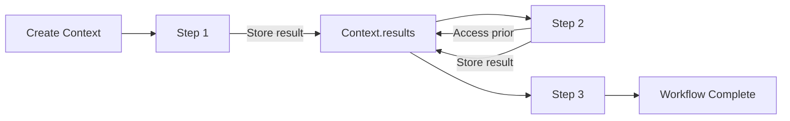
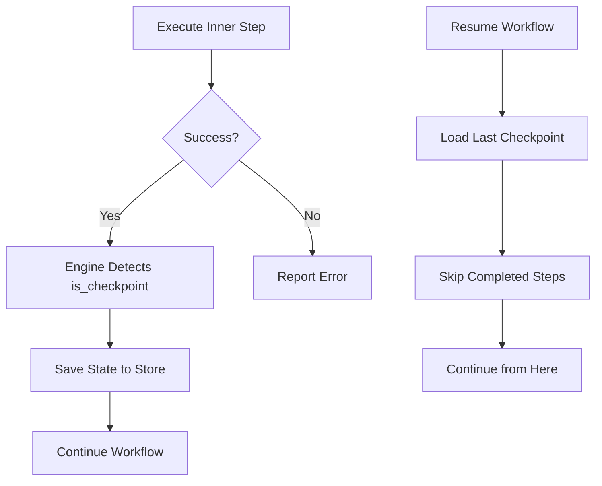

# 14. Step Execution Framework

<div class="text-lg text-secondary mt-4">
From workflow definitions to running code
</div>

<div class="mt-8 flex justify-center gap-6 text-sm">
  <div class="flex items-center gap-2">
    <span class="w-2 h-2 rounded-full bg-teal"></span>
    <span class="text-muted">11 Slides</span>
  </div>
  <div class="flex items-center gap-2">
    <span class="w-2 h-2 rounded-full bg-brass"></span>
    <span class="text-muted">Step Handlers</span>
  </div>
  <div class="flex items-center gap-2">
    <span class="w-2 h-2 rounded-full bg-coral"></span>
    <span class="text-muted">Context Threading</span>
  </div>
</div>

<!--
Section 14 covers Maverick's step execution framework - the system that
transforms YAML step definitions into running code.

We'll cover:
1. Step execution overview
2. StepDefinition protocol
3. StepResult and outcomes
4. WorkflowContext threading
5. PythonStep execution
6. AgentStep execution
7. ValidateStep with retry logic
8. BranchStep conditional flow
9. ParallelStep execution
10. CheckpointStep for resumability
11. Building custom step handlers
-->

---
layout: two-cols
---

# 14.1 Step Execution Overview

<div class="pr-4">

<div v-click>

## The Journey from YAML to Code

```yaml
# This declarative YAML...
steps:
  - name: analyze
    type: agent
    agent: code_analyzer
    
  - name: report
    type: python
    action: generate_report
    args:
      - ${{ steps.analyze.output }}
```

</div>

<div v-click class="mt-4">

## ...Becomes Executable Steps

```python
# Resolved to step instances
steps = [
    AgentStep(
        name="analyze",
        agent=code_analyzer_instance,
        context={},
    ),
    PythonStep(
        name="report",
        action=generate_report,
        args=(resolved_output,),
    ),
]
```

</div>

</div>

::right::

<div class="pl-4 mt-8">

<div v-click>

## The Execution Pipeline



</div>

<div v-click class="mt-4 p-3 bg-teal/10 border border-teal/30 rounded-lg text-sm">
  <strong class="text-teal">Key Insight</strong><br>
  Each step type has a dedicated handler class that knows how 
  to execute that specific type of work (Python, Agent, etc.)
</div>

</div>

<!--
The step execution framework bridges the gap between declarative YAML
and imperative Python code. Each step type has a specialized handler
that implements the execute() protocol.
-->

---
layout: two-cols
---

# 14.2 The StepDefinition Protocol

<div class="pr-4">

<div v-click>

## Abstract Base Class

All step types inherit from `StepDefinition`:

```python
@dataclass(frozen=True, slots=True)
class StepDefinition(ABC):
    """Abstract base for step definitions.
    
    Attributes:
        name: Unique step name within workflow.
        step_type: Categorization for reporting.
    """
    name: str
    step_type: StepType

    @abstractmethod
    async def execute(
        self, context: WorkflowContext
    ) -> StepResult:
        """Execute step and return result."""
        ...

    @abstractmethod
    def to_dict(self) -> dict[str, Any]:
        """Serialize for logging/persistence."""
        ...
```

</div>

</div>

::right::

<div class="pl-4 mt-8">

<div v-click>

## Step Types Enum

```python
class StepType(str, Enum):
    """Step type categorization."""
    PYTHON = "python"      # Python callables
    AGENT = "agent"        # AI agents
    GENERATE = "generate"  # Text generation
    VALIDATE = "validate"  # Validation stages
    SUBWORKFLOW = "subworkflow"
    BRANCH = "branch"      # Conditional
    LOOP = "loop"          # Iteration
    CHECKPOINT = "checkpoint"  # Resumability
```

</div>

<div v-click class="mt-4">

## Design Principles

<div class="space-y-2 mt-2 text-sm">
  <div class="flex items-start gap-2">
    <span class="text-teal mt-1">✓</span>
    <span><strong>Frozen</strong>: Immutable after creation</span>
  </div>
  <div class="flex items-start gap-2">
    <span class="text-teal mt-1">✓</span>
    <span><strong>Slotted</strong>: Memory efficient</span>
  </div>
  <div class="flex items-start gap-2">
    <span class="text-teal mt-1">✓</span>
    <span><strong>Async</strong>: Non-blocking execution</span>
  </div>
  <div class="flex items-start gap-2">
    <span class="text-teal mt-1">✓</span>
    <span><strong>Serializable</strong>: to_dict() for logging</span>
  </div>
</div>

</div>

<div v-click class="mt-4 p-3 bg-brass/10 border border-brass/30 rounded-lg text-sm">
  <strong class="text-brass">Location</strong><br>
  <code>src/maverick/dsl/steps/base.py</code>
</div>

</div>

<!--
The StepDefinition protocol ensures all step types have a consistent
interface. The frozen dataclass pattern makes steps safe to pass around
without risk of mutation.
-->

---
layout: two-cols
---

# 14.3 StepResult and Outcomes

<div class="pr-4">

<div v-click>

## The StepResult Dataclass

```python
@dataclass(frozen=True, slots=True)
class StepResult:
    """Result of executing a single step."""
    
    name: str           # Step name
    step_type: StepType # Categorization
    success: bool       # Did it succeed?
    output: Any         # The returned value
    duration_ms: int    # Execution time
    error: str | None = None  # Error message

    def __post_init__(self) -> None:
        """Validate invariants."""
        if self.duration_ms < 0:
            raise ValueError("duration_ms >= 0")
        if not self.success and self.error is None:
            raise ValueError(
                "Failed steps must have error"
            )
```

</div>

</div>

::right::

<div class="pl-4 mt-8">

<div v-click>

## Factory Methods

```python
# Create successful result
result = StepResult.create_success(
    name="my-step",
    step_type=StepType.PYTHON,
    output={"data": "value"},
    duration_ms=150,
)

# Create failed result
result = StepResult.create_failure(
    name="my-step",
    step_type=StepType.PYTHON,
    duration_ms=50,
    error="Connection timeout",
)
```

</div>

<div v-click class="mt-4">

## Invariants Enforced

| Rule | Enforcement |
|------|-------------|
| Duration ≥ 0 | `__post_init__` check |
| Failed → error | `__post_init__` check |
| Immutable | `frozen=True` |
| No slots waste | `slots=True` |

</div>

<div v-click class="mt-4 p-3 bg-coral/10 border border-coral/30 rounded-lg text-sm">
  <strong class="text-coral">Note</strong><br>
  Results are immutable - you can't accidentally change 
  success=False to success=True after creation.
</div>

</div>

<!--
StepResult captures everything we need to know about a step execution:
whether it succeeded, what it returned, how long it took, and any errors.
The factory methods make it easy to create valid results.
-->

---
layout: two-cols
---

# 14.4 WorkflowContext Threading

<div class="pr-4">

<div v-click>

## The WorkflowContext Class

```python
@dataclass
class WorkflowContext:
    """Runtime context for workflow execution."""
    
    inputs: dict[str, Any]       # Workflow inputs
    results: dict[str, StepResult] = field(
        default_factory=dict
    )
    workflow_name: str | None = None
    config: ConfigProtocol | None = None
    iteration_context: dict[str, Any] = field(
        default_factory=dict
    )
    _pending_rollbacks: list[RollbackRegistration] = (
        field(default_factory=list)
    )
```

</div>

<div v-click class="mt-4">

## Accessing Prior Results

```python
# Get step output with default
output = context.get_step_output(
    "analyze", 
    default=None
)

# Direct access
result = context.results["analyze"]
data = result.output["findings"]
```

</div>

</div>

::right::

<div class="pl-4 mt-8">

<div v-click>

## Context Flow Through Workflow



</div>

<div v-click class="mt-4">

## Key Properties

| Property | Purpose |
|----------|---------|
| `inputs` | Workflow arguments (read-only) |
| `results` | Completed step results |
| `iteration_context` | Loop vars (item, index) |
| `config` | Shared services |

</div>

<div v-click class="mt-4 p-3 bg-teal/10 border border-teal/30 rounded-lg text-sm">
  <strong class="text-teal">Data Flow</strong><br>
  Context is passed to each step's <code>execute()</code> method.
  Steps store their results, making them available to 
  subsequent steps.
</div>

</div>

<!--
WorkflowContext is the glue that connects steps together. It starts with
workflow inputs and accumulates step results as execution progresses.
The iteration_context is used for loop variables.
-->

---
layout: two-cols
---

# 14.5 PythonStep Execution

<div class="pr-4">

<div v-click>

## What PythonStep Does

Executes arbitrary Python callables:

```python
@dataclass(frozen=True, slots=True)
class PythonStep(StepDefinition):
    """Step that executes a Python callable."""
    
    name: str
    action: Callable[..., Any]  # The function
    args: tuple[Any, ...] = ()
    kwargs: dict[str, Any] = field(
        default_factory=dict
    )
    step_type: StepType = field(
        default=StepType.PYTHON, init=False
    )
```

</div>

<div v-click class="mt-4">

## Example Usage

```python
def parse_tasks(content: str) -> list[str]:
    return content.strip().split("\n")

step = PythonStep(
    name="parse_tasks",
    action=parse_tasks,
    args=("task1\ntask2\ntask3",)
)
```

</div>

</div>

::right::

<div class="pl-4 mt-8">

<div v-click>

## The Execute Method

```python {all|3-4|6-10|12-15|all}
async def execute(
    self, context: WorkflowContext
) -> StepResult:
    start_time = time.perf_counter()
    
    try:
        # Handle sync vs async callables
        if inspect.iscoroutinefunction(self.action):
            result = await self.action(
                *self.args, **self.kwargs
            )
        else:
            # Offload to thread (don't block!)
            result = await asyncio.to_thread(
                self.action, *self.args, **self.kwargs
            )
        
        duration_ms = int(
            (time.perf_counter() - start_time) * 1000
        )
        return StepResult.create_success(...)
        
    except Exception as e:
        return StepResult.create_failure(...)
```

</div>

<div v-click class="mt-3 p-3 bg-brass/10 border border-brass/30 rounded-lg text-sm">
  <strong class="text-brass">Async Safety</strong><br>
  Sync functions are automatically offloaded to threads 
  via <code>asyncio.to_thread()</code> to avoid blocking.
</div>

</div>

<!--
PythonStep is the workhorse for executing arbitrary Python code.
The key insight is handling both sync and async callables properly -
sync functions must be offloaded to threads to avoid blocking.
-->

---
layout: two-cols
---

# 14.6 AgentStep Execution

<div class="pr-4">

<div v-click>

## What AgentStep Does

Invokes AI agents with dynamic context:

```python
@dataclass(frozen=True, slots=True)
class AgentStep(StepDefinition):
    """Step that invokes a MaverickAgent."""
    
    name: str
    agent: AgentProtocol
    context: dict[str, Any] | ContextBuilder
    step_type: StepType = field(
        default=StepType.AGENT, init=False
    )
```

</div>

<div v-click class="mt-4">

## The AgentProtocol

```python
class AgentProtocol(Protocol):
    """Any class with async execute()."""
    
    async def execute(
        self, context: dict[str, Any]
    ) -> Any:
        """Execute agent with context."""
        ...
```

<div class="text-sm text-muted mt-2">
Structural typing - no inheritance required
</div>

</div>

</div>

::right::

<div class="pl-4 mt-8">

<div v-click>

## Static vs Dynamic Context

```python
# Static context - simple dict
step = AgentStep(
    name="review",
    agent=code_reviewer,
    context={"files": ["main.py"]},
)

# Dynamic context - built at runtime
async def build_ctx(wf_ctx: WorkflowContext):
    files = wf_ctx.results["find"].output
    return {"files": files}

step = AgentStep(
    name="review",
    agent=code_reviewer,
    context=build_ctx,  # Callable!
)
```

</div>

<div v-click class="mt-4">

## Context Resolution

```python
async def _resolve_context(
    self, workflow_context: WorkflowContext
) -> dict[str, Any]:
    """Return static dict or call builder."""
    if callable(self.context):
        return await self.context(workflow_context)
    return self.context
```

</div>

<div v-click class="mt-3 p-3 bg-coral/10 border border-coral/30 rounded-lg text-sm">
  <strong class="text-coral">Error Separation</strong><br>
  Context builder failures and agent execution failures 
  are reported differently for clear debugging.
</div>

</div>

<!--
AgentStep is how workflows invoke AI agents. The context builder pattern
allows dynamic construction of agent inputs based on prior step outputs.
This enables sophisticated data flow between steps and agents.
-->

---
layout: two-cols
---

# 14.7 ValidateStep with Retry

<div class="pr-4">

<div v-click>

## What ValidateStep Does

Runs validation stages with configurable retry:

```python
@dataclass(frozen=True, slots=True)
class ValidateStep(StepDefinition):
    name: str
    stages: list[str] | str | None = None
    retry: int = 2  # Default retries
    on_failure: StepDefinition | None = None
    step_type: StepType = field(
        default=StepType.VALIDATE, init=False
    )
```

</div>

<div v-click class="mt-4">

## YAML Example

```yaml
- name: validate
  type: validate
  stages: [format, lint, test]
  retry: 3
  on_failure:
    name: auto_fix
    type: python
    action: run_formatter
```

</div>

</div>

::right::

<div class="pl-4 mt-8">

<div v-click>

## The Retry Loop

```python {all|1-2|4-8|10-15|17-19|all}
async def execute(self, context):
    retries_remaining = self.retry
    
    while True:
        # Run validation
        result = await context.config\
            .run_validation_stages(stages)
        
        if result.success:
            return StepResult.create_success(...)
        
        # Validation failed - retry?
        if retries_remaining <= 0:
            break
            
        # Run on_failure step (auto-fix)
        if self.on_failure is not None:
            await self.on_failure.execute(context)
            
        retries_remaining -= 1
    
    # All retries exhausted
    return StepResult.create_failure(
        error=f"Failed after {self.retry} retries"
    )
```

</div>

<div v-click class="mt-3 p-3 bg-teal/10 border border-teal/30 rounded-lg text-sm">
  <strong class="text-teal">Auto-Fix Pattern</strong><br>
  The <code>on_failure</code> step can run a formatter or 
  fixer before retrying validation.
</div>

</div>

<!--
ValidateStep is a sophisticated step type that implements retry logic
with optional auto-fix on failure. This is key for the agent-driven
development workflow where validation might need multiple attempts.
-->

---
layout: two-cols
---

# 14.8 BranchStep Conditional Flow

<div class="pr-4">

<div v-click>

## What BranchStep Does

Evaluates predicates and executes first match:

```python
@dataclass(frozen=True, slots=True)
class BranchOption:
    """Single branch option."""
    predicate: Predicate  # () -> bool
    step: StepDefinition   # Step to run

@dataclass(frozen=True, slots=True)
class BranchStep(StepDefinition):
    name: str
    options: tuple[BranchOption, ...]
    step_type: StepType = field(
        init=False, default=StepType.BRANCH
    )
```

</div>

<div v-click class="mt-4">

## Example: Fast vs Thorough

```python
step = BranchStep(
    name="choose_mode",
    options=(
        BranchOption(
            predicate=lambda ctx: ctx.inputs["quick"],
            step=fast_analysis,
        ),
        BranchOption(
            predicate=lambda ctx: True,  # Default
            step=thorough_analysis,
        ),
    ),
)
```

</div>

</div>

::right::

<div class="pl-4 mt-8">

<div v-click>

## Execution Logic

```python {all|3-6|8-16|18-22|all}
async def execute(self, context):
    for i, option in enumerate(self.options):
        try:
            # Evaluate predicate (sync or async)
            result = option.predicate(context)
            if asyncio.iscoroutine(result):
                result = await result
            
            if result:
                # Execute matching step
                inner = await option.step.execute(
                    context
                )
                return StepResult(
                    output=BranchResult(
                        selected_index=i,
                        selected_step_name=option.step.name,
                        inner_output=inner.output,
                    ),
                    ...
                )
        except Exception:
            continue  # Try next option
    
    # No match → fail (FR-008)
    return StepResult.create_failure(
        error="No branch predicate matched"
    )
```

</div>

<div v-click class="mt-3 p-3 bg-coral/10 border border-coral/30 rounded-lg text-sm">
  <strong class="text-coral">Fail-Fast</strong><br>
  If no predicate matches, the workflow fails. Always 
  include a default branch (<code>lambda: True</code>).
</div>

</div>

<!--
BranchStep implements conditional execution - evaluating predicates
in order and running the first matching step. This enables dynamic
workflow behavior based on inputs or prior step outputs.
-->

---
layout: two-cols
---

# 14.9 ParallelStep Execution

<div class="pr-4">

<div v-click>

## What ParallelStep Does

Executes multiple child steps:

```python
@dataclass(frozen=True, slots=True)
class ParallelStep(StepDefinition):
    """Step that executes multiple steps."""
    
    name: str
    step_type: StepType  # PARALLEL
    children: tuple[StepDefinition, ...]

    def __post_init__(self) -> None:
        """Validate unique child names."""
        names = [c.name for c in self.children]
        if len(names) != len(set(names)):
            raise ValueError("Duplicate names")
```

</div>

<div v-click class="mt-4">

## Current Implementation

Sequential execution (concurrent coming):

```python
async def execute(self, context):
    child_results = []
    for child in self.children:
        result = await child.execute(context)
        child_results.append(result)
        context.results[child.name] = result
        if not result.success:
            break  # Fail fast
    
    return StepResult(
        output=ParallelResult(
            child_results=tuple(child_results)
        ),
        ...
    )
```

</div>

</div>

::right::

<div class="pl-4 mt-8">

<div v-click>

## Future: True Parallelism

```python
# Concurrent execution (planned)
async def execute_concurrent(self, context):
    tasks = [
        asyncio.create_task(
            child.execute(context)
        )
        for child in self.children
    ]
    
    results = await asyncio.gather(
        *tasks, 
        return_exceptions=True
    )
    
    # Process results...
```

</div>

<div v-click class="mt-4">

## The ParallelResult

```python
@dataclass(frozen=True, slots=True)
class ParallelResult:
    """Output from parallel execution."""
    child_results: tuple[StepResult, ...]
    
    @property
    def all_succeeded(self) -> bool:
        return all(r.success for r in self.child_results)
```

</div>

<div v-click class="mt-3 p-3 bg-brass/10 border border-brass/30 rounded-lg text-sm">
  <strong class="text-brass">Design Note</strong><br>
  Sequential now, parallel later. The interface is 
  ready for concurrent execution when implemented.
</div>

</div>

<!--
ParallelStep currently runs steps sequentially but has an interface
designed for future concurrent execution. The key constraint is that
child step names must be unique for result storage.
-->

---
layout: two-cols
---

# 14.10 CheckpointStep Resumability

<div class="pr-4">

<div v-click>

## What CheckpointStep Does

Marks steps as checkpoint boundaries:

```python
@dataclass(frozen=True, slots=True)
class CheckpointStep(StepDefinition):
    """Wrapper for checkpoint boundaries."""
    
    inner: StepDefinition
    is_checkpoint: bool = True
    name: str = field(init=False)
    step_type: StepType = field(init=False)

    def __post_init__(self) -> None:
        """Derive from inner step."""
        object.__setattr__(
            self, "name", self.inner.name
        )
        object.__setattr__(
            self, "step_type", self.inner.step_type
        )
```

</div>

<div v-click class="mt-4">

## YAML Example

```yaml
- name: expensive_operation
  type: checkpoint  # Wrapper type
  step:
    name: expensive_operation
    type: agent
    agent: code_generator
```

</div>

</div>

::right::

<div class="pl-4 mt-8">

<div v-click>

## Execution is Pass-Through

```python
async def execute(
    self, context: WorkflowContext
) -> StepResult:
    """Execute inner step.
    
    Checkpoint save is handled by engine,
    not this step.
    """
    return await self.inner.execute(context)
```

</div>

<div v-click class="mt-4">

## How Checkpoints Work



</div>

<div v-click class="mt-3 p-3 bg-teal/10 border border-teal/30 rounded-lg text-sm">
  <strong class="text-teal">Separation of Concerns</strong><br>
  CheckpointStep marks boundaries; the workflow engine 
  handles persistence and resume logic.
</div>

</div>

<!--
CheckpointStep is a wrapper that marks a step as a checkpoint boundary.
The actual checkpointing logic lives in the workflow engine, not in the
step itself - following the separation of concerns principle.
-->

---
layout: two-cols
---

# 14.11 Building Custom Step Handlers

<div class="pr-4">

<div v-click>

## Step 1: Define Your Step Class

```python
from dataclasses import dataclass, field
from maverick.dsl.steps.base import StepDefinition
from maverick.dsl.types import StepType

@dataclass(frozen=True, slots=True)
class NotifyStep(StepDefinition):
    """Step that sends notifications."""
    
    name: str
    channel: str  # slack, email, etc.
    message: str
    step_type: StepType = field(
        default=StepType.PYTHON,  # Or new type
        init=False
    )
```

</div>

<div v-click class="mt-4">

## Step 2: Implement execute()

```python
async def execute(
    self, context: WorkflowContext
) -> StepResult:
    start = time.perf_counter()
    try:
        await send_notification(
            self.channel, self.message
        )
        return StepResult.create_success(...)
    except Exception as e:
        return StepResult.create_failure(...)
```

</div>

</div>

::right::

<div class="pl-4 mt-8">

<div v-click>

## Step 3: Implement to_dict()

```python
def to_dict(self) -> dict[str, Any]:
    """Serialize for logging."""
    return {
        "name": self.name,
        "step_type": self.step_type.value,
        "channel": self.channel,
        "message": self.message[:50] + "...",
    }
```

</div>

<div v-click class="mt-4">

## Checklist

<div class="space-y-2 mt-2 text-sm">
  <div class="flex items-start gap-2">
    <span class="text-teal mt-1">☐</span>
    <span>Inherit from <code>StepDefinition</code></span>
  </div>
  <div class="flex items-start gap-2">
    <span class="text-teal mt-1">☐</span>
    <span>Use <code>@dataclass(frozen=True, slots=True)</code></span>
  </div>
  <div class="flex items-start gap-2">
    <span class="text-teal mt-1">☐</span>
    <span>Implement async <code>execute()</code></span>
  </div>
  <div class="flex items-start gap-2">
    <span class="text-teal mt-1">☐</span>
    <span>Return <code>StepResult</code> (always!)</span>
  </div>
  <div class="flex items-start gap-2">
    <span class="text-teal mt-1">☐</span>
    <span>Implement <code>to_dict()</code></span>
  </div>
  <div class="flex items-start gap-2">
    <span class="text-teal mt-1">☐</span>
    <span>Use <code>asyncio.to_thread()</code> for sync I/O</span>
  </div>
  <div class="flex items-start gap-2">
    <span class="text-teal mt-1">☐</span>
    <span>Handle exceptions → create_failure()</span>
  </div>
</div>

</div>

<div v-click class="mt-4 p-3 bg-coral/10 border border-coral/30 rounded-lg text-sm">
  <strong class="text-coral">Testing</strong><br>
  Create unit tests with mock contexts. See 
  <code>tests/unit/dsl/steps/</code> for examples.
</div>

</div>

<!--
Building custom step handlers is straightforward - follow the protocol,
handle errors properly, and always return a StepResult. The frozen
dataclass pattern ensures your steps are safe and efficient.
-->

---
layout: center
class: text-center
---

# Step Execution Recap

<div class="grid grid-cols-3 gap-4 max-w-4xl mx-auto mt-8">
  <div v-click class="feature-card p-4">
    <span class="text-3xl">📋</span>
    <h3 class="font-semibold mt-2">Protocol</h3>
    <p class="text-sm text-muted mt-1">
      StepDefinition ABC with execute() and to_dict()
    </p>
  </div>
  <div v-click class="feature-card p-4">
    <span class="text-3xl">📊</span>
    <h3 class="font-semibold mt-2">Results</h3>
    <p class="text-sm text-muted mt-1">
      Immutable StepResult with success, output, timing
    </p>
  </div>
  <div v-click class="feature-card p-4">
    <span class="text-3xl">🔄</span>
    <h3 class="font-semibold mt-2">Context</h3>
    <p class="text-sm text-muted mt-1">
      WorkflowContext threads data between steps
    </p>
  </div>
  <div v-click class="feature-card p-4">
    <span class="text-3xl">🐍</span>
    <h3 class="font-semibold mt-2">Python</h3>
    <p class="text-sm text-muted mt-1">
      Sync/async callables with thread offloading
    </p>
  </div>
  <div v-click class="feature-card p-4">
    <span class="text-3xl">🤖</span>
    <h3 class="font-semibold mt-2">Agent</h3>
    <p class="text-sm text-muted mt-1">
      AI execution with static/dynamic context
    </p>
  </div>
  <div v-click class="feature-card p-4">
    <span class="text-3xl">✅</span>
    <h3 class="font-semibold mt-2">Validate</h3>
    <p class="text-sm text-muted mt-1">
      Retry logic with auto-fix on_failure
    </p>
  </div>
</div>

<div v-click class="mt-8 text-muted">
  <strong>Key Files:</strong> 
  <code>src/maverick/dsl/steps/</code>, 
  <code>src/maverick/dsl/results.py</code>,
  <code>src/maverick/dsl/context.py</code>
</div>

<!--
The step execution framework is the engine room of Maverick. Each step type
has specialized execution logic, but they all follow the same protocol
and produce consistent results. This uniformity enables the workflow
engine to orchestrate complex multi-step workflows reliably.

Next: Learn about agents that power the AI-driven steps!
-->
