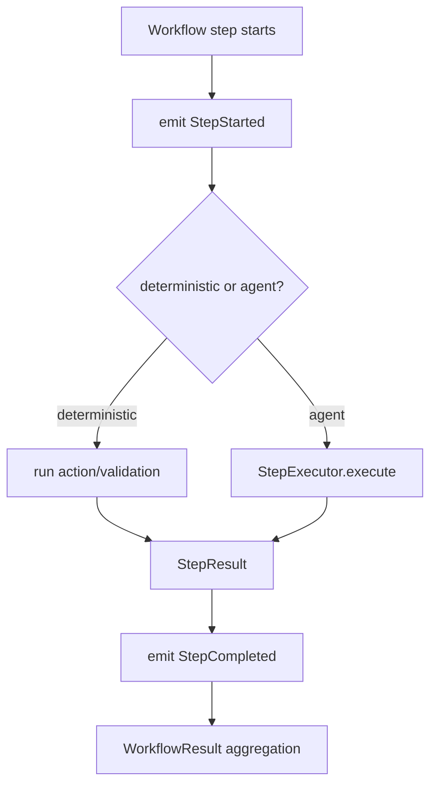

# 14. Step Execution & Event Model

<div class="text-lg text-secondary mt-4">
From workflow decisions to typed results and live progress events
</div>

<div class="mt-8 flex justify-center gap-6 text-sm">
  <div class="flex items-center gap-2">
    <span class="w-2 h-2 rounded-full bg-teal"></span>
    <span class="text-muted">6 Slides</span>
  </div>
  <div class="flex items-center gap-2">
    <span class="w-2 h-2 rounded-full bg-brass"></span>
    <span class="text-muted">Step Types</span>
  </div>
  <div class="flex items-center gap-2">
    <span class="w-2 h-2 rounded-full bg-coral"></span>
    <span class="text-muted">Streaming Events</span>
  </div>
</div>

---
layout: two-cols
---

# 14.1 StepExecutor Protocol

<div class="pr-4">

```python
@runtime_checkable
class StepExecutor(Protocol):
    async def execute(
        self,
        *,
        step_name: str,
        agent_name: str,
        prompt: Any,
        instructions: str | None = None,
        allowed_tools: list[str] | None = None,
        cwd: Path | None = None,
        output_schema: type[BaseModel] | None = None,
        config: StepConfig | None = None,
        event_callback: EventCallback | None = None,
    ) -> ExecutorResult: ...
```

</div>

::right::

<div class="pl-4 mt-8 text-sm">

## Why this protocol matters

- workflows depend on an abstraction, not one provider SDK
- prompts can be rich Python objects at the boundary
- streaming is standardized with an <code>event_callback</code>
- output validation is consistent across executor implementations

</div>

---
layout: two-cols
---

# 14.2 Step Types and Modes

<div class="pr-4">

```python
class StepType(str, Enum):
    PYTHON = "python"
    AGENT = "agent"
    GENERATE = "generate"
    VALIDATE = "validate"
    SUBWORKFLOW = "subworkflow"
    BRANCH = "branch"
    LOOP = "loop"
    CHECKPOINT = "checkpoint"
```

</div>

::right::

<div class="pl-4 mt-6 text-sm">

```python
class StepMode(str, Enum):
    DETERMINISTIC = "deterministic"
    AGENT = "agent"
```

<div v-click class="mt-4">

```python
class AutonomyLevel(str, Enum):
    OPERATOR = "operator"
    COLLABORATOR = "collaborator"
    CONSULTANT = "consultant"
    APPROVER = "approver"
```

</div>

</div>

---
layout: two-cols
---

# 14.3 StepResult and WorkflowResult

<div class="pr-4">

```python
@dataclass(frozen=True)
class StepResult:
    name: str
    step_type: StepType
    success: bool
    output: Any
    duration_ms: int
    error: str | None = None
```

</div>

::right::

<div class="pl-4 mt-8">

```python
@dataclass(frozen=True)
class WorkflowResult:
    workflow_name: str
    success: bool
    step_results: tuple[StepResult, ...]
    total_duration_ms: int
    final_output: Any
```

<div v-click class="mt-4 text-sm text-muted">
  Workflows aggregate step outcomes into a final typed result after the event stream drains.
</div>

</div>

---
layout: default
---

# 14.4 Progress Events

<div class="grid grid-cols-2 gap-6 mt-4 text-sm">
  <div>
    <ul class="space-y-2">
      <li><code>WorkflowStarted</code></li>
      <li><code>WorkflowCompleted</code></li>
      <li><code>StepStarted</code></li>
      <li><code>StepCompleted</code></li>
      <li><code>StepOutput</code></li>
    </ul>
  </div>
  <div>
    <ul class="space-y-2">
      <li><code>AgentStreamChunk</code></li>
      <li><code>CheckpointSaved</code></li>
      <li><code>RollbackStarted</code> / <code>RollbackCompleted</code></li>
      <li>Preflight event family</li>
      <li>Validation and loop progress events</li>
    </ul>
  </div>
</div>

<div class="mt-6 p-3 bg-teal/10 border border-teal/30 rounded-lg text-sm text-center">
  All events are frozen dataclasses that the CLI and TUI can render in real time.
</div>

---
layout: two-cols
---

# 14.5 End-to-End Flow

<div class="pr-4">


```mermaid {scale: 0.64}
flowchart TD
    A[Workflow step starts] --> B[emit StepStarted]
    B --> C{deterministic or agent?}
    C -->|deterministic| D[run action/validation]
    C -->|agent| E[StepExecutor.execute]
    D --> F[StepResult]
    E --> F
    F --> G[emit StepCompleted]
    G --> H[WorkflowResult aggregation]
```

</div>

::right::

<div class="pl-4 mt-8 text-sm">

## Operational benefit

The event stream is the canonical UI contract.

- CLI renders human-readable progress
- TUI renders a unified stream
- session logs can serialize the same events

</div>
