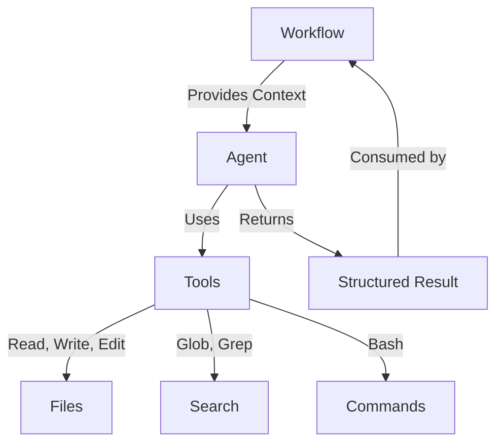
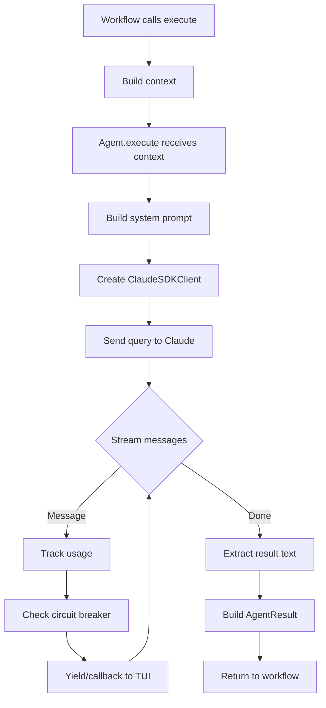

# 15. Agent Architecture

<div class="text-lg text-secondary mt-4">
AI agents as autonomous workers with typed contracts
</div>

<div class="mt-8 flex justify-center gap-6 text-sm">
  <div class="flex items-center gap-2">
    <span class="w-2 h-2 rounded-full bg-teal"></span>
    <span class="text-muted">10 Slides</span>
  </div>
  <div class="flex items-center gap-2">
    <span class="w-2 h-2 rounded-full bg-brass"></span>
    <span class="text-muted">Generic Types</span>
  </div>
  <div class="flex items-center gap-2">
    <span class="w-2 h-2 rounded-full bg-coral"></span>
    <span class="text-muted">Claude Agent SDK</span>
  </div>
</div>

<!--
Section 15 covers Maverick's agent architecture - how AI agents are
structured to provide judgment while workflows handle execution.

We'll cover:
1. What is a Maverick Agent?
2. MaverickAgent base class
3. Context types
4. Result types
5. System prompts
6. Tool selection (principle of least privilege)
7. Built-in tools
8. Agent registry
9. Streaming output
10. Agent execution flow
-->

---

## layout: two-cols

# 15.1 What is a Maverick Agent?

<div class="pr-4">

<div v-click>

## Agents Provide Judgment

Agents are **autonomous AI workers** that make decisions:

<div class="space-y-2 mt-3 text-sm">
  <div class="flex items-start gap-2">
    <span class="text-teal mt-1">✓</span>
    <span><strong>Analyze</strong>: Read code, understand context</span>
  </div>
  <div class="flex items-start gap-2">
    <span class="text-teal mt-1">✓</span>
    <span><strong>Decide</strong>: Determine what changes to make</span>
  </div>
  <div class="flex items-start gap-2">
    <span class="text-teal mt-1">✓</span>
    <span><strong>Execute</strong>: Use tools to implement changes</span>
  </div>
</div>

</div>

<div v-click class="mt-4">

## Separation of Concerns

| Component     | Responsibility                |
| ------------- | ----------------------------- |
| **Agents**    | HOW to do a task (judgment)   |
| **Workflows** | WHAT and WHEN (orchestration) |
| **Tools**     | Capabilities agents can use   |

</div>

<div v-click class="mt-4 p-3 bg-coral/10 border border-coral/30 rounded-lg text-sm">
  <strong class="text-coral">Key Principle</strong><br>
  Agents provide judgment only—no deterministic side effects.
  Workflows own git commits, validation, retries, checkpointing.
</div>

</div>

::right::

<div class="pl-4 mt-8">

<div v-click>

## The Agent Mental Model



</div>

<div v-click class="mt-4">

## Maverick Agent Types

| Agent               | Purpose                 |
| ------------------- | ----------------------- |
| `CodeReviewerAgent` | Analyze code for issues |
| `ImplementerAgent`  | Write code from tasks   |
| `FixerAgent`        | Fix validation errors   |
| `IssueFixerAgent`   | Resolve GitHub issues   |

</div>

<div v-click class="mt-4 p-3 bg-teal/10 border border-teal/30 rounded-lg text-sm">
  <strong class="text-teal">Location</strong><br>
  <code>src/maverick/agents/</code>
</div>

</div>

<!--
Maverick agents wrap Claude Agent SDK interactions. Each agent knows HOW to
do a specific task, while workflows know WHEN to invoke them. This separation
ensures deterministic behavior (git commits, validation) stays in workflows.
-->

---

## layout: two-cols

# 15.2 MaverickAgent Base Class

<div class="pr-4">

<div v-click>

## Generic Type Parameters

```python
from typing import Generic, TypeVar

# Context is contravariant (input)
TContext = TypeVar("TContext", contravariant=True)

# Result is covariant (output)
TResult = TypeVar("TResult", covariant=True)


class MaverickAgent(ABC, Generic[TContext, TResult]):
    """Abstract base for all Maverick agents.

    Type Parameters:
        TContext: Input context type
        TResult: Output result type
    """
```

</div>

<div v-click class="mt-4">

## Why Generics?

<div class="space-y-2 text-sm">
  <div class="flex items-start gap-2">
    <span class="text-teal mt-1">✓</span>
    <span><strong>Type Safety</strong>: Compiler catches mismatched contexts</span>
  </div>
  <div class="flex items-start gap-2">
    <span class="text-teal mt-1">✓</span>
    <span><strong>LSP Compliance</strong>: No Liskov Substitution violations</span>
  </div>
  <div class="flex items-start gap-2">
    <span class="text-teal mt-1">✓</span>
    <span><strong>IDE Support</strong>: Autocomplete for context/result</span>
  </div>
</div>

</div>

</div>

::right::

<div class="pl-4 mt-8">

<div v-click>

## Constructor Signature

```python
def __init__(
    self,
    name: str,
    system_prompt: str,
    allowed_tools: list[str],
    model: str | None = None,
    mcp_servers: dict[str, Any] | None = None,
    max_tokens: int | None = None,
    temperature: float | None = None,
) -> None:
    """Initialize the MaverickAgent.

    Args:
        name: Unique identifier
        system_prompt: Behavior definition
        allowed_tools: Validated tool list
        model: Claude model ID
        mcp_servers: Custom MCP tools
        max_tokens: Output limit
        temperature: Sampling temperature
    """
```

</div>

<div v-click class="mt-4">

## Abstract Method

```python
@abstractmethod
async def execute(
    self, context: TContext
) -> TResult:
    """Execute the agent task.

    Subclasses implement this method.
    """
    ...
```

</div>

</div>

<!--
MaverickAgent is a generic ABC parameterized by context and result types.
This ensures type safety - you can't accidentally pass a ReviewContext to
an ImplementerAgent. The abstract execute() method must be implemented
by all concrete agents.
-->

---

## layout: two-cols

# 15.3 Context Types

<div class="pr-4">

<div v-click>

## AgentContext: The Base Context

```python
@dataclass(frozen=True, slots=True)
class AgentContext:
    """Runtime context for agent execution.

    Attributes:
        cwd: Working directory
        branch: Current git branch
        config: Application config
        extra: Agent-specific data
    """

    cwd: Path
    branch: str
    config: MaverickConfig
    extra: dict[str, Any] = field(
        default_factory=dict
    )
```

</div>

<div v-click class="mt-4">

## Factory Method

```python
# Create from current directory
context = AgentContext.from_cwd(
    Path.cwd(),
    config=my_config,
    extra={"file_path": "src/main.py"},
)
# Automatically detects git branch!
```

</div>

</div>

::right::

<div class="pl-4 mt-8">

<div v-click>

## Specialized Context Types

Different agents need different context:

```python
# For code review
@dataclass(frozen=True)
class ReviewContext:
    diff: str           # Code diff to review
    file_paths: list[str]
    branch: str
    instructions: str | None

# For task implementation
@dataclass(frozen=True)
class ImplementerContext:
    task_file: Path     # Path to tasks.md
    phase: int          # Current phase
    cwd: Path
    branch: str
```

</div>

<div v-click class="mt-4">

## Design Principles

| Principle   | Enforcement           |
| ----------- | --------------------- |
| Immutable   | `frozen=True`         |
| Memory Safe | `slots=True`          |
| Validated   | `__post_init__` check |
| Typed       | Full type hints       |

</div>

<div v-click class="mt-3 p-3 bg-brass/10 border border-brass/30 rounded-lg text-sm">
  <strong class="text-brass">Type Safety</strong><br>
  Each agent type has its own context dataclass,
  ensuring you pass the right data to each agent.
</div>

</div>

<!--
Context types are frozen dataclasses that carry all the information an
agent needs to do its job. The base AgentContext works for generic agents,
while specialized contexts like ReviewContext carry domain-specific data.
-->

---

## layout: two-cols

# 15.4 Result Types

<div class="pr-4">

<div v-click>

## AgentUsage: Tracking Consumption

```python
@dataclass(frozen=True, slots=True)
class AgentUsage:
    """Usage statistics for agent execution."""

    input_tokens: int
    output_tokens: int
    total_cost_usd: float | None
    duration_ms: int

    @property
    def total_tokens(self) -> int:
        return self.input_tokens + self.output_tokens

    def __post_init__(self) -> None:
        # Validate non-negative values
        if self.input_tokens < 0:
            raise ValueError("...")
```

</div>

<div v-click class="mt-4">

## Why Track Usage?

<div class="space-y-2 text-sm">
  <div class="flex items-start gap-2">
    <span class="text-teal mt-1">$</span>
    <span><strong>Cost Control</strong>: Monitor API spend</span>
  </div>
  <div class="flex items-start gap-2">
    <span class="text-teal mt-1">⏱</span>
    <span><strong>Performance</strong>: Identify slow agents</span>
  </div>
  <div class="flex items-start gap-2">
    <span class="text-teal mt-1">📊</span>
    <span><strong>Metrics</strong>: Aggregate for reporting</span>
  </div>
</div>

</div>

</div>

::right::

<div class="pl-4 mt-8">

<div v-click>

## AgentResult: Execution Outcome

```python
@dataclass(frozen=True, slots=True)
class AgentResult:
    """Structured result from execution."""

    success: bool
    output: str
    usage: AgentUsage
    metadata: dict[str, Any] = field(
        default_factory=dict
    )
    errors: list[AgentError] = field(
        default_factory=list
    )
```

</div>

<div v-click class="mt-4">

## Factory Methods

```python
# Success case
result = AgentResult.success_result(
    output="Analysis complete",
    usage=usage,
    metadata={"session_id": "abc123"},
)

# Failure case
result = AgentResult.failure_result(
    errors=[AgentError("Timeout")],
    usage=usage,
)
```

</div>

<div v-click class="mt-3 p-3 bg-coral/10 border border-coral/30 rounded-lg text-sm">
  <strong class="text-coral">Invariant</strong><br>
  Failed results <strong>must</strong> have at least one error.
  Enforced in <code>__post_init__</code>.
</div>

</div>

<!--
Result types capture everything about an agent execution: success/failure,
text output, usage statistics, metadata, and errors. Factory methods
ensure valid states - you can't create a failed result without an error.
-->

---

## layout: two-cols

# 15.5 System Prompts

<div class="pr-4">

<div v-click>

## What System Prompts Do

System prompts define agent behavior:

<div class="space-y-2 mt-3 text-sm">
  <div class="flex items-start gap-2">
    <span class="text-brass mt-1">🎯</span>
    <span><strong>Role</strong>: Who the agent is</span>
  </div>
  <div class="flex items-start gap-2">
    <span class="text-brass mt-1">📋</span>
    <span><strong>Guidelines</strong>: How to approach tasks</span>
  </div>
  <div class="flex items-start gap-2">
    <span class="text-brass mt-1">🔧</span>
    <span><strong>Tool Usage</strong>: When to use which tools</span>
  </div>
  <div class="flex items-start gap-2">
    <span class="text-brass mt-1">📝</span>
    <span><strong>Output Format</strong>: Structure of responses</span>
  </div>
</div>

</div>

<div v-click class="mt-4">

## Example: Reviewer Prompt

```python
REVIEWER_SYSTEM_PROMPT = """
You are an expert code reviewer.

Guidelines:
- Focus on correctness, security, performance
- Cite specific line numbers
- Provide actionable suggestions
- Use Read, Glob, Grep tools

Output Format:
Return findings as structured JSON:
{
  "findings": [...],
  "severity": "low|medium|high",
  "summary": "..."
}
"""
```

</div>

</div>

::right::

<div class="pl-4 mt-8">

<div v-click>

## Dynamic Prompt Building

```python
class ImplementerAgent(MaverickAgent):
    def __init__(self, config: AgentConfig):
        # Build prompt dynamically
        prompt = self._build_system_prompt(config)
        super().__init__(
            name="implementer",
            system_prompt=prompt,
            allowed_tools=list(IMPLEMENTER_TOOLS),
        )

    def _build_system_prompt(
        self, config: AgentConfig
    ) -> str:
        """Build prompt from config."""
        base = IMPLEMENTER_BASE_PROMPT
        if config.tdd_mode:
            base += TDD_GUIDELINES
        if config.conventional_commits:
            base += COMMIT_FORMAT_GUIDE
        return base
```

</div>

<div v-click class="mt-4 p-3 bg-teal/10 border border-teal/30 rounded-lg text-sm">
  <strong class="text-teal">Best Practice</strong><br>
  Keep prompts in separate modules (<code>skill_prompts.py</code>)
  for easy iteration and A/B testing.
</div>

<div v-click class="mt-3 p-3 bg-coral/10 border border-coral/30 rounded-lg text-sm">
  <strong class="text-coral">Location</strong><br>
  <code>src/maverick/agents/skill_prompts.py</code>
</div>

</div>

<!--
System prompts are the heart of agent behavior. They tell Claude what role
to play, how to approach tasks, and what format to use for output. Well-crafted
prompts are essential for reliable agent behavior.
-->

---

## layout: two-cols

# 15.6 Tool Selection

<div class="pr-4">

<div v-click>

## Principle of Least Privilege

Agents only get tools they **need**:

```python
# Read-only for reviewers
REVIEWER_TOOLS: frozenset[str] = frozenset({
    "Read", "Glob", "Grep"
})

# Code modification for implementers
IMPLEMENTER_TOOLS: frozenset[str] = frozenset({
    "Read", "Write", "Edit",
    "Glob", "Grep", "Task"
})

# Minimal for targeted fixes
FIXER_TOOLS: frozenset[str] = frozenset({
    "Read", "Write", "Edit"
})

# Empty for generators
GENERATOR_TOOLS: frozenset[str] = frozenset()
```

</div>

<div v-click class="mt-4 p-3 bg-coral/10 border border-coral/30 rounded-lg text-sm">
  <strong class="text-coral">Why Frozensets?</strong><br>
  Immutable at runtime—can't accidentally add "Bash" 
  to REVIEWER_TOOLS during execution.
</div>

</div>

::right::

<div class="pl-4 mt-8">

<div v-click>

## Tool Validation at Construction

```python {all|8-10|12-16}
def __init__(
    self,
    name: str,
    system_prompt: str,
    allowed_tools: list[str],
    mcp_servers: dict[str, Any] | None = None,
):
    # Validate ALL tools at construction
    self._validate_tools(
        allowed_tools, mcp_servers or {}
    )

def _validate_tools(self, tools, mcp_servers):
    for tool in tools:
        if tool not in BUILTIN_TOOLS:
            # Check MCP tools...
            if not is_mcp_tool:
                raise InvalidToolError(tool)
```

</div>

<div v-click class="mt-4">

## Composing Tool Sets

```python
# Union: Combine tool sets
enhanced = FIXER_TOOLS | REVIEWER_TOOLS
# Result: {Read, Write, Edit, Glob, Grep}

# Intersection: Common tools
common = FIXER_TOOLS & REVIEWER_TOOLS
# Result: {Read}

# Use in agent
agent = CustomAgent(
    allowed_tools=list(enhanced)
)
```

</div>

</div>

<!--
Tool selection follows the principle of least privilege. Reviewers can't
write files. Generators can't read files. This limits the blast radius
of misbehaving agents and ensures predictable behavior.
-->

---

## layout: two-cols

# 15.7 Built-in Tools

<div class="pr-4">

<div v-click>

## The BUILTIN_TOOLS Constant

```python
BUILTIN_TOOLS: frozenset[str] = frozenset({
    "Read",         # Read file contents
    "Write",        # Create/overwrite files
    "Edit",         # Surgical file edits
    "Bash",         # Execute commands
    "Glob",         # Find files by pattern
    "Grep",         # Search file contents
    "NotebookEdit", # Jupyter notebooks
    "WebFetch",     # Fetch web content
    "WebSearch",    # Search the web
    "TodoWrite",    # Manage todos
    "Task",         # Spawn subagents
    "ExitPlanMode", # Exit planning mode
})
```

</div>

<div v-click class="mt-4">

## Tool Categories

| Category  | Tools                   |
| --------- | ----------------------- |
| File I/O  | Read, Write, Edit       |
| Search    | Glob, Grep              |
| Execution | Bash, Task              |
| Web       | WebFetch, WebSearch     |
| Special   | NotebookEdit, TodoWrite |

</div>

</div>

::right::

<div class="pl-4 mt-8">

<div v-click>

## Tool Capabilities

<div class="text-sm space-y-3">

**Read**: Access file contents

```plaintext
Read("src/main.py") → file contents
```

**Write**: Create or replace files

```plaintext
Write("new.py", "print('hello')") → file created
```

**Edit**: Surgical changes

```plaintext
Edit("main.py", old="foo", new="bar") → patched
```

**Glob**: Find files

```plaintext
Glob("**/*.py") → list of Python files
```

**Grep**: Search contents

```plaintext
Grep("TODO", "src/") → matching lines
```

</div>

</div>

<div v-click class="mt-4 p-3 bg-brass/10 border border-brass/30 rounded-lg text-sm">
  <strong class="text-brass">Note</strong><br>
  These are Claude Agent SDK built-in tools.
  Custom tools are added via MCP servers.
</div>

</div>

<!--
Built-in tools come from the Claude Agent SDK. They provide core capabilities
like file I/O, search, and command execution. Custom tools can be added via
MCP servers for domain-specific functionality.
-->

---

## layout: two-cols

# 15.8 Agent Registry

<div class="pr-4">

<div v-click>

## The AgentRegistry Class

```python
class AgentRegistry:
    """Registry for discovering agents."""

    def __init__(self) -> None:
        self._agents: dict[str, type] = {}

    def register(
        self,
        name: str,
        cls: type | None = None,
    ):
        """Register an agent class.

        Can be decorator or direct call.
        """
        if cls is None:
            # Decorator: @registry.register("name")
            def decorator(agent_cls):
                self._register_impl(name, agent_cls)
                return agent_cls
            return decorator
        else:
            # Direct: registry.register("name", Cls)
            self._register_impl(name, cls)
            return cls
```

</div>

</div>

::right::

<div class="pl-4 mt-8">

<div v-click>

## Usage Patterns

```python
# Decorator registration
@registry.register("code_reviewer")
class CodeReviewerAgent(MaverickAgent):
    ...

# Direct registration
registry.register("fixer", FixerAgent)

# Lookup agent class
agent_cls = registry.get("code_reviewer")

# Instantiate with config
agent = registry.create(
    "code_reviewer",
    mcp_servers={...}
)

# List all registered
names = registry.list_agents()
# ['code_reviewer', 'fixer', 'implementer']
```

</div>

<div v-click class="mt-4">

## Module-Level Singleton

```python
# Global registry instance
registry = AgentRegistry()

# Convenience decorator
@register("greeter")  # Uses global registry
class GreeterAgent(MaverickAgent):
    ...
```

</div>

<div v-click class="mt-3 p-3 bg-teal/10 border border-teal/30 rounded-lg text-sm">
  <strong class="text-teal">Location</strong><br>
  <code>src/maverick/agents/registry.py</code>
</div>

</div>

<!--
The AgentRegistry provides a centralized way to discover and instantiate
agents. Agents register themselves at import time, and workflows can
look them up by name. This enables dynamic agent selection in YAML workflows.
-->

---

## layout: two-cols

# 15.9 Streaming Output

<div class="pr-4">

<div v-click>

## The StreamCallback Type

```python
from typing import Callable, Coroutine, Any

# Async callback for streaming chunks
StreamCallback = Callable[
    [str],                      # Text chunk
    Coroutine[Any, Any, None]   # Async return
]
```

</div>

<div v-click class="mt-4">

## Setting Up Streaming

```python
class MaverickAgent:
    @property
    def stream_callback(self) -> StreamCallback | None:
        return self._stream_callback

    @stream_callback.setter
    def stream_callback(
        self, callback: StreamCallback | None
    ) -> None:
        self._stream_callback = callback
```

```python
# In workflow code
async def stream_to_tui(chunk: str) -> None:
    await tui.write(chunk)

agent.stream_callback = stream_to_tui
result = await agent.execute(context)
```

</div>

</div>

::right::

<div class="pl-4 mt-8">

<div v-click>

## The query() Method

```python {all|4|7-9|11-12}
async def query(
    self, prompt: str, cwd: Path | None = None
) -> AsyncIterator[Message]:
    """Stream messages from Claude."""

    async with ClaudeSDKClient(options) as client:
        await client.query(prompt)
        async for message in client.receive_response():
            # Track for circuit breaker
            message_count += 1

            # Yield to caller
            yield message
```

</div>

<div v-click class="mt-4">

## Real-Time Output Flow

```mermaid {scale: 0.55}
flowchart LR
    A[Claude API] -->|Stream| B[SDK Client]
    B -->|Message| C[query()]
    C -->|Yield| D[execute()]
    D -->|Callback| E[TUI Display]
```

</div>

<div v-click class="mt-3 p-3 bg-brass/10 border border-brass/30 rounded-lg text-sm">
  <strong class="text-brass">SDK Option</strong><br>
  <code>include_partial_messages=True</code> enables
  token-by-token streaming for real-time display.
</div>

</div>

<!--
Streaming enables real-time display of agent output in the TUI. The
stream_callback property accepts an async function that receives text
chunks. The query() method yields messages as they arrive from Claude.
-->

---

## layout: two-cols

# 15.10 Agent Execution Flow

<div class="pr-4">

<div v-click>

## The Complete Lifecycle



</div>

</div>

::right::

<div class="pl-4 mt-8">

<div v-click>

## Circuit Breaker Protection

```python
MAX_SAME_TOOL_CALLS: int = 15
MAX_TOTAL_MESSAGES: int = 100

def _check_circuit_breaker(
    self,
    tool_call_counts: dict[str, int],
    message_count: int,
) -> None:
    """Detect infinite loops."""

    for tool, count in tool_call_counts.items():
        if count >= MAX_SAME_TOOL_CALLS:
            raise CircuitBreakerError(
                tool_name=tool,
                call_count=count,
            )

    if message_count >= MAX_TOTAL_MESSAGES:
        raise CircuitBreakerError(...)
```

</div>

<div v-click class="mt-4 p-3 bg-coral/10 border border-coral/30 rounded-lg text-sm">
  <strong class="text-coral">Safety Valve</strong><br>
  Circuit breaker stops runaway agents that get stuck
  calling the same tool repeatedly.
</div>

<div v-click class="mt-3 p-3 bg-teal/10 border border-teal/30 rounded-lg text-sm">
  <strong class="text-teal">Error Wrapping</strong><br>
  SDK errors are mapped to Maverick's error hierarchy
  via <code>_wrap_sdk_error()</code>.
</div>

</div>

<!--
The execution flow shows how agents process requests end-to-end. Key safety
features include the circuit breaker (stops infinite loops) and error wrapping
(maps SDK errors to Maverick exceptions). Usage tracking enables cost monitoring.
-->

---

layout: center
class: text-center

---

# Agent Architecture Summary

<div class="grid grid-cols-3 gap-6 mt-8 text-sm">
  <div class="p-4 bg-teal/10 border border-teal/30 rounded-lg">
    <div class="text-teal font-bold mb-2">Type-Safe Design</div>
    <div>Generic base class with typed context and result parameters</div>
  </div>
  <div class="p-4 bg-brass/10 border border-brass/30 rounded-lg">
    <div class="text-brass font-bold mb-2">Least Privilege</div>
    <div>Tool sets are immutable frozensets, validated at construction</div>
  </div>
  <div class="p-4 bg-coral/10 border border-coral/30 rounded-lg">
    <div class="text-coral font-bold mb-2">Built-in Safety</div>
    <div>Circuit breaker and error wrapping protect against runaway agents</div>
  </div>
</div>

<div class="mt-8 text-muted">

**Next: Section 16 - The ImplementerAgent**

Deep dive into the agent that writes code from task files

</div>

<!--
Agents are the AI-powered workers in Maverick. They're type-safe, follow
least privilege for tool access, and have built-in safety mechanisms.
Next, we'll look at the ImplementerAgent - the workhorse for code generation.
-->
