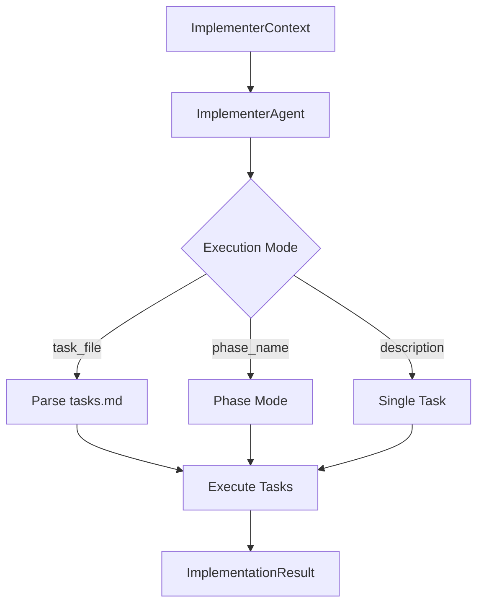

# 16. The ImplementerAgent

<div class="text-lg text-secondary mt-4">
The agent that writes code from structured task files
</div>

<div class="mt-8 flex justify-center gap-6 text-sm">
  <div class="flex items-center gap-2">
    <span class="w-2 h-2 rounded-full bg-teal"></span>
    <span class="text-muted">9 Slides</span>
  </div>
  <div class="flex items-center gap-2">
    <span class="w-2 h-2 rounded-full bg-brass"></span>
    <span class="text-muted">TDD Approach</span>
  </div>
  <div class="flex items-center gap-2">
    <span class="w-2 h-2 rounded-full bg-coral"></span>
    <span class="text-muted">Task Execution</span>
  </div>
</div>

<!--
Section 16 covers the ImplementerAgent - the workhorse agent that translates
structured task files into actual code changes.

We'll cover:
1. ImplementerAgent overview
2. Task file format (tasks.md)
3. Phase-based execution
4. ImplementerContext
5. System prompt design
6. Task execution loop
7. File change detection
8. ImplementationResult
9. Conventional commits integration
-->

---
layout: two-cols
---

# 16.1 ImplementerAgent Overview

<div class="pr-4">

<div v-click>

## The Code-Writing Agent

The `ImplementerAgent` is Maverick's **primary code-producing agent**:

<div class="space-y-2 mt-3 text-sm">
  <div class="flex items-start gap-2">
    <span class="text-teal mt-1">📝</span>
    <span><strong>Reads</strong>: Task files with structured requirements</span>
  </div>
  <div class="flex items-start gap-2">
    <span class="text-teal mt-1">🔧</span>
    <span><strong>Writes</strong>: Source code and test files</span>
  </div>
  <div class="flex items-start gap-2">
    <span class="text-teal mt-1">✅</span>
    <span><strong>Follows</strong>: TDD methodology</span>
  </div>
  <div class="flex items-start gap-2">
    <span class="text-teal mt-1">🔄</span>
    <span><strong>Marks</strong>: Task completion in the file</span>
  </div>
</div>

</div>

<div v-click class="mt-4">

## Key Responsibilities

| Task                  | Owner                 |
| --------------------- | --------------------- |
| Reading requirements  | ImplementerAgent      |
| Writing code          | ImplementerAgent      |
| Creating tests        | ImplementerAgent      |
| Git commits           | **Workflow** (not agent) |
| Validation execution  | **Workflow** (not agent) |
| Branch management     | **Workflow** (not agent) |

</div>

</div>

::right::

<div class="pl-4 mt-8">

<div v-click>

## Type Signature

```python
class ImplementerAgent(
    MaverickAgent[
        ImplementerContext,
        ImplementationResult
    ]
):
    """Agent for executing structured task files.

    Type Parameters:
        Context: ImplementerContext
        Result: ImplementationResult
    """
```

</div>

<div v-click class="mt-4">

## Execution Flow



</div>

<div v-click class="mt-4 p-3 bg-teal/10 border border-teal/30 rounded-lg text-sm">
  <strong class="text-teal">Location</strong><br>
  <code>src/maverick/agents/implementer.py</code>
</div>

</div>

<!--
The ImplementerAgent is a specialized MaverickAgent with typed context (ImplementerContext)
and result (ImplementationResult). It handles three execution modes: full task file,
single phase, or single task description. Critically, it focuses ONLY on writing code -
the workflow layer handles all git operations, validation, and commits.
-->

---
layout: two-cols
---

# 16.2 Task File Format

<div class="pr-4">

<div v-click>

## The `tasks.md` Structure

Task files use a markdown format with phases:

```markdown
# Project: Feature Implementation

## Phase 1: Core Setup

- [ ] T001 Create directory structure
- [ ] T002 [P] Initialize config module
- [ ] T003 [P] Add logging setup

## Phase 2: Implementation

- [ ] T004 Implement main logic
- [ ] T005 Add error handling

## Phase 3: Testing

- [ ] T006 Write unit tests
- [ ] T007 Add integration tests
```

</div>

<div v-click class="mt-3 p-3 bg-brass/10 border border-brass/30 rounded-lg text-sm">
  <strong class="text-brass">Markers</strong><br>
  <code>[ ]</code> = pending, <code>[x]</code> = complete,
  <code>[P]</code> = parallelizable
</div>

</div>

::right::

<div class="pl-4 mt-8">

<div v-click>

## Task ID Format

```python
class Task(BaseModel):
    id: str = Field(
        pattern=r"T\d{3,}",
        description="Task ID format T###"
    )
    description: str
    status: TaskStatus
    parallel: bool = False
    phase: str | None = None
    dependencies: list[str] = []
```

</div>

<div v-click class="mt-4">

## Task Parsing

```python
# TaskFile parses the markdown
task_file = TaskFile.parse(Path("tasks.md"))

# Access parsed data
pending = task_file.pending_tasks
completed = task_file.completed_tasks
phases = task_file.phases  # dict[str, list[Task]]

# Check parallelizable batch
batch = task_file.get_parallel_batch()
# Returns: [T002, T003] (marked with [P])
```

</div>

<div v-click class="mt-4">

## TaskStatus Enum

```python
class TaskStatus(str, Enum):
    PENDING = "pending"      # [ ]
    IN_PROGRESS = "in_progress"
    COMPLETED = "completed"  # [x]
    FAILED = "failed"
    SKIPPED = "skipped"
```

</div>

</div>

<!--
Task files (tasks.md) are the primary input to the ImplementerAgent. They use
a structured markdown format with phases, task IDs, and parallel markers.
The TaskFile class parses this format into strongly-typed Task objects with
status tracking and dependency management.
-->

---
layout: two-cols
---

# 16.3 Phase-Based Execution

<div class="pr-4">

<div v-click>

## Why Phases?

<div class="space-y-2 text-sm">
  <div class="flex items-start gap-2">
    <span class="text-brass mt-1">📊</span>
    <span><strong>Logical Grouping</strong>: Related tasks together</span>
  </div>
  <div class="flex items-start gap-2">
    <span class="text-brass mt-1">🔄</span>
    <span><strong>Sequential Flow</strong>: Setup → Implement → Test</span>
  </div>
  <div class="flex items-start gap-2">
    <span class="text-brass mt-1">📍</span>
    <span><strong>Resumption Points</strong>: Checkpoint between phases</span>
  </div>
  <div class="flex items-start gap-2">
    <span class="text-brass mt-1">⚡</span>
    <span><strong>Parallelization</strong>: Within-phase concurrency</span>
  </div>
</div>

</div>

<div v-click class="mt-4">

## Two Execution Modes

| Mode            | Description                              |
| --------------- | ---------------------------------------- |
| **Task Mode**   | Maverick batches parallel tasks          |
| **Phase Mode**  | Claude handles all tasks in one phase    |

</div>

<div v-click class="mt-4">

## Task Mode Flow

```python
# Maverick controls parallelization
while remaining_tasks:
    batch = get_parallel_batch(remaining_tasks)
    if batch:
        # asyncio.gather for [P] tasks
        results = await execute_parallel(batch)
    else:
        # Sequential execution
        result = await execute_single(task)
```

</div>

</div>

::right::

<div class="pl-4 mt-8">

<div v-click>

## Phase Mode Flow

```python {all|6-7|9-10|12-17}
async def _execute_phase_mode(
    self, context: ImplementerContext
) -> ImplementationResult:
    """Let Claude handle entire phase."""
    
    # Build phase-specific prompt
    prompt = self._build_phase_prompt(context)
    
    # Claude reads tasks.md, finds phase
    # Claude decides how to parallelize [P] tasks
    
    # Single agent invocation for whole phase
    async for msg in self.query(prompt, cwd=context.cwd):
        messages.append(msg)
        if self.stream_callback:
            text = extract_streaming_text(msg)
            await self.stream_callback(text)
```

</div>

<div v-click class="mt-4 p-3 bg-teal/10 border border-teal/30 rounded-lg text-sm">
  <strong class="text-teal">When to Use Phase Mode?</strong><br>
  When you want Claude to decide parallelization within
  a phase using subagents (<code>Task</code> tool).
</div>

<div v-click class="mt-3 p-3 bg-coral/10 border border-coral/30 rounded-lg text-sm">
  <strong class="text-coral">When to Use Task Mode?</strong><br>
  When you want Maverick to control parallel batching
  via <code>asyncio.gather()</code>.
</div>

</div>

<!--
Phases group related tasks for logical execution flow. The ImplementerAgent
supports two modes: Task Mode where Maverick explicitly batches parallel
tasks using asyncio.gather(), and Phase Mode where a single Claude invocation
handles all tasks in a phase (Claude decides how to use subagents for [P] tasks).
-->

---
layout: two-cols
---

# 16.4 ImplementerContext

<div class="pr-4">

<div v-click>

## Context Fields

```python
class ImplementerContext(BaseModel):
    """Input context for ImplementerAgent."""
    
    # Task source (exactly one required)
    task_file: Path | None = None
    task_description: str | None = None
    
    # Optional phase filter
    phase_name: str | None = None
    
    # Execution environment
    branch: str          # Git branch
    cwd: Path            # Working directory
    
    # Options
    skip_validation: bool = False
    dry_run: bool = False
```

</div>

<div v-click class="mt-4">

## Validation Rules

```python
@model_validator(mode="after")
def validate_task_source(self) -> Self:
    """Ensure exactly one task source."""
    if self.task_file and self.task_description:
        raise ValueError("Provide one, not both")
    if not self.task_file and not self.task_description:
        raise ValueError("Must provide task source")
    if self.phase_name and self.task_description:
        raise ValueError("phase_name requires task_file")
    return self
```

</div>

</div>

::right::

<div class="pl-4 mt-8">

<div v-click>

## Property Helpers

```python
@property
def is_single_task(self) -> bool:
    """Check if executing single task."""
    return self.task_description is not None

@property
def is_phase_mode(self) -> bool:
    """Check if executing in phase mode."""
    return (
        self.phase_name is not None 
        and self.task_file is not None
    )
```

</div>

<div v-click class="mt-4">

## Usage Examples

```python
# Full task file execution
context = ImplementerContext(
    task_file=Path("specs/004/tasks.md"),
    branch="feature/implement"
)

# Single phase execution
context = ImplementerContext(
    task_file=Path("specs/004/tasks.md"),
    phase_name="Phase 1: Core Setup",
    branch="feature/implement"
)

# Single task (no file)
context = ImplementerContext(
    task_description="Add logging to main.py",
    branch="fix/logging",
    dry_run=True
)
```

</div>

</div>

<!--
ImplementerContext is a Pydantic model that carries all the information
the agent needs: task source (file OR description), optional phase filter,
git branch, working directory, and execution flags. The model validator
ensures exactly one task source is provided.
-->

---
layout: two-cols
---

# 16.5 System Prompt Design

<div class="pr-4">

<div v-click>

## Core Prompt Structure

```python
IMPLEMENTER_SYSTEM_PROMPT_TEMPLATE = """
You are an expert software engineer.
You focus on methodical, test-driven 
implementation.

$skill_guidance

## Your Role
You implement tasks by writing code.
The orchestration layer handles:
- Git operations (commits are automatic)
- Validation execution
- Branch management

## Core Approach
1. Understand the task fully
2. Write tests for EVERY source file
3. Follow project conventions (CLAUDE.md)
4. Make small, incremental changes
5. Ensure code is ready for validation
"""
```

</div>

<div v-click class="mt-3 p-3 bg-coral/10 border border-coral/30 rounded-lg text-sm">
  <strong class="text-coral">Critical Rule</strong><br>
  Every source file MUST have a corresponding test file.
  Tests are not optional or deferrable.
</div>

</div>

::right::

<div class="pl-4 mt-8">

<div v-click>

## Dynamic Prompt Rendering

```python
def __init__(self, project_type: str | None = None):
    # Render prompt with skill guidance
    system_prompt = render_prompt(
        IMPLEMENTER_SYSTEM_PROMPT_TEMPLATE,
        project_type=project_type,
    )
    
    super().__init__(
        name="implementer",
        system_prompt=system_prompt,
        allowed_tools=list(IMPLEMENTER_TOOLS),
    )
```

</div>

<div v-click class="mt-4">

## Available Tools

```python
IMPLEMENTER_TOOLS: frozenset[str] = frozenset({
    "Read",   # Read file contents
    "Write",  # Create/overwrite files
    "Edit",   # Surgical file edits
    "Glob",   # Find files by pattern
    "Grep",   # Search file contents
    "Task",   # Spawn subagents
})
```

</div>

<div v-click class="mt-3 p-3 bg-brass/10 border border-brass/30 rounded-lg text-sm">
  <strong class="text-brass">No Bash!</strong><br>
  The ImplementerAgent cannot run shell commands.
  All execution is via Write/Edit tools only.
</div>

</div>

<!--
The system prompt establishes TDD methodology as mandatory. Every source file
requires tests - this is non-negotiable. The prompt is rendered with skill
guidance specific to the project type. Notice the tools don't include Bash -
the agent writes code but can't run arbitrary commands.
-->

---
layout: two-cols
---

# 16.6 Task Execution Loop

<div class="pr-4">

<div v-click>

## Main Execution Flow

```python {all|4-5|7-10|12-16|18-22}
async def _execute_task_mode(
    self, context: ImplementerContext
) -> ImplementationResult:
    # Parse tasks from file or description
    task_file = TaskFile.parse(context.task_file)
    
    remaining_tasks = list(task_file.pending_tasks)
    while remaining_tasks:
        # Check for parallelizable batch
        batch = self._get_parallel_batch(remaining_tasks)
        
        if batch:
            # Execute parallel batch concurrently
            results = await self._execute_parallel_batch(
                batch, context
            )
        else:
            # Execute single sequential task
            task = remaining_tasks.pop(0)
            result = await self._execute_single_task(
                task, context
            )
```

</div>

</div>

::right::

<div class="pl-4 mt-8">

<div v-click>

## Single Task Execution

```python
async def _execute_single_task(
    self, task: Task, context: ImplementerContext
) -> TaskResult:
    start_time = time.monotonic()
    
    # Build prompt for Claude
    prompt = self._build_task_prompt(task, context)
    
    # Execute via Claude SDK with streaming
    async for msg in self.query(prompt, cwd=context.cwd):
        if self.stream_callback:
            text = extract_streaming_text(msg)
            await self.stream_callback(text)
    
    # Detect file changes after execution
    files_changed = await detect_file_changes(context.cwd)
    
    return TaskResult(
        task_id=task.id,
        status=TaskStatus.COMPLETED,
        files_changed=files_changed,
        tests_added=[f for f in files_changed 
                     if "test" in f.file_path.lower()],
        duration_ms=int((time.monotonic() - start_time) * 1000),
    )
```

</div>

<div v-click class="mt-3 p-3 bg-teal/10 border border-teal/30 rounded-lg text-sm">
  <strong class="text-teal">Streaming</strong><br>
  Real-time output via <code>stream_callback</code> keeps
  the TUI updated during long executions.
</div>

</div>

<!--
The task execution loop processes tasks in order, batching parallelizable
tasks when possible. Each task is sent to Claude via query(), with streaming
output captured for the TUI. After Claude completes, file changes are detected
from the working directory.
-->

---
layout: two-cols
---

# 16.7 File Change Detection

<div class="pr-4">

<div v-click>

## Tracking What Changed

```python
from maverick.agents.utils import detect_file_changes

# After Claude finishes writing code
files_changed = await detect_file_changes(context.cwd)

# Returns list of FileChange objects
for change in files_changed:
    print(f"{change.file_path}: "
          f"+{change.lines_added} -{change.lines_removed}")
```

</div>

<div v-click class="mt-4">

## FileChange Model

```python
class FileChange(BaseModel):
    """Record of a single file modification."""
    
    file_path: str = Field(
        description="Path relative to repo root"
    )
    change_type: ChangeType = Field(
        default=ChangeType.MODIFIED
    )
    lines_added: int = Field(default=0, ge=0)
    lines_removed: int = Field(default=0, ge=0)
    old_path: str | None = None  # For renames
    
    @property
    def net_lines(self) -> int:
        return self.lines_added - self.lines_removed
```

</div>

</div>

::right::

<div class="pl-4 mt-8">

<div v-click>

## ChangeType Enum

```python
class ChangeType(str, Enum):
    """Type of file change."""
    
    ADDED = "added"       # New file created
    MODIFIED = "modified" # Existing file changed
    DELETED = "deleted"   # File removed
    RENAMED = "renamed"   # File moved/renamed
```

</div>

<div v-click class="mt-4">

## Detection via Git

```python
async def detect_file_changes(cwd: Path) -> list[FileChange]:
    """Detect file changes using git diff."""
    
    # Use git diff to find changed files
    # Parse diff output into FileChange objects
    # Works for staged and unstaged changes
    
    # Returns detailed change information:
    # - Which files changed
    # - Lines added/removed per file
    # - Change type (add/modify/delete/rename)
```

</div>

<div v-click class="mt-4 p-3 bg-brass/10 border border-brass/30 rounded-lg text-sm">
  <strong class="text-brass">Why Git-Based?</strong><br>
  Using <code>git diff</code> gives accurate line counts
  and handles renames, binary files, and edge cases.
</div>

</div>

<!--
After Claude writes code, we need to know exactly what changed. The
detect_file_changes() function uses git diff to identify all modifications
with accurate line counts. This data feeds into ImplementationResult and
helps workflows decide what to commit.
-->

---
layout: two-cols
---

# 16.8 ImplementationResult

<div class="pr-4">

<div v-click>

## Result Structure

```python
class ImplementationResult(BaseModel):
    """Aggregate result of task file execution."""
    
    success: bool
    tasks_completed: int
    tasks_failed: int
    tasks_skipped: int
    
    task_results: list[TaskResult]
    files_changed: list[FileChange]
    commits: list[str]
    
    validation_passed: bool
    output: str  # Raw output for debugging
    metadata: dict[str, Any]
    errors: list[str]
```

</div>

<div v-click class="mt-4">

## Computed Properties

```python
@property
def total_tasks(self) -> int:
    return (self.tasks_completed 
            + self.tasks_failed 
            + self.tasks_skipped)

@property
def total_lines_changed(self) -> int:
    return sum(c.lines_added + c.lines_removed 
               for c in self.files_changed)
```

</div>

</div>

::right::

<div class="pl-4 mt-8">

<div v-click>

## TaskResult (Per-Task)

```python
class TaskResult(BaseModel):
    """Result of executing a single task."""
    
    task_id: str
    status: TaskStatus
    files_changed: list[FileChange]
    tests_added: list[str]
    commit_sha: str | None
    error: str | None
    duration_ms: int
    validation: list[ValidationResult]
    
    @property
    def succeeded(self) -> bool:
        return self.status == TaskStatus.COMPLETED
```

</div>

<div v-click class="mt-4">

## Summary Generation

```python
def to_summary(self) -> str:
    """Generate human-readable summary."""
    parts = [
        f"{self.tasks_completed}/{self.total_tasks} "
        f"tasks completed"
    ]
    if self.tasks_failed > 0:
        parts.append(f"{self.tasks_failed} failed")
    if self.commits:
        parts.append(f"{len(self.commits)} commits")
    return ", ".join(parts)

# "3/4 tasks completed, 1 failed, 2 commits"
```

</div>

</div>

<!--
ImplementationResult aggregates all task outcomes into a single result.
It includes per-task results (TaskResult), aggregated file changes, and
summary statistics. The workflow layer uses this to decide whether to
proceed with validation and commit.
-->

---
layout: two-cols
---

# 16.9 Conventional Commits

<div class="pr-4">

<div v-click>

## Commit Message Format

Maverick uses [Conventional Commits](https://conventionalcommits.org/):

```
<type>(<scope>): <description>

[optional body]

[optional footer(s)]
```

</div>

<div v-click class="mt-4">

## Common Types

| Type       | Purpose                        |
| ---------- | ------------------------------ |
| `feat`     | New feature                    |
| `fix`      | Bug fix                        |
| `refactor` | Code restructure (no behavior change) |
| `test`     | Adding/updating tests          |
| `docs`     | Documentation changes          |
| `chore`    | Maintenance tasks              |

</div>

<div v-click class="mt-4">

## Example Commits

```bash
feat(auth): add JWT token validation
fix(api): handle null user gracefully
test(auth): add tests for token expiry
refactor(logging): extract logger factory
```

</div>

</div>

::right::

<div class="pl-4 mt-8">

<div v-click>

## Who Creates Commits?

<div class="p-3 bg-coral/10 border border-coral/30 rounded-lg text-sm mb-4">
  <strong class="text-coral">Important</strong><br>
  The <strong>workflow layer</strong> creates commits, NOT the agent.
  The agent focuses only on writing code.
</div>

```python
# In workflow code (not agent)
async def commit_changes(
    result: ImplementationResult,
    message_generator: MessageGenerator,
) -> str:
    """Create commit from agent result."""
    
    # Generate message from diff
    diff = await git.get_diff()
    message = message_generator.generate(diff)
    
    # Create commit
    return await git.commit(message)
```

</div>

<div v-click class="mt-4">

## Integration in System Prompt

```python
# From IMPLEMENTER_SYSTEM_PROMPT_TEMPLATE
"""
Do NOT include a commit_message — 
the orchestration layer generates 
commit messages automatically from 
the diff.
"""
```

</div>

<div v-click class="mt-3 p-3 bg-teal/10 border border-teal/30 rounded-lg text-sm">
  <strong class="text-teal">Separation of Concerns</strong><br>
  Agent = code writing<br>
  Workflow = git operations, commits, PRs
</div>

</div>

<!--
Conventional Commits provide a standardized commit message format that
enables automated changelog generation and semantic versioning. Critically,
commit creation is a workflow responsibility, not an agent responsibility.
The agent's system prompt explicitly tells it NOT to include commit messages.
-->

---
layout: center
class: text-center
---

# Section 16 Summary

<div class="grid grid-cols-3 gap-8 mt-8 text-left max-w-4xl mx-auto">

<div v-click class="p-4 bg-teal/10 border border-teal/30 rounded-lg">
  <div class="text-teal text-2xl mb-2">📝</div>
  <h3 class="font-bold text-lg mb-2">Task File Format</h3>
  <div class="text-sm text-muted space-y-1">
    <div>• Structured <code>tasks.md</code></div>
    <div>• Phases group related tasks</div>
    <div>• <code>[P]</code> marks parallel tasks</div>
    <div>• Checkbox tracking</div>
  </div>
</div>

<div v-click class="p-4 bg-brass/10 border border-brass/30 rounded-lg">
  <div class="text-brass text-2xl mb-2">🔄</div>
  <h3 class="font-bold text-lg mb-2">Execution Modes</h3>
  <div class="text-sm text-muted space-y-1">
    <div>• Task mode: Maverick batches</div>
    <div>• Phase mode: Claude decides</div>
    <div>• Single task: Direct execution</div>
    <div>• Streaming output to TUI</div>
  </div>
</div>

<div v-click class="p-4 bg-coral/10 border border-coral/30 rounded-lg">
  <div class="text-coral text-2xl mb-2">✅</div>
  <h3 class="font-bold text-lg mb-2">TDD by Design</h3>
  <div class="text-sm text-muted space-y-1">
    <div>• Tests are mandatory</div>
    <div>• No Bash access for agent</div>
    <div>• Commits by workflow only</div>
    <div>• Clean separation of concerns</div>
  </div>
</div>

</div>

<div v-click class="mt-10">

```python
# The complete flow
context = ImplementerContext(task_file=Path("tasks.md"), branch="feature/new")
result = await ImplementerAgent().execute(context)
if result.success:
    await workflow.run_validation()
    await workflow.create_commit()
```

</div>

<!--
The ImplementerAgent is Maverick's code-writing workhorse. It reads structured
task files, executes tasks with TDD methodology, and returns detailed results.
Key insight: the agent focuses ONLY on writing code. All git operations,
validation execution, and commit creation are handled by the workflow layer.
-->
