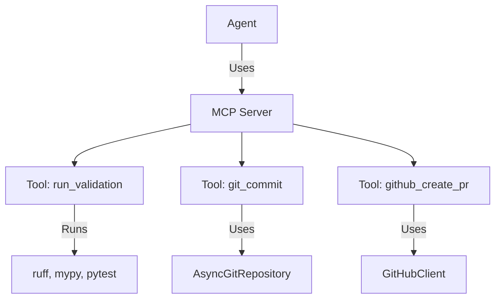

# 17. MCP Tools Layer

<div class="text-lg text-secondary mt-4">
Extending agent capabilities through custom tool servers
</div>

<div class="mt-8 flex justify-center gap-6 text-sm">
  <div class="flex items-center gap-2">
    <span class="w-2 h-2 rounded-full bg-teal"></span>
    <span class="text-muted">9 Slides</span>
  </div>
  <div class="flex items-center gap-2">
    <span class="w-2 h-2 rounded-full bg-brass"></span>
    <span class="text-muted">Validation Tools</span>
  </div>
  <div class="flex items-center gap-2">
    <span class="w-2 h-2 rounded-full bg-coral"></span>
    <span class="text-muted">Git & GitHub</span>
  </div>
</div>

<!--
Section 17 covers Maverick's MCP Tools Layer - how we extend agent
capabilities beyond Claude's built-in tools.

We'll cover:
1. MCP tools in Maverick
2. Tool server architecture
3. Validation tools overview
4. run_validation tool
5. Output parsing patterns
6. Git tools
7. GitHub tools
8. Response patterns
9. Error handling in tools
-->

---
layout: two-cols
---

# 17.1 MCP Tools in Maverick

<div class="pr-4">

<div v-click>

## Why Custom Tools?

Claude's built-in tools cover basics:

<div class="space-y-2 mt-3 text-sm">
  <div class="flex items-start gap-2">
    <span class="text-muted mt-1">✓</span>
    <span>Read, Write, Edit (files)</span>
  </div>
  <div class="flex items-start gap-2">
    <span class="text-muted mt-1">✓</span>
    <span>Glob, Grep (search)</span>
  </div>
  <div class="flex items-start gap-2">
    <span class="text-muted mt-1">✓</span>
    <span>Bash (commands)</span>
  </div>
</div>

But Maverick needs **domain-specific** capabilities:

<div class="space-y-2 mt-3 text-sm">
  <div class="flex items-start gap-2">
    <span class="text-teal mt-1">✓</span>
    <span><strong>Validation</strong>: format, lint, typecheck, test</span>
  </div>
  <div class="flex items-start gap-2">
    <span class="text-teal mt-1">✓</span>
    <span><strong>Git</strong>: commit, push, branch</span>
  </div>
  <div class="flex items-start gap-2">
    <span class="text-teal mt-1">✓</span>
    <span><strong>GitHub</strong>: create PR, list issues</span>
  </div>
</div>

</div>

<div v-click class="mt-4 p-3 bg-coral/10 border border-coral/30 rounded-lg text-sm">
  <strong class="text-coral">No Bash for Agents</strong><br>
  Many Maverick agents don't have Bash access for safety.
  MCP tools provide controlled alternatives.
</div>

</div>

::right::

<div class="pl-4 mt-8">

<div v-click>

## MCP Tool Architecture



</div>

<div v-click class="mt-4">

## Maverick Tool Servers

| Server             | Tools                         |
| ------------------ | ----------------------------- |
| `validation-tools` | run_validation, parse_output  |
| `git-tools`        | commit, push, branch, diff    |
| `github-tools`     | create_pr, list_issues, etc.  |

</div>

<div v-click class="mt-3 p-3 bg-teal/10 border border-teal/30 rounded-lg text-sm">
  <strong class="text-teal">Location</strong><br>
  <code>src/maverick/tools/</code>
</div>

</div>

<!--
MCP (Model Context Protocol) tools extend what agents can do. While Claude
has built-in tools, Maverick adds domain-specific tools for validation,
git operations, and GitHub interactions. This is especially important
for agents that don't have Bash access for safety reasons.
-->

---
layout: two-cols
---

# 17.2 Tool Server Architecture

<div class="pr-4">

<div v-click>

## The Factory Pattern

Every tool server uses a factory function:

```python
from claude_agent_sdk import create_sdk_mcp_server
from claude_agent_sdk.types import McpSdkServerConfig


def create_validation_tools_server(
    config: ValidationConfig | None = None,
    project_root: Path | None = None,
) -> McpSdkServerConfig:
    """Create MCP server with validation tools."""
    
    # Capture config in closure (no globals!)
    _config = config or ValidationConfig()
    
    @tool("run_validation", ...)
    async def run_validation(args):
        # Uses _config from closure
        ...
    
    return create_sdk_mcp_server(
        name="validation-tools",
        version="1.0.0",
        tools=[run_validation, parse_output],
    )
```

</div>

</div>

::right::

<div class="pl-4 mt-8">

<div v-click>

## Using Tool Servers with Agents

```python
from maverick.tools.validation import (
    create_validation_tools_server
)
from maverick.tools.git import (
    create_git_tools_server
)

# Create server instances
validation_server = create_validation_tools_server(
    project_root=Path("/my/project")
)
git_server = create_git_tools_server()

# Pass to agent
agent = MaverickAgent(
    mcp_servers={
        "validation-tools": validation_server,
        "git-tools": git_server,
    },
    allowed_tools=[
        "mcp__validation-tools__run_validation",
        "mcp__git-tools__git_commit",
    ],
)
```

</div>

<div v-click class="mt-4 p-3 bg-brass/10 border border-brass/30 rounded-lg text-sm">
  <strong class="text-brass">Tool Naming</strong><br>
  MCP tools are named: <code>mcp__&lt;server&gt;__&lt;tool&gt;</code><br>
  Example: <code>mcp__git-tools__git_commit</code>
</div>

</div>

<!--
Tool servers are created via factory functions that capture configuration
in closures. This avoids global state and makes testing easier. Servers
are passed to agents via mcp_servers dict, and tools must be explicitly
listed in allowed_tools (principle of least privilege).
-->

---
layout: two-cols
---

# 17.3 Validation Tools Overview

<div class="pr-4">

<div v-click>

## What Validation Covers

```python
VALIDATION_TYPES: set[str] = {
    "format",     # Code formatting (ruff format)
    "lint",       # Linting (ruff check)
    "typecheck",  # Type checking (mypy)
    "test",       # Unit tests (pytest)
    "sync",       # Dependency sync (uv sync)
    "build",      # Alias for typecheck
}
```

</div>

<div v-click class="mt-4">

## Configuration

```python
class ValidationConfig(BaseModel):
    """Configuration for validation commands."""
    
    format_cmd: list[str] = [
        "ruff", "format", "--check", "."
    ]
    lint_cmd: list[str] = [
        "ruff", "check", "."
    ]
    typecheck_cmd: list[str] = [
        "mypy", "src/"
    ]
    test_cmd: list[str] = [
        "pytest", "-x", "--tb=short"
    ]
    timeout_seconds: int = 300
    max_errors: int = 50
```

</div>

</div>

::right::

<div class="pl-4 mt-8">

<div v-click>

## Two Tools Available

| Tool                     | Purpose                       |
| ------------------------ | ----------------------------- |
| `run_validation`         | Execute validation commands   |
| `parse_validation_output`| Parse errors into structured  |

</div>

<div v-click class="mt-4">

## Why Two Tools?

<div class="text-sm space-y-2">
  <div class="flex items-start gap-2">
    <span class="text-brass mt-1">1.</span>
    <span><strong>run_validation</strong> runs commands, returns raw output</span>
  </div>
  <div class="flex items-start gap-2">
    <span class="text-brass mt-1">2.</span>
    <span><strong>parse_validation_output</strong> extracts structured errors</span>
  </div>
</div>

```python
# Agent workflow:
# 1. Run validation
result = run_validation(types=["lint", "typecheck"])

# 2. If failed, parse for details
if not result["success"]:
    for r in result["results"]:
        if not r["success"]:
            errors = parse_validation_output(
                output=r["output"],
                type=r["type"]
            )
```

</div>

<div v-click class="mt-3 p-3 bg-teal/10 border border-teal/30 rounded-lg text-sm">
  <strong class="text-teal">Location</strong><br>
  <code>src/maverick/tools/validation.py</code>
</div>

</div>

<!--
Validation tools wrap project validation commands (ruff, mypy, pytest).
Configuration is via ValidationConfig with sensible defaults. The two-tool
design separates execution (run_validation) from parsing (parse_validation_output),
giving agents flexibility in how they process results.
-->

---
layout: two-cols
---

# 17.4 run_validation Tool

<div class="pr-4">

<div v-click>

## Tool Definition

```python {all|1-3|5-11}
@tool(
    "run_validation",
    "Run project validation commands...",
    {
        "type": "object",
        "properties": {
            "types": {
                "type": "array",
                "items": {"type": "string"},
            },
        },
        "required": ["types"],
    },
)
async def run_validation(args: dict[str, Any]):
    types_to_run = args.get("types", [])
    # ...
```

</div>

<div v-click class="mt-4">

## Example Invocation

```python
# Agent calls the tool
result = await run_validation({
    "types": ["format", "lint", "typecheck"]
})
```

</div>

</div>

::right::

<div class="pl-4 mt-8">

<div v-click>

## Response Structure

```python
{
    "success": False,  # Overall success
    "results": [
        {
            "type": "format",
            "success": True,
            "output": "",
            "duration_ms": 1234,
            "status": "success"
        },
        {
            "type": "lint",
            "success": False,
            "output": "src/main.py:10:5: E501...",
            "duration_ms": 2345,
            "status": "failed"
        },
        {
            "type": "typecheck",
            "success": True,
            "output": "Success: no issues...",
            "duration_ms": 5678,
            "status": "success"
        }
    ]
}
```

</div>

<div v-click class="mt-3 p-3 bg-coral/10 border border-coral/30 rounded-lg text-sm">
  <strong class="text-coral">Status Values</strong><br>
  <code>"success"</code>, <code>"failed"</code>, or <code>"timeout"</code>
</div>

</div>

<!--
run_validation accepts an array of validation types and runs each command
sequentially. Each result includes success/failure, raw output, duration,
and status. The overall success is true only if ALL validations pass.
-->

---
layout: two-cols
---

# 17.5 Output Parsing

<div class="pr-4">

<div v-click>

## Ruff Pattern (Lint)

```python
# Format: path:line:col: code message
RUFF_PATTERN = re.compile(
    r"^(.+):(\d+):(\d+): (\w+) (.+)$",
    re.MULTILINE
)

# Example output:
# src/main.py:10:5: E501 Line too long
# src/util.py:25:1: F401 Unused import
```

</div>

<div v-click class="mt-4">

## Mypy Pattern (Typecheck)

```python
# Format: path:line: severity: message [code]
MYPY_PATTERN = re.compile(
    r"^(.+):(\d+): (error|warning|note): "
    r"(.+?)(?: \[(.+)\])?$",
    re.MULTILINE
)

# Example output:
# src/main.py:15: error: Arg 1 has type... [arg-type]
# src/util.py:30: note: Revealed type is...
```

</div>

</div>

::right::

<div class="pl-4 mt-8">

<div v-click>

## Parsed Error Structure

```python
{
    "errors": [
        {
            "file": "src/main.py",
            "line": 10,
            "column": 5,        # Ruff only
            "code": "E501",
            "message": "Line too long",
            "severity": None    # Mypy only
        },
        {
            "file": "src/util.py",
            "line": 25,
            "column": 1,
            "code": "F401",
            "message": "Unused import 'os'",
            "severity": None
        }
    ],
    "total_count": 2,
    "truncated": False
}
```

</div>

<div v-click class="mt-4 p-3 bg-brass/10 border border-brass/30 rounded-lg text-sm">
  <strong class="text-brass">Truncation</strong><br>
  Results are limited to <code>MAX_ERRORS = 50</code>
  to prevent overwhelming the agent context.
</div>

</div>

<!--
Output parsing uses regex patterns specific to each tool. Ruff output
includes column numbers while Mypy includes severity levels. The parsed
structure gives agents precise location information for fixing errors.
Results are truncated to MAX_ERRORS to keep responses manageable.
-->

---
layout: two-cols
---

# 17.6 Git Tools

<div class="pr-4">

<div v-click>

## Available Tools

```python
# create_git_tools_server() provides:

git_commit        # Create commits
git_push          # Push to remote
git_current_branch # Get current branch
git_diff_stats    # Get diff statistics
git_create_branch # Create new branch
```

</div>

<div v-click class="mt-4">

## git_commit Tool

```python
@tool(
    "git_commit",
    "Create a git commit with conventional format",
    {
        "message": str,   # Required
        "type": str,      # feat, fix, etc.
        "scope": str,     # Optional scope
        "breaking": bool  # Breaking change?
    },
)
async def git_commit(args):
    message = args.get("message")
    commit_type = args.get("type")  # "feat"
    scope = args.get("scope")       # "auth"
    breaking = args.get("breaking") # False
    
    # Format: feat(auth): add login
    formatted = format_commit_message(...)
    
    repo = AsyncGitRepository(_cwd)
    sha = await repo.commit(formatted)
    return success_response({"commit_sha": sha})
```

</div>

</div>

::right::

<div class="pl-4 mt-8">

<div v-click>

## Conventional Commit Types

```python
COMMIT_TYPES: frozenset[str] = frozenset({
    "feat",     # New feature
    "fix",      # Bug fix
    "docs",     # Documentation
    "style",    # Formatting
    "refactor", # Code restructure
    "perf",     # Performance
    "test",     # Adding tests
    "build",    # Build system
    "ci",       # CI config
    "chore",    # Maintenance
    "revert",   # Revert commit
})
```

</div>

<div v-click class="mt-4">

## git_commit Response

```python
# Success
{
    "success": True,
    "commit_sha": "a1b2c3d4e5f6...",
    "message": "feat(auth): add login"
}

# Error
{
    "isError": True,
    "error_code": "NOTHING_TO_COMMIT",
    "message": "No changes to commit"
}
```

</div>

<div v-click class="mt-3 p-3 bg-teal/10 border border-teal/30 rounded-lg text-sm">
  <strong class="text-teal">Location</strong><br>
  <code>src/maverick/tools/git/</code>
</div>

</div>

<!--
Git tools wrap AsyncGitRepository operations for agent use. The git_commit
tool supports conventional commit formatting with type, scope, and breaking
change markers. All git tools use the same response pattern with success
or error formats.
-->

---
layout: two-cols
---

# 17.7 GitHub Tools

<div class="pr-4">

<div v-click>

## Available Tools

```python
# create_github_tools_server() provides:

github_create_pr   # Create pull request
github_list_issues # List repo issues
github_get_issue   # Get issue details
github_get_pr_diff # Get PR diff
github_pr_status   # Check PR status
github_add_labels  # Add issue labels
github_close_issue # Close an issue
```

</div>

<div v-click class="mt-4">

## github_create_pr Tool

```python
@tool(
    "github_create_pr",
    "Create a pull request on GitHub",
    {
        "title": str,
        "body": str,
        "base": str,   # Target branch
        "head": str,   # Source branch
        "draft": bool  # Create as draft?
    },
)
async def github_create_pr(args):
    # Validate inputs
    if not args["title"].strip():
        return error_response(
            "PR title cannot be empty",
            "INVALID_INPUT"
        )
    
    client = _get_client()  # GitHubClient
    pr = await client.create_pr(...)
    return success_response({"pr_number": pr.number})
```

</div>

</div>

::right::

<div class="pl-4 mt-8">

<div v-click>

## github_create_pr Response

```python
# Success
{
    "pr_number": 42,
    "url": "https://github.com/...",
    "state": "open",  # or "draft"
    "title": "feat: add auth module"
}

# Error - branch not found
{
    "isError": True,
    "error_code": "BRANCH_NOT_FOUND",
    "message": "Branch 'feature/x' not found"
}

# Error - auth failure
{
    "isError": True,
    "error_code": "AUTH_ERROR",
    "message": "GitHub CLI not installed..."
}
```

</div>

<div v-click class="mt-4 p-3 bg-coral/10 border border-coral/30 rounded-lg text-sm">
  <strong class="text-coral">Authentication</strong><br>
  Uses <code>gh auth token</code> via GitHubClient.
  No manual token management needed.
</div>

<div v-click class="mt-3 p-3 bg-teal/10 border border-teal/30 rounded-lg text-sm">
  <strong class="text-teal">Location</strong><br>
  <code>src/maverick/tools/github/</code>
</div>

</div>

<!--
GitHub tools wrap PyGithub operations for agent use. They authenticate
via the gh CLI token (no manual token handling). Error responses use
specific error codes like BRANCH_NOT_FOUND and AUTH_ERROR for actionable
feedback to the agent.
-->

---
layout: two-cols
---

# 17.8 Response Patterns

<div class="pr-4">

<div v-click>

## Success Response

```python
def success_response(data: dict[str, Any]) -> dict:
    """Create MCP success response."""
    return {
        "content": [{
            "type": "text",
            "text": json.dumps(data)
        }]
    }

# Usage
return success_response({
    "commit_sha": "abc123",
    "message": "feat: add login",
    "files_changed": 3
})
```

</div>

<div v-click class="mt-4">

## Error Response

```python
def error_response(
    message: str,
    error_code: str,
    retry_after_seconds: int | None = None,
) -> dict:
    """Create MCP error response."""
    error_data = {
        "isError": True,
        "message": message,
        "error_code": error_code,
    }
    if retry_after_seconds:
        error_data["retry_after_seconds"] = retry_after_seconds
    
    return {
        "content": [{
            "type": "text",
            "text": json.dumps(error_data)
        }]
    }
```

</div>

</div>

::right::

<div class="pl-4 mt-8">

<div v-click>

## Why Consistent Patterns?

<div class="space-y-3 text-sm">
  <div class="flex items-start gap-2">
    <span class="text-brass mt-1">✓</span>
    <span><strong>Predictability</strong>: Agents know what to expect</span>
  </div>
  <div class="flex items-start gap-2">
    <span class="text-brass mt-1">✓</span>
    <span><strong>Error Codes</strong>: Machine-readable error handling</span>
  </div>
  <div class="flex items-start gap-2">
    <span class="text-brass mt-1">✓</span>
    <span><strong>Retry Support</strong>: Rate limits handled gracefully</span>
  </div>
  <div class="flex items-start gap-2">
    <span class="text-brass mt-1">✓</span>
    <span><strong>Testing</strong>: Easy to assert on response shape</span>
  </div>
</div>

</div>

<div v-click class="mt-4">

## Standard Error Codes

| Code                 | Meaning                    |
| -------------------- | -------------------------- |
| `INVALID_INPUT`      | Bad arguments              |
| `AUTH_ERROR`         | Authentication failed      |
| `NOT_FOUND`          | Resource doesn't exist     |
| `NOTHING_TO_COMMIT`  | No changes staged          |
| `BRANCH_NOT_FOUND`   | Git branch missing         |
| `RATE_LIMITED`       | Too many requests          |
| `INTERNAL_ERROR`     | Unexpected failure         |

</div>

<div v-click class="mt-3 p-3 bg-teal/10 border border-teal/30 rounded-lg text-sm">
  <strong class="text-teal">Shared Module</strong><br>
  Each tool package has <code>responses.py</code> with these helpers.
</div>

</div>

<!--
Consistent response patterns across all MCP tools make agent development
easier. Success responses contain the data, while error responses include
a machine-readable error_code. Rate limiting is supported via retry_after_seconds.
Each tool package has its own responses.py with these shared helpers.
-->

---
layout: two-cols
---

# 17.9 Error Handling in Tools

<div class="pr-4">

<div v-click>

## Never Raise Exceptions

Tools should **never** raise exceptions to the agent:

```python
async def git_commit(args):
    try:
        # Validate input
        if not message:
            return error_response(
                "Message cannot be empty",
                "INVALID_INPUT"
            )
        
        # Execute operation
        repo = AsyncGitRepository(_cwd)
        sha = await repo.commit(message)
        
        return success_response({"commit_sha": sha})
        
    except NothingToCommitError:
        # Known error - specific code
        return error_response(
            "No changes to commit",
            "NOTHING_TO_COMMIT"
        )
    except Exception as e:
        # Unknown error - log and return
        logger.exception("Unexpected error")
        return error_response(
            str(e),
            "INTERNAL_ERROR"
        )
```

</div>

</div>

::right::

<div class="pl-4 mt-8">

<div v-click>

## Error Handling Checklist

<div class="space-y-2 text-sm">
  <div class="flex items-start gap-2">
    <span class="text-teal mt-1">☐</span>
    <span>Validate all inputs before processing</span>
  </div>
  <div class="flex items-start gap-2">
    <span class="text-teal mt-1">☐</span>
    <span>Use specific error codes for known errors</span>
  </div>
  <div class="flex items-start gap-2">
    <span class="text-teal mt-1">☐</span>
    <span>Log errors with context for debugging</span>
  </div>
  <div class="flex items-start gap-2">
    <span class="text-teal mt-1">☐</span>
    <span>Catch all exceptions (never leak to agent)</span>
  </div>
  <div class="flex items-start gap-2">
    <span class="text-teal mt-1">☐</span>
    <span>Provide actionable error messages</span>
  </div>
</div>

</div>

<div v-click class="mt-4">

## Logging Pattern

```python
# At module level
logger = get_logger(__name__)

# Before operation
logger.info(
    "Creating commit: message='%s', type=%s",
    message[:50], commit_type
)

# On success
logger.info("Commit created: %s", sha[:7])

# On known error
logger.warning("Nothing to commit")

# On unknown error
logger.exception("Unexpected error in git_commit")
```

</div>

<div v-click class="mt-3 p-3 bg-coral/10 border border-coral/30 rounded-lg text-sm">
  <strong class="text-coral">Never Raise!</strong><br>
  Exceptions crash agent execution. Always return
  an error response instead.
</div>

</div>

<!--
Error handling in MCP tools must be robust - exceptions crash agent execution.
Every tool wraps its logic in try/except and returns error_response on failure.
Known errors get specific codes, unknown errors get INTERNAL_ERROR with
logging for debugging. Input validation happens early to fail fast.
-->

---
layout: center
class: text-center
---

# Section 17 Summary

<div class="grid grid-cols-3 gap-8 mt-8 text-left max-w-4xl mx-auto">

<div v-click class="p-4 bg-teal/10 border border-teal/30 rounded-lg">
  <div class="text-teal text-2xl mb-2">🔧</div>
  <h3 class="font-bold text-lg mb-2">Tool Servers</h3>
  <div class="text-sm text-muted space-y-1">
    <div>• Factory pattern with closures</div>
    <div>• <code>create_sdk_mcp_server()</code></div>
    <div>• Dependency injection via config</div>
    <div>• No global state</div>
  </div>
</div>

<div v-click class="p-4 bg-brass/10 border border-brass/30 rounded-lg">
  <div class="text-brass text-2xl mb-2">✅</div>
  <h3 class="font-bold text-lg mb-2">Validation & Git</h3>
  <div class="text-sm text-muted space-y-1">
    <div>• run_validation for pipelines</div>
    <div>• Structured error parsing</div>
    <div>• Conventional commits</div>
    <div>• AsyncGitRepository wrapper</div>
  </div>
</div>

<div v-click class="p-4 bg-coral/10 border border-coral/30 rounded-lg">
  <div class="text-coral text-2xl mb-2">🛡️</div>
  <h3 class="font-bold text-lg mb-2">Error Handling</h3>
  <div class="text-sm text-muted space-y-1">
    <div>• Never raise exceptions</div>
    <div>• success_response / error_response</div>
    <div>• Machine-readable error codes</div>
    <div>• Comprehensive logging</div>
  </div>
</div>

</div>

<div v-click class="mt-10">

```python
# The tool server pattern
server = create_validation_tools_server(config=ValidationConfig())
agent = MaverickAgent(
    mcp_servers={"validation-tools": server},
    allowed_tools=["mcp__validation-tools__run_validation"],
)
# Agent can now run: format, lint, typecheck, test
```

</div>

<!--
MCP Tools extend agent capabilities through custom tool servers. The factory
pattern with closures avoids global state. Consistent response patterns make
agent development predictable. Error handling is robust - tools never raise
exceptions, always returning structured error responses instead.
-->
