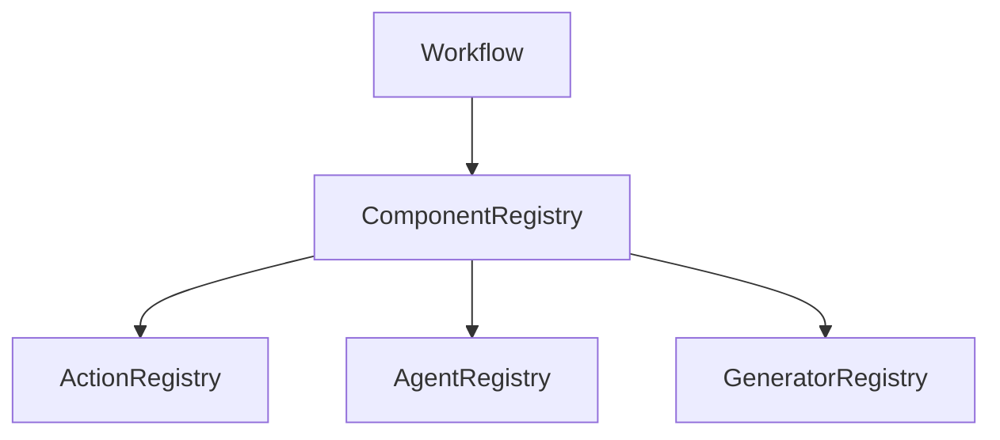

# 17. Component Registry & Library

<div class="text-lg text-secondary mt-4">
How workflows discover actions, agents, and generators by name
</div>

<div class="mt-8 flex justify-center gap-6 text-sm">
  <div class="flex items-center gap-2">
    <span class="w-2 h-2 rounded-full bg-teal"></span>
    <span class="text-muted">5 Slides</span>
  </div>
  <div class="flex items-center gap-2">
    <span class="w-2 h-2 rounded-full bg-brass"></span>
    <span class="text-muted">Registry</span>
  </div>
  <div class="flex items-center gap-2">
    <span class="w-2 h-2 rounded-full bg-coral"></span>
    <span class="text-muted">Actions & Agents</span>
  </div>
</div>

---
layout: two-cols
---

# 17.1 ComponentRegistry

<div class="pr-4">

```python
class ComponentRegistry:
    actions: ActionRegistry
    agents: AgentRegistry
    generators: GeneratorRegistry
    strict: bool
```

</div>

::right::

<div class="pl-4 mt-8 text-sm">

## Purpose

A single facade for looking up registerable components by name.

- workflows resolve actions through it
- executors resolve agents through it
- content generation flows resolve generators through it

</div>

---
layout: two-cols
---

# 17.2 Registration at Startup

<div class="pr-4">

```python
def create_registered_registry(strict: bool = False):
    registry = ComponentRegistry(strict=strict)
    register_all_actions(registry)
    register_all_agents(registry)
    register_all_generators(registry)
    return registry
```

</div>

::right::

<div class="pl-4 mt-8 text-sm">

## Why central registration?

- keeps CLI wiring thin
- makes workflows configurable by component name
- gives tests one obvious place to inject fakes or strict mode behavior

</div>

---
layout: default
---

# 17.3 What lives in the library?

<div class="grid grid-cols-3 gap-4 mt-4 text-sm">
  <div class="p-4 bg-raised rounded-lg border border-border">
    <div class="font-semibold text-teal">Actions</div>
    <div class="mt-2 text-muted">beads, jj, preflight, validation, review, workspace, dependencies, git, github</div>
  </div>
  <div class="p-4 bg-raised rounded-lg border border-border">
    <div class="font-semibold text-brass">Agents</div>
    <div class="mt-2 text-muted">implementer, reviewers, fixers, curator, decomposer, generators</div>
  </div>
  <div class="p-4 bg-raised rounded-lg border border-border">
    <div class="font-semibold text-coral">Generators</div>
    <div class="mt-2 text-muted">specialized content-producing agents registered separately from task agents</div>
  </div>
</div>

---
layout: two-cols
---

# 17.4 Lookup Flow

<div class="pr-4">

```python
agent_class = registry.agents.get("implementer")
action_fn = registry.actions.get("run_preflight_checks")
```

</div>

::right::

<div class="pl-4 mt-8 text-sm">


```mermaid {scale: 0.64}
flowchart TD
    A[Workflow] --> B[ComponentRegistry]
    B --> C[ActionRegistry]
    B --> D[AgentRegistry]
    B --> E[GeneratorRegistry]
```

<div class="mt-4 text-muted">
  Name-based dispatch keeps workflows declarative without reviving the retired YAML DSL.
</div>

</div>
