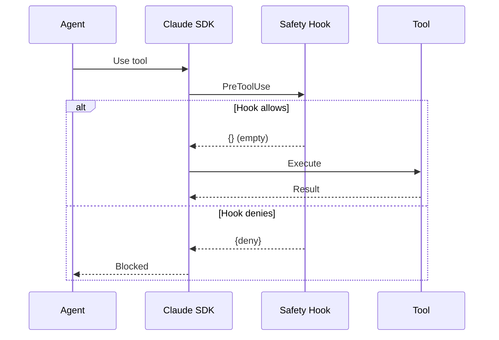

# 18. Safety Hooks

<div class="text-lg text-secondary mt-4">
Defense in depth for AI agent operations
</div>

<div class="mt-8 flex justify-center gap-6 text-sm">
  <div class="flex items-center gap-2">
    <span class="w-2 h-2 rounded-full bg-coral"></span>
    <span class="text-muted">9 Slides</span>
  </div>
  <div class="flex items-center gap-2">
    <span class="w-2 h-2 rounded-full bg-brass"></span>
    <span class="text-muted">Bash Safety</span>
  </div>
  <div class="flex items-center gap-2">
    <span class="w-2 h-2 rounded-full bg-teal"></span>
    <span class="text-muted">Path Protection</span>
  </div>
</div>

<!--
Section 18 covers Maverick's Safety Hooks - critical protection layer
that prevents AI agents from executing dangerous operations.

We'll cover:
1. Why safety hooks matter
2. Hook architecture
3. Dangerous bash patterns
4. Pattern detection implementation
5. Command normalization
6. Path protection
7. SafetyConfig options
8. Secret detection
9. Logging & alerting
-->

---

## layout: two-cols

# 18.1 Why Safety Hooks?

<div class="pr-4">

<div v-click>

## The Risk

AI agents with tool access can be **dangerous**:

<div class="space-y-2 mt-3 text-sm">
  <div class="flex items-start gap-2">
    <span class="text-coral mt-1">⚠</span>
    <span>Execute arbitrary shell commands</span>
  </div>
  <div class="flex items-start gap-2">
    <span class="text-coral mt-1">⚠</span>
    <span>Write to any file on the system</span>
  </div>
  <div class="flex items-start gap-2">
    <span class="text-coral mt-1">⚠</span>
    <span>Delete critical data</span>
  </div>
  <div class="flex items-start gap-2">
    <span class="text-coral mt-1">⚠</span>
    <span>Leak credentials or secrets</span>
  </div>
</div>

</div>

<div v-click class="mt-6">

## Defense in Depth

Multiple layers of protection:

<div class="space-y-2 mt-3 text-sm">
  <div class="flex items-start gap-2">
    <span class="text-teal mt-1">1.</span>
    <span><strong>System prompts</strong>: Guide agent behavior</span>
  </div>
  <div class="flex items-start gap-2">
    <span class="text-teal mt-1">2.</span>
    <span><strong>allowed_tools</strong>: Restrict available tools</span>
  </div>
  <div class="flex items-start gap-2">
    <span class="text-teal mt-1">3.</span>
    <span><strong>Safety hooks</strong>: Validate before execution</span>
  </div>
  <div class="flex items-start gap-2">
    <span class="text-teal mt-1">4.</span>
    <span><strong>Secrets scrubbing</strong>: Redact sensitive output</span>
  </div>
</div>

</div>

</div>

::right::

<div class="pl-4 mt-8">

<div v-click>

## What Hooks Prevent

```bash
# Recursive delete of system
rm -rf /
rm -rf ~/*

# Fork bomb
:(){ :|:& };:

# Disk formatting
mkfs.ext4 /dev/sda

# Raw disk write
dd if=/dev/zero of=/dev/sda

# System shutdown
shutdown -h now
reboot
```

</div>

<div v-click class="mt-4 p-3 bg-coral/10 border border-coral/30 rounded-lg text-sm">
  <strong class="text-coral">Real Threat</strong><br>
  These aren't hypotheticals — LLMs can be tricked via prompt 
  injection or generate dangerous commands trying to be "helpful."
</div>

</div>

<!--
AI agents with shell access are powerful but dangerous. A confused
or manipulated model might execute destructive commands. Safety hooks
are the last line of defense - they validate every tool use before
execution and can block dangerous operations.
-->

---

## layout: two-cols

# 18.2 Hook Architecture

<div class="pr-4">

<div v-click>

## Where Hooks Run



</div>

<div v-click class="mt-4">

## Hook Events

| Event         | When                 | Use Case          |
| ------------- | -------------------- | ----------------- |
| `PreToolUse`  | Before tool executes | Safety validation |
| `PostToolUse` | After tool completes | Logging, metrics  |

</div>

</div>

::right::

<div class="pl-4 mt-8">

<div v-click>

## Creating Safety Hooks

```python
from maverick.hooks import (
    create_safety_hooks,
    HookConfig,
)
from claude_agent_sdk import ClaudeAgentOptions

# Configure hooks
config = HookConfig()
safety_hooks = create_safety_hooks(config)

# Use with agent
options = ClaudeAgentOptions(
    hooks={
        "PreToolUse": safety_hooks
    }
)
```

</div>

<div v-click class="mt-4">

## Hook Matchers

```python
# Hooks target specific tools
HookMatcher(
    matcher="Bash",           # Tool name regex
    hooks=[validate_bash],    # Validation functions
    timeout=10.0,             # Seconds before abort
)

# Multiple tools
HookMatcher(
    matcher="Write|Edit",     # Match Write OR Edit
    hooks=[validate_paths],
)
```

</div>

</div>

<!--
Hooks integrate with the Claude SDK's event system. PreToolUse hooks
run before every tool execution - returning an empty dict allows the
operation, returning a deny response blocks it. HookMatcher lets us
target specific tools with regex patterns.
-->

---

## layout: two-cols

# 18.3 Dangerous Bash Patterns

<div class="pr-4">

<div v-click>

## Built-in Pattern List

Maverick blocks these by default:

```python
DANGEROUS_BASH_PATTERNS: list[tuple[str, str]] = [
    # Recursive delete of root/home
    (r"rm\s+(-[rfRF]+\s+)*(/|~|\$HOME)\s*$",
     "Recursive delete of root or home"),

    # Fork bombs
    (r":\(\)\s*\{.*:\|:.*\}",
     "Fork bomb detected"),

    # Disk formatting
    (r"mkfs\.\w+",
     "Disk formatting command"),

    # Raw disk write
    (r"dd\s+.*of=/dev/[a-z]+\s*$",
     "Raw disk write"),

    # System shutdown
    (r"\b(shutdown|reboot|halt|poweroff)\b",
     "System shutdown command"),
]
```

</div>

</div>

::right::

<div class="pl-4 mt-8">

<div v-click>

## More Patterns

```python
    # Kill all processes
    (r"kill\s+-9\s+-1",
     "Kill all processes"),

    # Chmod 777 on system directories
    (r"chmod\s+(-R\s+)?777\s+/",
     "Dangerous chmod on root"),

    # Writing to passwd/shadow
    (r">\s*/etc/(passwd|shadow)",
     "Write to password file"),
```

</div>

<div v-click class="mt-4 p-3 bg-teal/10 border border-teal/30 rounded-lg text-sm">
  <strong class="text-teal">Pre-compiled</strong><br>
  Patterns are compiled once at module load for performance:
  
```python
_COMPILED_DANGEROUS_PATTERNS = [
    (re.compile(pattern, re.IGNORECASE), 
     description, pattern)
    for pattern, description 
    in DANGEROUS_BASH_PATTERNS
]
```

</div>

<div v-click class="mt-3 p-3 bg-brass/10 border border-brass/30 rounded-lg text-sm">
  <strong class="text-brass">Location</strong><br>
  <code>src/maverick/hooks/safety.py</code>
</div>

</div>

<!--
The DANGEROUS_BASH_PATTERNS list defines regex patterns that match
destructive commands. Each pattern includes a description for logging.
Patterns are pre-compiled at module load time for fast matching during
execution. Case-insensitive matching catches variations.
-->

---

## layout: two-cols

# 18.4 Pattern Detection

<div class="pr-4">

<div v-click>

## The Validation Flow

```python
async def validate_bash_command(
    input_data: dict[str, Any],
    tool_use_id: str | None,
    context: Any,
    *,
    config: SafetyConfig | None = None,
) -> dict[str, Any]:
    """Validate bash commands."""
    config = config or SafetyConfig()

    # Extract command from tool input
    tool_input = input_data.get("tool_input", {})
    command = tool_input.get("command", "")

    # Normalize for bypass attempts
    normalized = normalize_command(command)
    expanded = expand_variables(normalized)

    # Parse compound commands
    components = parse_compound_command(expanded)

    # Check each component
    for component in components:
        is_dangerous, reason, pattern = \
            _check_compiled_patterns(
                component,
                _COMPILED_DANGEROUS_PATTERNS
            )
        if is_dangerous:
            return _deny_response(reason, pattern)

    return {}  # Allow
```

</div>

</div>

::right::

<div class="pl-4 mt-8">

<div v-click>

## Pattern Checking

```python
def _check_compiled_patterns(
    cmd: str,
    compiled_patterns: list[tuple[
        re.Pattern[str], str, str
    ]],
) -> tuple[bool, str | None, str | None]:
    """Check command against patterns."""
    for compiled, desc, orig in compiled_patterns:
        if compiled.search(cmd):
            return True, desc, orig
    return False, None, None
```

</div>

<div v-click class="mt-4">

## Deny Response

```python
def _deny_response(
    reason: str,
    pattern: str | None
) -> dict[str, Any]:
    """Create SDK deny response."""
    return {
        "hookSpecificOutput": {
            "hookEventName": "PreToolUse",
            "permissionDecision": "deny",
            "permissionDecisionReason": reason,
            "blockedPattern": pattern,
        }
    }
```

</div>

<div v-click class="mt-3 p-3 bg-coral/10 border border-coral/30 rounded-lg text-sm">
  <strong class="text-coral">Fail Closed</strong><br>
  Any exception during validation blocks the command.
</div>

</div>

<!--
The validate_bash_command function processes each tool use. It normalizes
the command (to catch unicode tricks), expands variables, parses compound
commands (to catch chained dangerous operations), then checks each component
against the pattern list. Returning {} allows; returning deny blocks.
-->

---

## layout: two-cols

# 18.5 Command Normalization

<div class="pr-4">

<div v-click>

## Why Normalize?

Attackers can try to bypass detection:

<div class="space-y-2 mt-3 text-sm">
  <div class="flex items-start gap-2">
    <span class="text-coral mt-1">⚠</span>
    <span><strong>Unicode tricks</strong>: Lookalike characters</span>
  </div>
  <div class="flex items-start gap-2">
    <span class="text-coral mt-1">⚠</span>
    <span><strong>Escape sequences</strong>: <code>\x72\x6d</code> = "rm"</span>
  </div>
  <div class="flex items-start gap-2">
    <span class="text-coral mt-1">⚠</span>
    <span><strong>Variable expansion</strong>: <code>$HOME</code></span>
  </div>
  <div class="flex items-start gap-2">
    <span class="text-coral mt-1">⚠</span>
    <span><strong>Compound commands</strong>: <code>a && rm -rf /</code></span>
  </div>
</div>

</div>

<div v-click class="mt-6">

## Normalization Steps

```python
def normalize_command(cmd: str) -> str:
    """Normalize unicode and escapes."""
    # 1. NFC normalization (canonical form)
    normalized = unicodedata.normalize("NFC", cmd)

    # 2. Normalize whitespace
    normalized = re.sub(r"[\t\r\n]+", " ", normalized)

    # 3. Decode escape sequences
    try:
        normalized = normalized.encode().decode(
            "unicode_escape"
        )
    except UnicodeDecodeError:
        pass  # Keep original if decode fails

    return normalized.strip()
```

</div>

</div>

::right::

<div class="pl-4 mt-8">

<div v-click>

## Variable Expansion

```python
def expand_variables(cmd: str) -> str:
    """Expand environment variables."""
    # Expand $VAR and ${VAR} patterns
    return os.path.expandvars(cmd)
```

Example:

```python
expand_variables("rm -rf $HOME")
# → "rm -rf /home/user"
```

</div>

<div v-click class="mt-4">

## Compound Command Parsing

```python
def parse_compound_command(cmd: str) -> list[str]:
    """Split on && || ; |"""

    # Input: "echo hi && rm -rf /"
    # Output: ["echo hi", "rm -rf /"]

    # Respects quotes and braces
    # "{" and "}" track function definitions
    ...
```

</div>

<div v-click class="mt-3 p-3 bg-teal/10 border border-teal/30 rounded-lg text-sm">
  <strong class="text-teal">Defense in Depth</strong><br>
  Each component is checked separately, so chaining 
  <code>safe && dangerous</code> still blocks the dangerous part.
</div>

</div>

<!--
Command normalization defeats bypass attempts. Unicode normalization
catches lookalike characters (Cyrillic 'а' vs ASCII 'a'). Escape decoding
reveals hidden commands. Variable expansion catches $HOME tricks. Compound
parsing ensures each chained command is validated independently.
-->

---

## layout: two-cols

# 18.6 Path Protection

<div class="pr-4">

<div v-click>

## Sensitive Paths

File write validation blocks these by default:

```python
def _default_sensitive_paths() -> list[str]:
    return [
        # Environment files
        ".env",
        ".env.*",

        # Secret directories
        "secrets/",
        ".secrets/",

        # User credentials
        "~/.ssh/",
        "~/.aws/",
        "~/.config/gcloud/",

        # System directories
        "/etc/",
        "/usr/",
        "/bin/",
        "/sbin/",
        "/root/",
    ]
```

</div>

</div>

::right::

<div class="pl-4 mt-8">

<div v-click>

## Path Validation

```python
async def validate_file_write(
    input_data: dict[str, Any],
    tool_use_id: str | None,
    context: Any,
    *,
    config: SafetyConfig | None = None,
) -> dict[str, Any]:
    """Validate file writes."""
    config = config or SafetyConfig()

    file_path = input_data.get("tool_input", {}) \
                          .get("file_path", "")

    # Normalize path
    normalized = normalize_path(file_path)

    # Check allowlist first (takes precedence)
    for pattern in config.path_allowlist:
        if _matches_path_pattern(normalized, pattern):
            return {}  # Allow

    # Check blocklist and sensitive paths
    for pattern in config.sensitive_paths:
        if _matches_path_pattern(normalized, pattern):
            return _deny_response(
                f"Sensitive path: {pattern}",
                pattern
            )

    return {}  # Allow
```

</div>

<div v-click class="mt-3 p-3 bg-brass/10 border border-brass/30 rounded-lg text-sm">
  <strong class="text-brass">Tool Matching</strong><br>
  Path validation runs on both <code>Write</code> and <code>Edit</code> tools.
</div>

</div>

<!--
File write validation protects sensitive paths. Default patterns block
environment files, credential directories, and system paths. The allowlist
takes precedence, so you can permit specific files. Path normalization
expands ~ and environment variables for accurate matching.
-->

---

## layout: two-cols

# 18.7 SafetyConfig

<div class="pr-4">

<div v-click>

## Configuration Options

```python
class SafetyConfig(BaseModel):
    """Safety hook configuration."""

    # Enable/disable validation
    bash_validation_enabled: bool = True
    file_write_validation_enabled: bool = True

    # Custom patterns
    bash_blocklist: list[str] = []
    bash_allow_override: list[str] = []

    # Path rules
    sensitive_paths: list[str] = Field(
        default_factory=_default_sensitive_paths
    )
    path_allowlist: list[str] = []
    path_blocklist: list[str] = []

    # Error handling
    fail_closed: bool = True
    hook_timeout_seconds: int = 10
```

</div>

</div>

::right::

<div class="pl-4 mt-8">

<div v-click>

## Example: Custom Rules

```python
from maverick.hooks.config import SafetyConfig

config = SafetyConfig(
    # Allow npm/yarn commands
    bash_allow_override=[
        r"^npm\s+",
        r"^yarn\s+",
    ],

    # Block additional patterns
    bash_blocklist=[
        r"curl.*\|\s*bash",   # Pipe to bash
        r"wget.*\|\s*sh",     # Download & execute
    ],

    # Allow writing to specific paths
    path_allowlist=[
        "./output/",
        "./build/",
    ],

    # Block additional paths
    path_blocklist=[
        ".git/hooks/",        # Git hooks
        "node_modules/.bin/", # Binary scripts
    ],
)
```

</div>

<div v-click class="mt-3 p-3 bg-coral/10 border border-coral/30 rounded-lg text-sm">
  <strong class="text-coral">Validation</strong><br>
  All regex patterns are validated at config load time:
  
```python
@field_validator("bash_blocklist", mode="after")
def validate_regex_patterns(cls, v):
    for pattern in v:
        re.compile(pattern)  # Raises if invalid
    return v
```

</div>

</div>

<!--
SafetyConfig is a Pydantic model with all hook settings. You can enable/disable
entire categories, add custom patterns, configure path rules, and control
error handling. Regex patterns are validated at load time to catch typos.
fail_closed=True means exceptions block operations (secure default).
-->

---

## layout: two-cols

# 18.8 Secret Detection

<div class="pr-4">

<div v-click>

## The Secrets Module

```python
# src/maverick/utils/secrets.py

# Canonical patterns for all scrubbing
SENSITIVE_PATTERNS: tuple[tuple[str, str], ...] = (
    # GitHub PATs
    (r"\b(gh[opsu]_[A-Za-z0-9_]{36,})\b",
     "***GITHUB_TOKEN***"),

    # OpenAI/Anthropic keys
    (r"sk-[a-zA-Z0-9]{32,}",
     "***API_KEY***"),

    # AWS access keys
    (r"AKIA[0-9A-Z]{16}",
     "***AWS_KEY***"),

    # Auth headers
    (r"(bearer|authorization)\s+\S+",
     r"\1 ***REDACTED***"),

    # Generic credentials
    (r"(password|passwd|pwd)\s*[=:]\s*\S+",
     r"\1=***REDACTED***"),
    (r"(api[_\-]?key|apikey)\s*[=:]\s*\S+",
     r"\1=***REDACTED***"),
)
```

</div>

</div>

::right::

<div class="pl-4 mt-8">

<div v-click>

## Scrubbing Function

```python
def scrub_secrets(text: str) -> str:
    """Remove potential secrets from text."""
    result = text
    for pattern, replacement in SENSITIVE_PATTERNS:
        result = re.sub(
            pattern,
            replacement,
            result,
            flags=re.IGNORECASE
        )
    return result
```

Example:

```python
scrub_secrets("token=ghp_abc123...")
# → "token=***GITHUB_TOKEN***"

scrub_secrets("password=secret123")
# → "password=***REDACTED***"
```

</div>

<div v-click class="mt-4">

## detect-secrets Integration

```python
from detect_secrets.core.plugins.util import (
    get_mapping_from_secret_type_to_class
)

def detect_secrets(content: str) -> list[Finding]:
    """Scan content for secrets using
    Yelp's detect-secrets library."""
    ...
```

</div>

</div>

<!--
Secret detection has two layers. scrub_secrets() uses regex patterns to
redact sensitive data from logs and output. detect_secrets() uses Yelp's
detect-secrets library for deeper analysis of file content. Both are used
throughout Maverick to prevent credential leaks.
-->

---

## layout: two-cols

# 18.9 Logging & Alerting

<div class="pr-4">

<div v-click>

## What Gets Logged

When a hook blocks an operation:

```python
logger.warning(
    f"Dangerous command blocked: {component} "
    f"(pattern: {matched_pattern})"
)
```

Output:

```json
{
  "event": "Dangerous command blocked",
  "component": "rm -rf /",
  "pattern": "rm\\s+(-[rfRF]+\\s+)*/",
  "level": "warning",
  "timestamp": "2025-02-07T10:30:00Z"
}
```

</div>

<div v-click class="mt-4">

## Logging Configuration

```python
class LoggingConfig(BaseModel):
    enabled: bool = True
    log_level: str = "INFO"
    output_destination: str = "maverick.hooks"
    sanitize_inputs: bool = True
    max_output_length: int = 1000
```

</div>

</div>

::right::

<div class="pl-4 mt-8">

<div v-click>

## Metrics Collection

Track hook performance:

```python
from maverick.hooks import MetricsCollector

collector = MetricsCollector()

# Later: query metrics
metrics = await collector.get_metrics("Bash")
print(f"Calls: {metrics.call_count}")
print(f"Success rate: {metrics.success_rate:.1%}")
print(f"Avg time: {metrics.avg_duration_ms:.1f}ms")
```

</div>

<div v-click class="mt-4">

## ToolMetrics Dataclass

```python
@dataclass(frozen=True, slots=True)
class ToolMetrics:
    tool_name: str | None
    call_count: int
    success_count: int
    failure_count: int
    avg_duration_ms: float
    p50_duration_ms: float
    p95_duration_ms: float
    p99_duration_ms: float

    @property
    def success_rate(self) -> float:
        return self.success_count / self.call_count
```

</div>

<div v-click class="mt-3 p-3 bg-teal/10 border border-teal/30 rounded-lg text-sm">
  <strong class="text-teal">Rolling Window</strong><br>
  Metrics use a configurable rolling window 
  (default 10,000 entries) to prevent memory growth.
</div>

</div>

<!--
Logging hooks capture blocked operations with full context for debugging.
Metrics hooks track performance data across tool executions. Both use
structlog for structured output. The MetricsCollector maintains a rolling
window to prevent unbounded memory growth in long-running workflows.
-->

---

layout: center
class: text-center

---

# Safety Hooks Summary

<div class="grid grid-cols-3 gap-6 mt-8 text-sm">

<div v-click class="p-4 bg-slate-800/50 rounded-lg">
  <div class="text-coral text-2xl mb-2">🛡️</div>
  <div class="font-bold mb-2">Bash Protection</div>
  <div class="text-muted">
    Pattern-based detection of dangerous commands with
    normalization to defeat bypass attempts
  </div>
</div>

<div v-click class="p-4 bg-slate-800/50 rounded-lg">
  <div class="text-brass text-2xl mb-2">📁</div>
  <div class="font-bold mb-2">Path Protection</div>
  <div class="text-muted">
    Block writes to sensitive paths like ~/.ssh, /etc,
    and .env files with configurable allowlists
  </div>
</div>

<div v-click class="p-4 bg-slate-800/50 rounded-lg">
  <div class="text-teal text-2xl mb-2">🔐</div>
  <div class="font-bold mb-2">Secret Safety</div>
  <div class="text-muted">
    Scrub credentials from logs and detect secrets
    in file content before commits
  </div>
</div>

</div>

<div v-click class="mt-8 p-4 bg-coral/10 border border-coral/30 rounded-lg text-sm max-w-2xl mx-auto">
  <strong class="text-coral">Key Principle</strong><br>
  Safety hooks are the <strong>last line of defense</strong>. They assume
  all other layers (prompts, tool restrictions) have failed. When in doubt,
  block the operation. <code>fail_closed=True</code> is the secure default.
</div>

<div v-click class="mt-6 text-muted text-sm">
  Key files: <code>src/maverick/hooks/safety.py</code> · 
  <code>src/maverick/hooks/config.py</code> · 
  <code>src/maverick/utils/secrets.py</code>
</div>

<!--
Safety hooks provide defense in depth for AI agents. They block dangerous
bash commands, protect sensitive file paths, and prevent credential leaks.
The fail-closed approach means any error blocks the operation. This is
critical because LLMs can be unpredictable and prompt injection is real.

Next up: Section 19 - Checkpointing & Resumption
-->
