# 19. Checkpointing & Resumption

<div class="text-lg text-secondary mt-4">
Saving state and recovering from failures
</div>

<div class="mt-8 flex justify-center gap-6 text-sm">
  <div class="flex items-center gap-2">
    <span class="w-2 h-2 rounded-full bg-teal"></span>
    <span class="text-muted">9 Slides</span>
  </div>
  <div class="flex items-center gap-2">
    <span class="w-2 h-2 rounded-full bg-brass"></span>
    <span class="text-muted">Checkpoint Storage</span>
  </div>
  <div class="flex items-center gap-2">
    <span class="w-2 h-2 rounded-full bg-coral"></span>
    <span class="text-muted">Resume Logic</span>
  </div>
</div>

<!--
Section 19 covers Maverick's Checkpointing system - critical infrastructure
for recovering from failures in long-running workflows.

We'll cover:
1. Why checkpointing matters
2. The checkpoint concept
3. CheckpointData model
4. Checkpoint storage patterns
5. Creating checkpoints in workflows
6. Resume detection
7. Resume logic and context restoration
8. Idempotent step design
9. CLI integration
-->

---

## layout: two-cols

# 19.1 Why Checkpointing?

<div class="pr-4">

<div v-click>

## Long Workflows Fail

AI-powered workflows are vulnerable:

<div class="space-y-2 mt-3 text-sm">
  <div class="flex items-start gap-2">
    <span class="text-coral mt-1">⚠</span>
    <span><strong>Network issues</strong>: API timeouts, rate limits</span>
  </div>
  <div class="flex items-start gap-2">
    <span class="text-coral mt-1">⚠</span>
    <span><strong>Process crashes</strong>: OOM, signals, exceptions</span>
  </div>
  <div class="flex items-start gap-2">
    <span class="text-coral mt-1">⚠</span>
    <span><strong>User interrupts</strong>: Ctrl+C, laptop close</span>
  </div>
  <div class="flex items-start gap-2">
    <span class="text-coral mt-1">⚠</span>
    <span><strong>Agent errors</strong>: Confused models, bad outputs</span>
  </div>
</div>

</div>

<div v-click class="mt-6">

## The Cost of Restarting

Without checkpoints:

<div class="space-y-2 mt-3 text-sm">
  <div class="flex items-start gap-2">
    <span class="text-coral mt-1">💰</span>
    <span>Re-run completed agent steps (API costs)</span>
  </div>
  <div class="flex items-start gap-2">
    <span class="text-coral mt-1">⏱️</span>
    <span>Wait through entire workflow again</span>
  </div>
  <div class="flex items-start gap-2">
    <span class="text-coral mt-1">🔄</span>
    <span>Recreate side effects (commits, PRs)</span>
  </div>
  <div class="flex items-start gap-2">
    <span class="text-coral mt-1">😤</span>
    <span>User frustration and lost productivity</span>
  </div>
</div>

</div>

</div>

::right::

<div class="pl-4 mt-8">

<div v-click>

## A Real-World Scenario

```mermaid {scale: 0.55}
flowchart TD
    A[Preflight ✓] --> B[Implement Phase 1 ✓]
    B --> C[Validate Phase 1 ✓]
    C --> D[Implement Phase 2 ✓]
    D --> E[Validate Phase 2 ✓]
    E --> F[Implement Phase 3]
    F --> G[💥 Network Timeout]

    style A fill:#22c55e30
    style B fill:#22c55e30
    style C fill:#22c55e30
    style D fill:#22c55e30
    style E fill:#22c55e30
    style F fill:#fbbf2430
    style G fill:#ef444430
```



</div>

<div v-click class="mt-4 p-3 bg-teal/10 border border-teal/30 rounded-lg text-sm">
  <strong class="text-teal">With Checkpoints</strong><br>
  Save state after Phase 2. On failure, resume from Phase 3.
  No need to re-run Phases 1 and 2!
</div>

<div v-click class="mt-3 p-3 bg-coral/10 border border-coral/30 rounded-lg text-sm">
  <strong class="text-coral">Maverick Principle</strong><br>
  <em>"Fail gracefully, recover aggressively"</em> — checkpoints 
  are the foundation of aggressive recovery.
</div>

</div>

<!--
AI-powered workflows can run for minutes or hours, involving multiple
agent invocations and external API calls. Any of these can fail. Without
checkpoints, the only option is to restart from scratch, wasting time,
money (API costs), and creating frustration. Checkpoints let us pick up
where we left off.
-->

---

## layout: two-cols

# 19.2 Checkpoint Concept

<div class="pr-4">

<div v-click>

## What is a Checkpoint?

A **snapshot of workflow state** at a safe point:

<div class="space-y-2 mt-3 text-sm">
  <div class="flex items-start gap-2">
    <span class="text-teal mt-1">📸</span>
    <span><strong>Step outputs</strong>: Results of completed steps</span>
  </div>
  <div class="flex items-start gap-2">
    <span class="text-teal mt-1">🔑</span>
    <span><strong>Input hash</strong>: Validates same inputs on resume</span>
  </div>
  <div class="flex items-start gap-2">
    <span class="text-teal mt-1">🏷️</span>
    <span><strong>Checkpoint ID</strong>: Unique identifier</span>
  </div>
  <div class="flex items-start gap-2">
    <span class="text-teal mt-1">🕐</span>
    <span><strong>Timestamp</strong>: When checkpoint was saved</span>
  </div>
</div>

</div>

<div v-click class="mt-6">

## When to Checkpoint

Strategic placement for maximum benefit:

<div class="space-y-2 mt-3 text-sm">
  <div class="flex items-start gap-2">
    <span class="text-brass mt-1">✓</span>
    <span>After expensive agent operations</span>
  </div>
  <div class="flex items-start gap-2">
    <span class="text-brass mt-1">✓</span>
    <span>After external API calls</span>
  </div>
  <div class="flex items-start gap-2">
    <span class="text-brass mt-1">✓</span>
    <span>Between loop iterations</span>
  </div>
  <div class="flex items-start gap-2">
    <span class="text-brass mt-1">✓</span>
    <span>Before risky operations</span>
  </div>
</div>

</div>

</div>

::right::

<div class="pl-4 mt-8">

<div v-click>

## Checkpoint Anatomy

```yaml
# Checkpoint saved to disk
checkpoint_id: "implementation_complete"
workflow_name: "feature"
inputs_hash: "a1b2c3d4e5f6g7h8"
saved_at: "2025-02-07T10:30:00Z"

step_results:
  - name: preflight
    output:
      success: true
      branch: "feature/add-login"

  - name: implement_phase
    output:
      files_changed:
        - src/auth/login.py
        - tests/test_login.py
      commit_sha: "abc123"
```

</div>

<div v-click class="mt-3 p-3 bg-brass/10 border border-brass/30 rounded-lg text-sm">
  <strong class="text-brass">Storage Location</strong><br>
  <code>.maverick/checkpoints/&lt;workflow&gt;/&lt;id&gt;.json</code>
</div>

</div>

<!--
A checkpoint captures everything needed to resume: which steps have
completed and what they returned. The inputs hash ensures you're resuming
with compatible inputs. Checkpoints are placed strategically after
expensive or risky operations to maximize recovery value.
-->

---

## layout: two-cols

# 19.3 CheckpointData Model

<div class="pr-4">

<div v-click>

## The Dataclass

```python
@dataclass(frozen=True, slots=True)
class CheckpointData:
    """Data persisted at a workflow checkpoint.

    Attributes:
        checkpoint_id: Unique identifier
        workflow_name: Name of the workflow
        inputs_hash: SHA-256 hash of inputs
        step_results: Tuple of step result dicts
        saved_at: ISO 8601 timestamp
    """

    checkpoint_id: str
    workflow_name: str
    inputs_hash: str
    step_results: tuple[dict[str, Any], ...]
    saved_at: str
```

</div>

<div v-click class="mt-4">

## Design Choices

<div class="space-y-2 text-sm">
  <div class="flex items-start gap-2">
    <span class="text-teal mt-1">✓</span>
    <span><strong>frozen=True</strong>: Immutable after creation</span>
  </div>
  <div class="flex items-start gap-2">
    <span class="text-teal mt-1">✓</span>
    <span><strong>slots=True</strong>: Memory efficient</span>
  </div>
  <div class="flex items-start gap-2">
    <span class="text-teal mt-1">✓</span>
    <span><strong>tuple</strong>: Immutable sequence of results</span>
  </div>
</div>

</div>

</div>

::right::

<div class="pl-4 mt-8">

<div v-click>

## Serialization Methods

```python
def to_dict(self) -> dict[str, Any]:
    """Serialize for persistence."""
    return {
        "checkpoint_id": self.checkpoint_id,
        "workflow_name": self.workflow_name,
        "inputs_hash": self.inputs_hash,
        "step_results": list(self.step_results),
        "saved_at": self.saved_at,
    }

@classmethod
def from_dict(
    cls, data: dict[str, Any]
) -> CheckpointData:
    """Deserialize from dictionary."""
    return cls(
        checkpoint_id=data["checkpoint_id"],
        workflow_name=data["workflow_name"],
        inputs_hash=data["inputs_hash"],
        step_results=tuple(data["step_results"]),
        saved_at=data["saved_at"],
    )
```

</div>

<div v-click class="mt-3 p-3 bg-brass/10 border border-brass/30 rounded-lg text-sm">
  <strong class="text-brass">Location</strong><br>
  <code>src/maverick/dsl/checkpoint/data.py</code>
</div>

</div>

<!--
CheckpointData is a frozen dataclass for immutability. It stores all
completed step results as serialized dictionaries. The to_dict/from_dict
methods handle JSON serialization for file storage. The inputs_hash
validates that resume uses the same workflow inputs.
-->

---

## layout: two-cols

# 19.4 Checkpoint Storage

<div class="pr-4">

<div v-click>

## The CheckpointStore Protocol

```python
class CheckpointStore(Protocol):
    """Protocol for checkpoint persistence."""

    async def save(
        self,
        workflow_id: str,
        data: CheckpointData,
    ) -> None:
        """Save checkpoint atomically."""
        ...

    async def load(
        self,
        workflow_id: str,
        checkpoint_id: str,
    ) -> CheckpointData | None:
        """Load a specific checkpoint."""
        ...

    async def load_latest(
        self,
        workflow_id: str,
    ) -> CheckpointData | None:
        """Load most recent checkpoint."""
        ...

    async def clear(
        self,
        workflow_id: str,
    ) -> None:
        """Remove all checkpoints."""
        ...
```

</div>

</div>

::right::

<div class="pl-4 mt-8">

<div v-click>

## FileCheckpointStore

```python
class FileCheckpointStore:
    """File-based checkpoint store."""

    def __init__(
        self,
        base_path: Path | None = None
    ) -> None:
        self._base_path = (
            Path(base_path)
            if base_path
            else Path(DEFAULTS.CHECKPOINT_DIR)
        )
        # Clean orphaned temp files
        self._cleanup_temp_files()
```

</div>

<div v-click class="mt-3">

## Atomic Writes

```python
async def save(
    self,
    workflow_id: str,
    data: CheckpointData,
) -> None:
    """Save with atomic write."""
    dir_path = self._base_path / workflow_id
    file_path = dir_path / f"{data.checkpoint_id}.json"
    content = json.dumps(data.to_dict(), indent=2)

    # Atomic: temp file → rename
    atomic_write_text(file_path, content, mkdir=True)
```

</div>

<div v-click class="mt-3 p-3 bg-teal/10 border border-teal/30 rounded-lg text-sm">
  <strong class="text-teal">Crash Safety</strong><br>
  Atomic writes prevent corrupted checkpoints if the 
  process crashes during save.
</div>

</div>

<!--
The CheckpointStore protocol defines async methods for persistence.
FileCheckpointStore implements it with JSON files on disk. Atomic writes
(temp file → rename) ensure checkpoints are never corrupted even if the
process crashes mid-write. The store also cleans up orphaned temp files
from previous interrupted saves.
-->

---

## layout: two-cols

# 19.5 Creating Checkpoints

<div class="pr-4">

<div v-click>

## Checkpoint Step in YAML

```yaml
steps:
  - name: fetch_issues
    type: python
    action: fetch_github_issues
    kwargs:
      label: ${{ inputs.label }}
      limit: ${{ inputs.limit }}

  # Save state after expensive GitHub API call
  - name: checkpoint_after_fetch
    type: checkpoint
    when: ${{ not inputs.dry_run }}
    checkpoint_id: issues_fetched
    metadata:
      progress:
        stage: "checkpoint"
        weight: 1

  - name: process_issues
    type: agent
    agent: issue_processor
    # If this fails, resume from checkpoint
```

</div>

</div>

::right::

<div class="pl-4 mt-8">

<div v-click>

## Dynamic Checkpoint IDs

Inside loops, use expressions:

```yaml
steps:
  - name: implement_phases
    type: loop
    for_each: ${{ inputs.phases }}
    steps:
      - name: implement_phase
        type: agent
        agent: implementer

      - name: phase_checkpoint
        type: checkpoint
        # Dynamic ID per iteration
        checkpoint_id: phase_${{ index }}_complete
```

</div>

<div v-click class="mt-4">

## Checkpoint Step Handler

```python
async def execute_checkpoint_step(
    step: CheckpointStepRecord,
    resolved_inputs: dict[str, Any],
    context: WorkflowContext,
    checkpoint_store: CheckpointStore,
) -> dict[str, Any]:
    """Save current workflow state."""
    checkpoint_id = (
        resolved_inputs.get("checkpoint_id")
        or step.checkpoint_id
        or step.name
    )

    checkpoint_data = CheckpointData(...)
    await checkpoint_store.save(
        context.workflow_name,
        checkpoint_data
    )

    return {"saved": True, ...}
```

</div>

</div>

<!--
Checkpoint steps are declarative in YAML. Place them after expensive
operations like API calls or agent invocations. The checkpoint_id can
be static or dynamic using expressions - useful in loops where each
iteration needs its own checkpoint. The handler saves all completed
step results to the store.
-->

---

## layout: two-cols

# 19.6 Resume Detection

<div class="pr-4">

<div v-click>

## Finding Existing Checkpoints

```python
async def load_checkpoint_if_resuming(
    workflow: WorkflowFile,
    inputs: dict[str, Any],
    resume_from_checkpoint: bool,
    checkpoint_store: CheckpointStore,
) -> tuple[
    CheckpointData | None,
    str | None,  # resume_after_step
    CheckpointLocation | None
]:
    if not resume_from_checkpoint:
        return None, None, None

    checkpoint_data = await checkpoint_store.load_latest(
        workflow.name
    )

    if checkpoint_data is None:
        logger.info(
            f"No checkpoint found, "
            f"executing from start"
        )
        return None, None, None
```

</div>

</div>

::right::

<div class="pl-4 mt-8">

<div v-click>

## Input Validation

```python
    # Validate inputs match checkpoint
    current_hash = compute_inputs_hash(inputs)

    if current_hash != checkpoint_data.inputs_hash:
        raise ValueError(
            f"Cannot resume: inputs differ "
            f"from checkpoint inputs. "
            f"Checkpoint saved at "
            f"{checkpoint_data.saved_at}."
        )
```

</div>

<div v-click class="mt-4">

## Input Hash Computation

```python
def compute_inputs_hash(
    inputs: dict[str, Any]
) -> str:
    """Deterministic hash of inputs."""
    serialized = json.dumps(
        inputs,
        sort_keys=True  # Deterministic order
    )
    return hashlib.sha256(
        serialized.encode()
    ).hexdigest()[:16]  # First 16 chars
```

</div>

<div v-click class="mt-3 p-3 bg-coral/10 border border-coral/30 rounded-lg text-sm">
  <strong class="text-coral">Why Validate?</strong><br>
  Different inputs may produce incompatible outputs.
  Resuming with wrong inputs leads to undefined behavior.
</div>

</div>

<!--
Resume detection happens at workflow start. It loads the latest checkpoint,
validates that the current inputs match the checkpoint's inputs (via hash
comparison), and determines which step to resume from. If inputs don't
match, it raises an error - you can't safely resume with different inputs.
-->

---

## layout: two-cols

# 19.7 Resume Logic

<div class="pr-4">

<div v-click>

## Skipping Completed Steps

```python
# In workflow executor
for step in workflow.steps:
    # Check if step was completed before checkpoint
    if _is_step_completed(
        step.name,
        checkpoint_data.step_results
    ):
        # Restore result from checkpoint
        result = _restore_step_result(
            step.name,
            checkpoint_data.step_results
        )
        context.results[step.name] = result

        logger.info(
            f"Skipped step '{step.name}' "
            f"(restored from checkpoint)"
        )
        continue

    # Execute step normally
    result = await execute_step(step, context)
    context.results[step.name] = result
```

</div>

</div>

::right::

<div class="pl-4 mt-8">

<div v-click>

## Context Restoration

```python
def _restore_context_from_checkpoint(
    context: WorkflowContext,
    checkpoint_data: CheckpointData,
) -> None:
    """Restore step results to context."""
    for step_dict in checkpoint_data.step_results:
        step_name = step_dict["name"]
        output = step_dict["output"]

        # Create StepResult from checkpoint data
        result = StepResult(
            name=step_name,
            step_type=StepType.PYTHON,  # Default
            success=True,
            output=output,
            duration_ms=0,  # Unknown
        )
        context.results[step_name] = result
```

</div>

<div v-click class="mt-4">

## Resume Flow Diagram


</div>

</div>

<!--
Resume logic is straightforward: iterate through steps, check if each
was completed in the checkpoint, and either skip (restoring from
checkpoint data) or execute normally. The context is pre-populated with
all checkpoint results so expression evaluation works correctly for
steps that reference earlier outputs.
-->

---

## layout: two-cols

# 19.8 Idempotent Step Design

<div class="pr-4">

<div v-click>

## The Idempotency Requirement

Steps may be **re-run** after a crash:

```python
# Step might be called multiple times
async def create_branch(
    branch_name: str
) -> dict[str, Any]:
    # What if branch already exists?
    # WRONG: crash on duplicate
    repo.create_head(branch_name)  # 💥

    # RIGHT: check first or handle error
    if branch_name not in repo.heads:
        repo.create_head(branch_name)
    return {"branch": branch_name}
```

</div>

<div v-click class="mt-4">

## Why This Matters

<div class="space-y-2 text-sm">
  <div class="flex items-start gap-2">
    <span class="text-coral mt-1">⚠</span>
    <span>Crash after step completes, before checkpoint</span>
  </div>
  <div class="flex items-start gap-2">
    <span class="text-coral mt-1">⚠</span>
    <span>User interrupts and resumes</span>
  </div>
  <div class="flex items-start gap-2">
    <span class="text-coral mt-1">⚠</span>
    <span>Retry logic re-executes step</span>
  </div>
</div>

</div>

</div>

::right::

<div class="pl-4 mt-8">

<div v-click>

## Idempotent Patterns

**Check-then-act:**

```python
async def create_pr(title: str) -> dict:
    # Check if PR already exists
    existing = await github.find_pr(
        head=current_branch
    )
    if existing:
        return {"pr_url": existing.url}

    # Create new PR
    pr = await github.create_pr(title=title)
    return {"pr_url": pr.url}
```

</div>

<div v-click class="mt-4">

**Upsert instead of create:**

```python
async def save_config(data: dict) -> dict:
    # Overwrite if exists
    config_path.write_text(
        json.dumps(data)
    )
    return {"saved": True}
```

</div>

<div v-click class="mt-3 p-3 bg-teal/10 border border-teal/30 rounded-lg text-sm">
  <strong class="text-teal">Rule of Thumb</strong><br>
  Every step should be safe to call multiple times 
  with the same inputs and produce the same result.
</div>

</div>

<!--
Idempotency is critical for resumability. A step might be interrupted
after completing but before the checkpoint saves. On resume, it will
run again. If the step creates a branch that already exists, it will
crash. Idempotent steps check for existing state or use upsert semantics
to handle re-execution gracefully.
-->

---

## layout: two-cols

# 19.9 Checkpoint CLI

<div class="pr-4">

<div v-click>

## Resume from Checkpoint

```bash
# Run workflow with checkpoint resume
maverick fly feature --resume

# Starts from last checkpoint if available
# Otherwise starts from beginning
```

</div>

<div v-click class="mt-4">

## Fresh Start (Clear Checkpoints)

```bash
# Force fresh run, ignore checkpoints
maverick fly feature --restart

# Clears existing checkpoints before running
```

</div>

<div v-click class="mt-4">

## List Checkpoints

```bash
# See available checkpoints
maverick workflow checkpoints feature

# Output:
# Workflow: feature
# Checkpoints:
#   - issues_fetched (2025-02-07T10:30:00Z)
#   - implementation_complete (2025-02-07T10:45:00Z)
```

</div>

</div>

::right::

<div class="pl-4 mt-8">

<div v-click>

## Clear Checkpoints

```bash
# Remove all checkpoints for a workflow
maverick workflow checkpoints feature --clear

# Confirm before clearing
# Are you sure? [y/N]: y
# Cleared 2 checkpoints for 'feature'
```

</div>

<div v-click class="mt-4">

## CLI Options Summary

| Flag              | Behavior                       |
| ----------------- | ------------------------------ |
| `--resume`        | Resume from latest checkpoint  |
| `--restart`       | Clear checkpoints, start fresh |
| `--no-checkpoint` | Skip checkpoint creation       |

</div>

<div v-click class="mt-4 p-3 bg-brass/10 border border-brass/30 rounded-lg text-sm">
  <strong class="text-brass">Default Behavior</strong><br>
  By default, Maverick creates checkpoints but does not 
  automatically resume. Use <code>--resume</code> explicitly.
</div>

</div>

<!--
The CLI provides intuitive controls for checkpoint management. --resume
looks for an existing checkpoint and continues from there. --restart
clears existing checkpoints and starts fresh. Users can list and clear
checkpoints manually. The default is to create checkpoints but require
explicit --resume to use them, avoiding surprising behavior.
-->

---

layout: center
class: text-center

---

# Checkpointing Summary

<div class="grid grid-cols-3 gap-6 mt-8 text-sm">

<div v-click class="p-4 bg-slate-800/50 rounded-lg">
  <div class="text-teal text-2xl mb-2">📸</div>
  <div class="font-bold mb-2">State Snapshots</div>
  <div class="text-muted">
    Checkpoints capture completed step outputs at safe 
    points for later recovery
  </div>
</div>

<div v-click class="p-4 bg-slate-800/50 rounded-lg">
  <div class="text-brass text-2xl mb-2">💾</div>
  <div class="font-bold mb-2">Atomic Storage</div>
  <div class="text-muted">
    FileCheckpointStore uses atomic writes to prevent 
    corrupted checkpoints on crashes
  </div>
</div>

<div v-click class="p-4 bg-slate-800/50 rounded-lg">
  <div class="text-coral text-2xl mb-2">🔄</div>
  <div class="font-bold mb-2">Smart Resume</div>
  <div class="text-muted">
    Validates inputs match, skips completed steps, 
    restores context for expressions
  </div>
</div>

</div>

<div v-click class="mt-8 p-4 bg-teal/10 border border-teal/30 rounded-lg text-sm max-w-2xl mx-auto">
  <strong class="text-teal">Key Principle</strong><br>
  Place checkpoints after <strong>expensive operations</strong> (agent calls, API requests).
  Design steps to be <strong>idempotent</strong> so they're safe to re-run.
  Use <code>--resume</code> to recover from failures without wasting work.
</div>

<div v-click class="mt-6 text-muted text-sm">
  Key files: <code>src/maverick/dsl/checkpoint/data.py</code> · 
  <code>src/maverick/dsl/checkpoint/store.py</code> · 
  <code>src/maverick/dsl/serialization/executor/checkpointing.py</code>
</div>

<!--
Checkpointing is essential infrastructure for reliable AI workflows.
It captures state at safe points, stores it atomically to prevent
corruption, and enables intelligent resume that validates inputs and
restores context. Remember: expensive operations should be followed
by checkpoints, and steps must be idempotent for safe re-execution.

Next up: Section 20 - The TUI Layer
-->
