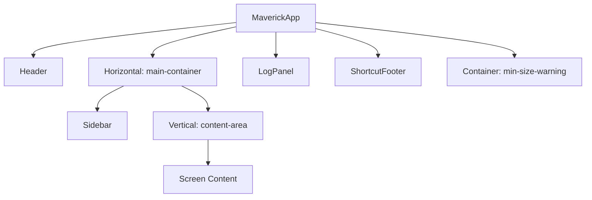
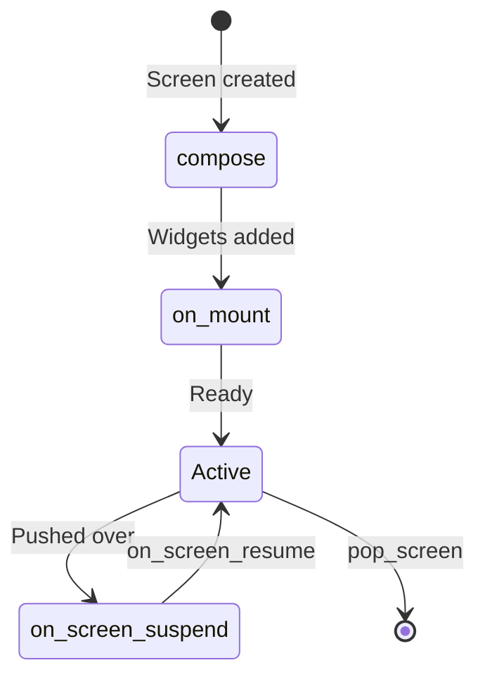
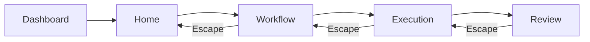
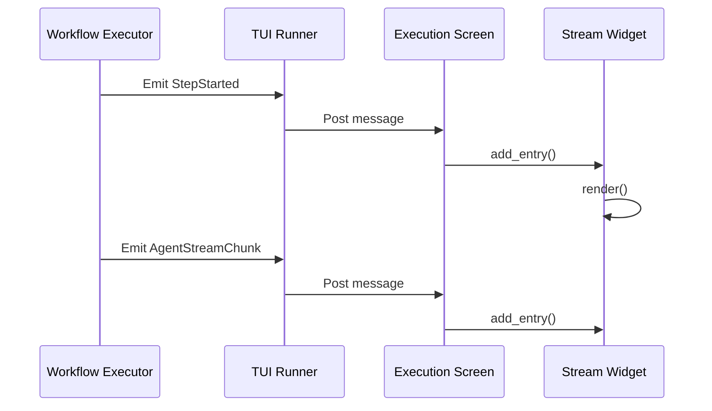

# 20. The TUI Layer

<div class="text-lg text-secondary mt-4">
Display-only terminal interface for workflow orchestration
</div>

<div class="mt-8 flex justify-center gap-6 text-sm">
  <div class="flex items-center gap-2">
    <span class="w-2 h-2 rounded-full bg-teal"></span>
    <span class="text-muted">10 Slides</span>
  </div>
  <div class="flex items-center gap-2">
    <span class="w-2 h-2 rounded-full bg-brass"></span>
    <span class="text-muted">Screens & Widgets</span>
  </div>
  <div class="flex items-center gap-2">
    <span class="w-2 h-2 rounded-full bg-coral"></span>
    <span class="text-muted">Streaming-First</span>
  </div>
</div>

<!--
Section 20 covers Maverick's TUI Layer - the terminal user interface
built with Textual that provides real-time workflow visualization.

We'll cover:
1. TUI design philosophy
2. MaverickApp class structure
3. Application layout
4. Screen inventory
5. Widget inventory
6. Navigation system
7. Command palette
8. Workflow runner integration
9. Streaming event display
10. TCSS theming
-->

---
layout: two-cols
---

# 20.1 TUI Design Philosophy

<div class="pr-4">

<div v-click>

## Core Principle: Display-Only

The TUI has **one job**: visualize state

<div class="space-y-2 mt-3 text-sm">
  <div class="flex items-start gap-2">
    <span class="text-teal mt-1">✓</span>
    <span><strong>Display</strong> workflow progress and output</span>
  </div>
  <div class="flex items-start gap-2">
    <span class="text-teal mt-1">✓</span>
    <span><strong>Capture</strong> user input and selections</span>
  </div>
  <div class="flex items-start gap-2">
    <span class="text-teal mt-1">✓</span>
    <span><strong>Delegate</strong> execution to runners/services</span>
  </div>
</div>

</div>

<div v-click class="mt-6">

## What TUI Must NOT Do

<div class="space-y-2 mt-3 text-sm">
  <div class="flex items-start gap-2">
    <span class="text-coral mt-1">✗</span>
    <span>Execute subprocesses</span>
  </div>
  <div class="flex items-start gap-2">
    <span class="text-coral mt-1">✗</span>
    <span>Make network calls</span>
  </div>
  <div class="flex items-start gap-2">
    <span class="text-coral mt-1">✗</span>
    <span>Contain business logic</span>
  </div>
  <div class="flex items-start gap-2">
    <span class="text-coral mt-1">✗</span>
    <span>Modify repository state</span>
  </div>
</div>

</div>

</div>

::right::

<div class="pl-4 mt-8">

<div v-click>

## Streaming-First Design

Inspired by Claude Code's interface:

```
┌────────────────────────────────┐
│ Header                    Time │
├─────────┬──────────────────────┤
│ Sidebar │  Unified Event       │
│         │  Stream              │
│  Stages │                      │
│  Steps  │  ▸ Step started...   │
│         │  ▸ Agent thinking... │
│         │  ▸ Tool call: edit   │
│         │  ▸ Agent output...   │
│         │                      │
├─────────┴──────────────────────┤
│ Log Panel (toggleable)         │
├────────────────────────────────┤
│ Shortcut Footer      Ctrl+L  ? │
└────────────────────────────────┘
```

</div>

<div v-click class="mt-4 p-3 bg-brass/10 border border-brass/30 rounded-lg text-sm">
  <strong class="text-brass">Architectural Guardrail</strong><br>
  <code>src/maverick/tui/**</code> MUST NOT execute subprocesses 
  or make network calls. TUI code delegates and renders only.
</div>

</div>

<!--
The TUI follows a strict display-only principle. It receives events from
workflow execution, renders them beautifully, and captures user input.
All actual work happens in runners and services. This separation keeps
the TUI responsive and testable, and prevents accidental side effects.
-->

---
layout: two-cols
---

# 20.2 MaverickApp Class

<div class="pr-4">

<div v-click>

## The Entry Point

```python
class MaverickApp(App[None]):
    """Maverick TUI application.
    
    Main app providing base layout with
    header, sidebar, content area, log
    panel, and footer.
    """

    CSS_PATH = Path(__file__).parent / "maverick.tcss"
    TITLE = "Maverick"
    ENABLE_COMMAND_PALETTE = True
    COMMANDS = {MaverickCommands}

    # Minimum terminal size requirements
    MIN_WIDTH = 80
    MIN_HEIGHT = 24
```

</div>

<div v-click class="mt-4">

## Key Bindings

```python
BINDINGS = [
    Binding("ctrl+l", "toggle_log", "Toggle Log"),
    Binding("escape", "pop_screen", "Back"),
    Binding("q", "quit", "Quit"),
    Binding("?", "show_help_panel", "Help"),
    Binding("ctrl+comma", "show_config", "Settings"),
    Binding("ctrl+h", "go_home", "Home"),
]
```

</div>

</div>

::right::

<div class="pl-4 mt-8">

<div v-click>

## Composition Method

```python
def compose(self) -> ComposeResult:
    """Create the app layout."""
    yield Header()
    with Horizontal(id="main-container"):
        yield Sidebar(id="sidebar")
        yield Vertical(id="content-area")
    yield LogPanel(id="log-panel")
    yield ShortcutFooter(id="shortcut-footer")
    # Minimum size warning overlay
    with Container(id="min-size-warning"):
        yield Static(
            "[bold red]Terminal Too Small..."
        )
```

</div>

<div v-click class="mt-4">

## Initialization

```python
def __init__(self) -> None:
    super().__init__()
    self._timer_start: float | None = None
    self._timer_running: bool = False
    self._current_workflow: str = ""
    self._current_branch: str = ""
    self._navigation_context = NavigationContext()
```

</div>

<div v-click class="mt-3 p-3 bg-brass/10 border border-brass/30 rounded-lg text-sm">
  <strong class="text-brass">Location</strong><br>
  <code>src/maverick/tui/app.py</code>
</div>

</div>

<!--
MaverickApp extends Textual's App class. It defines the CSS file location,
title, command palette configuration, and key bindings. The compose method
creates the layout hierarchy. App state includes timer tracking, current
workflow info, and navigation context for history management.
-->

---
layout: two-cols
---

# 20.3 Application Layout

<div class="pr-4">

<div v-click>

## Layout Hierarchy



</div>

<div v-click class="mt-4">

## Responsive Breakpoints

```python
# Terminal width thresholds
LAYOUT_COMPACT_THRESHOLD = 100
LAYOUT_WIDE_THRESHOLD = 150

def _update_layout_class(self) -> None:
    width = self.size.width
    
    if width < 100:
        self.add_class("layout-compact")
    elif width > 150:
        self.add_class("layout-wide")
    else:
        self.add_class("layout-normal")
```

</div>

</div>

::right::

<div class="pl-4 mt-8">

<div v-click>

## Layout Regions

| Region | Purpose | Width |
|--------|---------|-------|
| Header | Title, clock | Full |
| Sidebar | Navigation, stages | 30 cols |
| Content | Screen content | 1fr |
| LogPanel | Debug logs | 15 rows |
| Footer | Shortcuts | 1 row |

</div>

<div v-click class="mt-4">

## Size Warning Overlay

```python
def _check_terminal_size(self) -> None:
    """Show warning if terminal too small."""
    width = self.size.width
    height = self.size.height
    
    warning = self.query_one("#min-size-warning")
    if width < 80 or height < 24:
        warning.add_class("visible")
    else:
        warning.remove_class("visible")
```

</div>

<div v-click class="mt-3 p-3 bg-teal/10 border border-teal/30 rounded-lg text-sm">
  <strong class="text-teal">Graceful Degradation</strong><br>
  Compact layout hides secondary panels and reduces 
  sidebar width for narrow terminals.
</div>

</div>

<!--
The layout uses Textual's container system. Header and footer dock to
edges, the main container splits horizontally into sidebar and content.
The log panel toggles visibility. Responsive classes adjust layout based
on terminal width, ensuring usability across different terminal sizes.
-->

---
layout: two-cols
---

# 20.4 Screen Inventory

<div class="pr-4">

<div v-click>

## Available Screens

| Screen | Purpose |
|--------|---------|
| `DashboardScreen` | Welcome, recent runs |
| `HomeScreen` | Workflow selection |
| `WorkflowScreen` | Workflow details |
| `WorkflowBrowserScreen` | Browse workflows |
| `WorkflowInputScreen` | Input parameters |
| `WorkflowExecutionScreen` | Live execution |
| `ReviewScreen` | Code review display |
| `SettingsScreen` | Configuration |
| `HistoryReviewScreen` | Past run details |

</div>

<div v-click class="mt-4">

## Base Screen Class

```python
class MaverickScreen(Screen[None]):
    """Base class for Maverick screens.
    
    Provides common functionality:
    - Navigation tracking
    - Shortcut footer integration
    - Consistent styling
    """
    
    TITLE: str = "Maverick"
    BINDINGS: list[Binding] = []
```

</div>

</div>

::right::

<div class="pl-4 mt-8">

<div v-click>

## Screen Lifecycle



</div>

<div v-click class="mt-4">

## Example: HomeScreen

```python
class HomeScreen(MaverickScreen):
    TITLE = "Home"
    
    BINDINGS = [
        Binding("enter", "select_workflow"),
        Binding("w", "start_workflow"),
        Binding("s", "navigate_settings"),
    ]

    def compose(self) -> ComposeResult:
        yield Static("[bold]Welcome...[/bold]")
        yield Static("Recent Workflows:")
        yield WorkflowList(id="workflow-list")
```

</div>

<div v-click class="mt-3 p-3 bg-brass/10 border border-brass/30 rounded-lg text-sm">
  <strong class="text-brass">Location</strong><br>
  <code>src/maverick/tui/screens/</code>
</div>

</div>

<!--
Screens are full-viewport views that handle specific functionality.
Each screen extends MaverickScreen for consistent behavior. The screen
lifecycle follows Textual's pattern: compose creates widgets, on_mount
initializes state, and screens can be pushed/popped for navigation.
-->

---
layout: two-cols
---

# 20.5 Widget Inventory

<div class="pr-4">

<div v-click>

## Core Widgets

| Widget | Purpose |
|--------|---------|
| `Sidebar` | Navigation & stages |
| `LogPanel` | Debug log display |
| `ShortcutFooter` | Key binding hints |
| `UnifiedStreamWidget` | Event stream |
| `WorkflowList` | Workflow selection |
| `StepTree` | Step hierarchy |
| `ValidationStatus` | Check results |

</div>

<div v-click class="mt-4">

## Specialized Widgets

| Widget | Purpose |
|--------|---------|
| `AgentStreamingPanel` | Agent output |
| `DiffPanel` | File diff view |
| `ReviewFindings` | Review issues |
| `IterationProgress` | Loop progress |
| `PRSummary` | PR details |
| `Timeline` | Stage timeline |

</div>

</div>

::right::

<div class="pl-4 mt-8">

<div v-click>

## Widget Composition

```python
class Sidebar(Widget):
    """Sidebar with navigation and stages."""
    
    DEFAULT_CSS = """
    Sidebar {
        width: 30;
        dock: left;
        border-right: solid $border;
    }
    """
    
    def compose(self) -> ComposeResult:
        yield Static("Maverick", classes="title")
        yield NavMenu(id="nav-menu")
        yield StageIndicator(id="stages")
```

</div>

<div v-click class="mt-4">

## Reactive Patterns

```python
class LogPanel(Widget):
    """Toggleable log panel."""
    
    visible: reactive[bool] = reactive(True)
    
    def watch_visible(self, value: bool) -> None:
        """React to visibility changes."""
        if value:
            self.remove_class("hidden")
        else:
            self.add_class("hidden")
    
    def toggle(self) -> None:
        self.visible = not self.visible
```

</div>

<div v-click class="mt-3 p-3 bg-brass/10 border border-brass/30 rounded-lg text-sm">
  <strong class="text-brass">Location</strong><br>
  <code>src/maverick/tui/widgets/</code>
</div>

</div>

<!--
Widgets are reusable UI components. Core widgets provide essential
functionality like navigation and logging. Specialized widgets handle
specific data visualization. Widgets use reactive attributes for automatic
UI updates and follow Textual's composition pattern.
-->

---
layout: two-cols
---

# 20.6 Navigation System

<div class="pr-4">

<div v-click>

## NavigationContext

```python
@dataclass(frozen=True, slots=True)
class NavigationEntry:
    """Entry in navigation history."""
    screen_name: str
    params: dict[str, Any] = field(
        default_factory=dict
    )
    timestamp: str = ""  # ISO 8601


@dataclass(frozen=True, slots=True)
class NavigationContext:
    """Tracks screen navigation history."""
    history: tuple[NavigationEntry, ...] = ()

    @property
    def can_go_back(self) -> bool:
        return len(self.history) > 1

    @property
    def current_screen(self) -> NavigationEntry | None:
        return self.history[-1] if self.history else None
```

</div>

</div>

::right::

<div class="pl-4 mt-8">

<div v-click>

## Tracked Navigation

```python
def push_screen_tracked(
    self,
    screen: Screen,
    params: dict[str, Any] | None = None
) -> None:
    """Push screen with history tracking."""
    from datetime import datetime

    entry = NavigationEntry(
        screen_name=type(screen).__name__,
        params=params or {},
        timestamp=datetime.now().isoformat(),
    )
    
    # Append to immutable history
    self._navigation_context = NavigationContext(
        history=self._navigation_context.history
                + (entry,)
    )
    
    self.push_screen(screen)
```

</div>

<div v-click class="mt-4">

## Navigation Flow



</div>

<div v-click class="mt-3 p-3 bg-teal/10 border border-teal/30 rounded-lg text-sm">
  <strong class="text-teal">Immutable History</strong><br>
  Navigation history uses frozen dataclasses to 
  prevent accidental mutation of state.
</div>

</div>

<!--
The navigation system tracks screen history using immutable dataclasses.
push_screen_tracked records each navigation, enabling back navigation
with pop_screen_tracked. The history supports breadcrumb display and
deep linking. All state changes create new immutable objects.
-->

---
layout: two-cols
---

# 20.7 Command Palette

<div class="pr-4">

<div v-click>

## MaverickCommands Provider

```python
class MaverickCommands(Provider):
    """Command palette provider."""

    async def search(self, query: str) -> Hits:
        """Search for Maverick commands."""
        app = self.app
        assert isinstance(app, MaverickApp)

        commands = [
            ("Go to Home", 
             "Navigate to home screen", 
             app.action_go_home),
            ("Go to Settings", 
             "Navigate to settings", 
             app.action_show_config),
            ("Toggle Log Panel", 
             "Show or hide log panel", 
             app.action_toggle_log),
            ("Start Workflow", 
             "Start a new workflow", 
             app.action_start_workflow),
            # ... more commands
        ]
```

</div>

</div>

::right::

<div class="pl-4 mt-8">

<div v-click>

## Fuzzy Matching

```python
        query_lower = query.lower()
        for name, description, callback in commands:
            if (query_lower in name.lower() or 
                query_lower in description.lower()):
                yield Hit(
                    score=1,
                    match_display=name,
                    command=callback,
                    text=name,
                    help=description,
                )
```

</div>

<div v-click class="mt-4">

## Activation

Press `Ctrl+P` or use the command:

```
> Toggle Log
> Go to Home  
> Start Workflow
> Settings
```

</div>

<div v-click class="mt-4 p-3 bg-teal/10 border border-teal/30 rounded-lg text-sm">
  <strong class="text-teal">VS Code Style</strong><br>
  The command palette provides familiar quick-access 
  to all app actions without memorizing shortcuts.
</div>

<div v-click class="mt-3 p-3 bg-brass/10 border border-brass/30 rounded-lg text-sm">
  <strong class="text-brass">Registration</strong><br>
  <code>COMMANDS = {MaverickCommands}</code> in MaverickApp
</div>

</div>

<!--
The command palette uses Textual's Provider system. MaverickCommands
searches available commands by name and description. Matching commands
are returned as Hit objects with callbacks. Users can access any command
quickly without remembering specific key bindings.
-->

---
layout: two-cols
---

# 20.8 Workflow Runner Integration

<div class="pr-4">

<div v-click>

## WorkflowExecutionApp

```python
class WorkflowExecutionApp(App[None]):
    """Dedicated app for workflow execution.
    
    Minimal App showing only the 
    WorkflowExecutionScreen, without 
    HomeScreen navigation.
    """

    def __init__(
        self,
        workflow: WorkflowFile,
        inputs: dict[str, Any],
        session_log_path: Path | None = None,
    ) -> None:
        super().__init__()
        self._workflow = workflow
        self._inputs = inputs
        self._session_log_path = session_log_path
```

</div>

<div v-click class="mt-4">

## Entry Point

```python
async def run_workflow_in_tui(
    workflow: WorkflowFile,
    inputs: dict[str, Any],
) -> None:
    """Run workflow with TUI display."""
    app = WorkflowExecutionApp(
        workflow=workflow,
        inputs=inputs,
    )
    await app.run_async()
```

</div>

</div>

::right::

<div class="pl-4 mt-8">

<div v-click>

## Event Flow



</div>

<div v-click class="mt-4">

## Message Types

| Event | Widget Action |
|-------|---------------|
| `StepStarted` | Add step entry |
| `StepCompleted` | Mark complete |
| `AgentStreamChunk` | Append output |
| `ToolCall` | Show tool info |
| `StepFailed` | Show error |

</div>

<div v-click class="mt-3 p-3 bg-brass/10 border border-brass/30 rounded-lg text-sm">
  <strong class="text-brass">Location</strong><br>
  <code>src/maverick/tui/workflow_runner.py</code>
</div>

</div>

<!--
WorkflowExecutionApp is a streamlined app specifically for running
workflows. It receives events from the workflow executor through Textual's
message system and routes them to the appropriate widgets for display.
The TUI never executes workflows directly - it only displays events.
-->

---
layout: two-cols
---

# 20.9 Streaming Event Display

<div class="pr-4">

<div v-click>

## UnifiedStreamWidget

```python
class UnifiedStreamWidget(Widget):
    """Widget for unified event stream.
    
    - Single scrollable stream
    - Type-specific styling with badges
    - Auto-scroll with pause indicator
    - FIFO buffer for memory efficiency
    """

    def __init__(
        self,
        state: UnifiedStreamState,
        ...
    ) -> None:
        self._state = state
        self._last_displayed_index = 0
        self._filter_path: str | None = None
```

</div>

<div v-click class="mt-4">

## Entry Types

```python
class StreamEntryType(str, Enum):
    STEP_START = "step_start"
    STEP_COMPLETE = "step_complete"
    STEP_FAILED = "step_failed"
    AGENT_OUTPUT = "agent_output"
    AGENT_THINKING = "agent_thinking"
    TOOL_CALL = "tool_call"
    TOOL_RESULT = "tool_result"
    LOOP_START = "loop_start"
    ERROR = "error"
```

</div>

</div>

::right::

<div class="pl-4 mt-8">

<div v-click>

## Badge Colors

```python
_BADGE_COLORS: dict[StreamEntryType, str] = {
    StreamEntryType.STEP_START: "dodger_blue1",
    StreamEntryType.STEP_COMPLETE: "green3",
    StreamEntryType.STEP_FAILED: "red1",
    StreamEntryType.AGENT_OUTPUT: "medium_purple2",
    StreamEntryType.AGENT_THINKING: "grey62 italic",
    StreamEntryType.TOOL_CALL: "grey42",
    StreamEntryType.ERROR: "red1",
}
```

</div>

<div v-click class="mt-4">

## Adding Entries

```python
def add_entry(
    self, 
    entry: UnifiedStreamEntry
) -> None:
    """Add entry to stream and render."""
    self._state.add_entry(entry)
    
    # Render with badge and styling
    text = Text()
    text.append(f"[{entry.entry_type.value}] ", 
                style=_BADGE_COLORS[entry.entry_type])
    text.append(entry.content)
    
    self._log.write(text)
```

</div>

<div v-click class="mt-3 p-3 bg-teal/10 border border-teal/30 rounded-lg text-sm">
  <strong class="text-teal">Memory Efficient</strong><br>
  FIFO buffer (100KB limit) prevents memory exhaustion 
  during long-running workflows.
</div>

</div>

<!--
UnifiedStreamWidget provides the main content display. All workflow events
flow into a single chronological stream with type-specific badges and
colors. The widget supports filtering by step, auto-scrolling, and uses
a FIFO buffer to prevent memory issues during long workflows.
-->

---
layout: two-cols
---

# 20.10 TCSS Theming

<div class="pr-4">

<div v-click>

## Color Variables

```css
/* === Color Variables === */
$background: #1a1a1a;
$surface: #242424;
$surface-elevated: #2d2d2d;
$border: #3a3a3a;

$text: #e0e0e0;
$text-muted: #808080;
$text-dim: #606060;

$success: #4caf50;
$warning: #ff9800;
$error: #f44336;
$info: #2196f3;

$accent: #00aaff;
$accent-muted: #0077aa;
```

</div>

<div v-click class="mt-4">

## Accessibility Compliance

| Color | Contrast | Level |
|-------|----------|-------|
| `$text` | 11.9:1 | AAA |
| `$text-muted` | 5.3:1 | AA |
| `$success` | 5.8:1 | AA |
| `$warning` | 7.3:1 | AA |
| `$error` | 5.2:1 | AA |
| `$accent` | 6.4:1 | AA |

</div>

</div>

::right::

<div class="pl-4 mt-8">

<div v-click>

## Component Styling

```css
/* === Sidebar === */
#sidebar {
    dock: left;
    width: 30;
    border-right: solid $border;
    background: $surface;
    padding: 1;
}

#sidebar .nav-item:hover {
    background: $surface-elevated;
}

#sidebar .nav-item.--selected {
    background: $accent-muted;
    color: $text;
}

/* === Status Indicators === */
.iteration-running {
    color: $accent;
}

.iteration-completed {
    color: $success;
}

.iteration-failed {
    color: $error;
}
```

</div>

<div v-click class="mt-3 p-3 bg-brass/10 border border-brass/30 rounded-lg text-sm">
  <strong class="text-brass">Location</strong><br>
  <code>src/maverick/tui/maverick.tcss</code> (2000+ lines)
</div>

</div>

<!--
TCSS (Textual CSS) provides styling for all TUI components. Color variables
ensure consistency. All colors meet WCAG AA accessibility standards for
contrast ratios. Component-specific styles handle layout, borders, and
state indicators. The stylesheet is extensive at 2000+ lines.
-->

---
layout: center
class: text-center
---

# TUI Layer Summary

<div class="grid grid-cols-3 gap-6 mt-8 text-sm">

<div v-click class="p-4 bg-slate-800/50 rounded-lg">
  <div class="text-teal text-2xl mb-2">🖥️</div>
  <div class="font-bold mb-2">Display-Only</div>
  <div class="text-muted">
    TUI visualizes state without executing business 
    logic or making external calls
  </div>
</div>

<div v-click class="p-4 bg-slate-800/50 rounded-lg">
  <div class="text-brass text-2xl mb-2">🎨</div>
  <div class="font-bold mb-2">Component Architecture</div>
  <div class="text-muted">
    Reusable screens and widgets with reactive state
    and TCSS theming
  </div>
</div>

<div v-click class="p-4 bg-slate-800/50 rounded-lg">
  <div class="text-coral text-2xl mb-2">📺</div>
  <div class="font-bold mb-2">Streaming-First</div>
  <div class="text-muted">
    Unified event stream displays real-time workflow 
    progress with type-specific styling
  </div>
</div>

</div>

<div v-click class="mt-8 p-4 bg-teal/10 border border-teal/30 rounded-lg text-sm max-w-2xl mx-auto">
  <strong class="text-teal">Key Principle</strong><br>
  The TUI is <strong>purely presentational</strong>. It receives events from 
  workflow execution, renders them with appropriate styling, and captures user 
  input. All actual work happens in runners and services outside the TUI layer.
</div>

<div v-click class="mt-6 text-muted text-sm">
  Key files: <code>src/maverick/tui/app.py</code> · 
  <code>src/maverick/tui/screens/</code> · 
  <code>src/maverick/tui/widgets/</code> · 
  <code>src/maverick/tui/maverick.tcss</code>
</div>

<!--
The TUI layer provides a rich terminal interface while maintaining strict
architectural boundaries. It's display-only - no business logic, no
subprocess execution. Screens and widgets compose into a responsive layout
with TCSS theming. The streaming-first design keeps users informed of
workflow progress in real-time.

This completes Part 2: Maverick Architecture. Part 3 covers Advanced Topics.
-->
