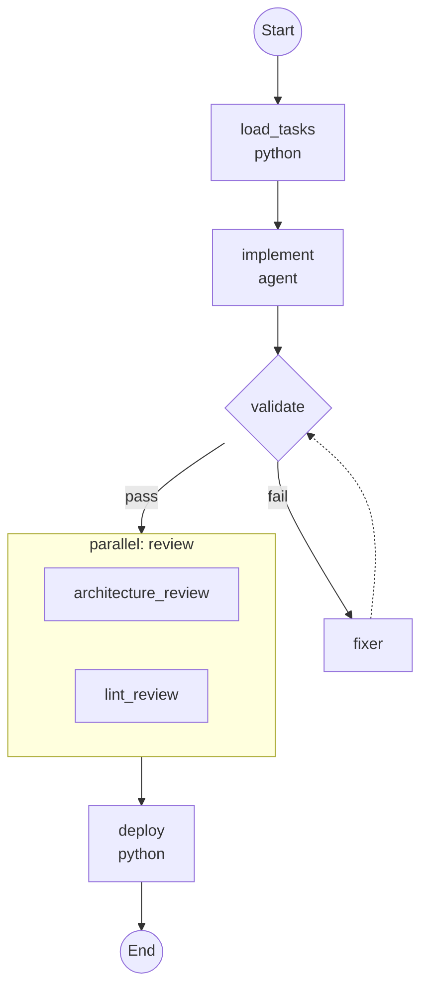

# CLI Commands Contract

**Feature**: 024-workflow-serialization-viz
**Date**: 2025-12-20

## Overview

This document defines the CLI commands for workflow management (FR-024 through FR-028).

---

## 1. Command Group

```
maverick workflow <command>
```

All workflow commands are grouped under the `workflow` subcommand.

---

## 2. Commands

### 2.1 workflow list (FR-024)

```
maverick workflow list [OPTIONS]
```

List registered workflows.

**Options**:
| Option | Type | Default | Description |
|--------|------|---------|-------------|
| `--format` | Choice: table, json, yaml | table | Output format |

**Output (table)**:
```
NAME                    DESCRIPTION                      STEPS
────────────────────────────────────────────────────────────────
feature-implementation  Implement feature from tasks.md  5
code-review             Run parallel code review         3
refuel                  Tech-debt resolution workflow    7
```

**Output (json)**:
```json
[
  {
    "name": "feature-implementation",
    "description": "Implement feature from tasks.md",
    "step_count": 5
  }
]
```

**Exit Codes**:
- 0: Success
- 1: Error listing workflows

---

### 2.2 workflow show (FR-025)

```
maverick workflow show NAME [OPTIONS]
```

Show workflow details including metadata, inputs, and steps.

**Arguments**:
| Argument | Required | Description |
|----------|----------|-------------|
| NAME | Yes | Workflow name (registered or file path) |

**Options**:
| Option | Type | Default | Description |
|--------|------|---------|-------------|
| `--format` | Choice: table, json, yaml | table | Output format |

**Output (table)**:
```
Workflow: feature-implementation
Description: Implement feature from tasks.md

Inputs:
  NAME        TYPE     REQUIRED  DEFAULT  DESCRIPTION
  ──────────────────────────────────────────────────────
  spec_dir    string   true      -        Path to spec directory
  dry_run     boolean  false     false    Skip actual commits

Steps:
  #  NAME           TYPE       CONDITION
  ──────────────────────────────────────────────────────
  1  load_tasks     python     -
  2  implement      agent      not inputs.dry_run
  3  validate       validate   -
  4  review         parallel   -
  5  deploy         python     -
```

**Exit Codes**:
- 0: Success
- 1: Workflow not found or invalid

---

### 2.3 workflow validate (FR-026)

```
maverick workflow validate FILE [OPTIONS]
```

Validate a workflow YAML file without execution.

**Arguments**:
| Argument | Required | Description |
|----------|----------|-------------|
| FILE | Yes | Path to workflow YAML file |

**Options**:
| Option | Type | Default | Description |
|--------|------|---------|-------------|
| `--strict` | Flag | True | Fail on unresolved references |
| `--format` | Choice: text, json | text | Output format |

**Output (success)**:
```
✓ Workflow 'feature-implementation' is valid
  - 5 steps defined
  - 2 inputs declared
  - All references resolved
```

**Output (failure)**:
```
✗ Workflow validation failed: 3 errors

  Error E001 at steps[2].agent:
    Unknown agent 'review_bot'
    Registered agents: code_reviewer, implementer, fixer

  Error E002 at steps[3].on_failure.context:
    Invalid expression: ${{ steps.nonexistent.output }}
    Step 'nonexistent' does not exist

  Error E003 at inputs.count:
    Default value 'five' is not a valid integer
```

**Exit Codes**:
- 0: Validation passed
- 1: Validation failed (with errors)
- 2: File not found or unreadable

---

### 2.4 workflow viz (FR-027)

```
maverick workflow viz NAME_OR_FILE [OPTIONS]
```

Visualize a workflow diagram.

**Arguments**:
| Argument | Required | Description |
|----------|----------|-------------|
| NAME_OR_FILE | Yes | Workflow name or file path |

**Options**:
| Option | Type | Default | Description |
|--------|------|---------|-------------|
| `--format` | Choice: ascii, mermaid | ascii | Diagram format |
| `--output` | Path | - | Write to file instead of stdout |
| `--direction` | Choice: TD, LR | TD | Mermaid flow direction |

**Output (ascii)**:
```
┌─────────────────────────────────────────────────┐
│ Workflow: feature-implementation                │
├─────────────────────────────────────────────────┤
│ 1. [python] load_tasks                          │
│       ↓                                         │
│ 2. [agent] implement                            │
│    └─ when: not inputs.dry_run                  │
│       ↓                                         │
│ 3. [validate] validate                          │
│    ├─ retry: 3                                  │
│    ├─ on_fail → 3a. [agent] fixer               │
│    │            └─ retry → 3.                   │
│    └─ on_pass ↓                                 │
│ 4. [parallel] review                            │
│    ├─ 4a. [agent] architecture_review           │
│    └─ 4b. [python] lint_review                  │
│       ↓                                         │
│ 5. [python] deploy                              │
└─────────────────────────────────────────────────┘
```

**Output (mermaid)**:


**Exit Codes**:
- 0: Success
- 1: Workflow not found or invalid

---

### 2.5 workflow run (FR-028)

```
maverick workflow run NAME_OR_FILE [OPTIONS]
```

Run a workflow with provided inputs.

**Arguments**:
| Argument | Required | Description |
|----------|----------|-------------|
| NAME_OR_FILE | Yes | Workflow name or file path |

**Options**:
| Option | Type | Multiple | Description |
|--------|------|----------|-------------|
| `-i, --input` | KEY=VALUE | Yes | Workflow input (can repeat) |
| `--input-file` | Path | No | JSON/YAML file with inputs |
| `--dry-run` | Flag | No | Validate and show plan without executing |
| `--no-tui` | Flag | No | Run without TUI (streaming output) |
| `--output` | Choice: text, json | text | Result output format |

**Examples**:
```bash
# Run with inline inputs
maverick workflow run feature-implementation \
  -i spec_dir=./specs/024-workflow-serialization-viz \
  -i dry_run=true

# Run with input file
maverick workflow run code-review --input-file inputs.yaml

# Run from file
maverick workflow run ./workflows/custom.yaml -i target=main

# Dry run (show plan)
maverick workflow run feature-implementation --dry-run -i spec_dir=./specs/001
```

**Output (success)**:
```
Running workflow: feature-implementation

Step 1/5: load_tasks [python]
  ✓ Completed (0.5s)
  Output: 3 tasks loaded

Step 2/5: implement [agent]
  ✓ Completed (45.2s)
  Output: 3 tasks implemented

Step 3/5: validate [validate]
  ✓ Completed (12.1s) after 1 retry
  Output: All validations passed

Step 4/5: review [parallel]
  ✓ architecture_review: No issues
  ✓ lint_review: 2 suggestions
  Completed (8.3s)

Step 5/5: deploy [python]
  ✓ Completed (2.1s)
  Output: PR #123 created

────────────────────────────────────────────────
Workflow completed successfully in 68.2s
```

**Output (failure)**:
```
Running workflow: feature-implementation

Step 1/5: load_tasks [python]
  ✓ Completed (0.5s)

Step 2/5: implement [agent]
  ✗ Failed after 3 attempts

Error: Agent 'implementer' failed with:
  Unable to complete task due to missing dependencies

Workflow failed at step 2/5
Elapsed time: 15.3s
```

**Output (dry-run)**:
```
Workflow: feature-implementation

Inputs:
  spec_dir = ./specs/024-workflow-serialization-viz
  dry_run = true (default)

Execution Plan:
  1. load_tasks [python]
     Action: maverick.actions.load_tasks
     Args: ['./specs/024-workflow-serialization-viz']

  2. implement [agent] (SKIPPED: when condition)
     Condition: not inputs.dry_run = False

  3. validate [validate]
     Stages: format, lint, test
     Retry: 3

  4. review [parallel]
     4a. architecture_review [agent]
     4b. lint_review [python]

  5. deploy [python]
     Action: maverick.actions.deploy

Total steps: 5 (1 will be skipped)
```

**Exit Codes**:
- 0: Workflow completed successfully
- 1: Workflow failed during execution
- 2: Validation failed (inputs, file not found, etc.)

---

## 3. Global Options

These options apply to all workflow commands:

| Option | Type | Default | Description |
|--------|------|---------|-------------|
| `--registry` | Path | - | Custom registry configuration file |
| `--lenient` | Flag | False | Defer reference resolution errors |

---

## 4. Error Messages

All error messages should be actionable:

```
# Bad
Error: Invalid workflow

# Good
Error: Invalid workflow file 'workflow.yaml'
  Line 15, column 5: Unknown step type 'custom'
  Valid step types: python, agent, generate, validate, subworkflow, branch, parallel
```

---

## 5. Integration with Existing CLI

Add to existing Click structure in `main.py`:

```python
@cli.group()
def workflow():
    """Manage workflow definitions."""
    pass

@workflow.command("list")
@click.option("--format", type=click.Choice(["table", "json", "yaml"]), default="table")
@click.pass_context
def workflow_list(ctx, format):
    ...

@workflow.command("show")
@click.argument("name")
@click.option("--format", type=click.Choice(["table", "json", "yaml"]), default="table")
@click.pass_context
def workflow_show(ctx, name, format):
    ...

@workflow.command("validate")
@click.argument("file", type=click.Path(exists=True))
@click.option("--strict/--no-strict", default=True)
@click.option("--format", type=click.Choice(["text", "json"]), default="text")
@click.pass_context
def workflow_validate(ctx, file, strict, format):
    ...

@workflow.command("viz")
@click.argument("name_or_file")
@click.option("--format", type=click.Choice(["ascii", "mermaid"]), default="ascii")
@click.option("--output", type=click.Path())
@click.option("--direction", type=click.Choice(["TD", "LR"]), default="TD")
@click.pass_context
def workflow_viz(ctx, name_or_file, format, output, direction):
    ...

@workflow.command("run")
@click.argument("name_or_file")
@click.option("-i", "--input", multiple=True, help="KEY=VALUE input")
@click.option("--input-file", type=click.Path(exists=True))
@click.option("--dry-run", is_flag=True)
@click.option("--no-tui", is_flag=True)
@click.option("--output", type=click.Choice(["text", "json"]), default="text")
@click.pass_context
@async_command
async def workflow_run(ctx, name_or_file, input, input_file, dry_run, no_tui, output):
    ...
```
