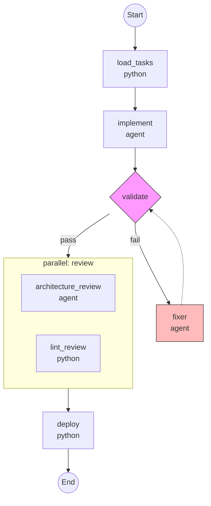

# Visualization API Contract

**Feature**: 024-workflow-serialization-viz
**Date**: 2025-12-20

## Overview

This document defines the Python API contracts for workflow visualization (Mermaid diagrams and ASCII representations).

---

## 1. Visualization Methods on Workflow

### 1.1 Workflow.to_mermaid (FR-020)

```python
def to_mermaid(
    self,
    direction: Literal["TD", "LR"] = "TD",
    include_conditions: bool = True,
) -> str:
    """Generate Mermaid flowchart diagram.

    Args:
        direction: Flow direction - "TD" (top-down) or "LR" (left-right).
        include_conditions: If True, annotate conditional steps with their
            `when` expressions.

    Returns:
        Mermaid diagram string starting with "flowchart TD" or "flowchart LR".

    Example output:
        ```mermaid
        flowchart TD
            START((Start)) --> step1[process_data]
            step1 --> step2{validate}
            step2 -->|pass| step3[deploy]
            step2 -->|fail| fix[fix_issues]
            fix --> step2
            step3 --> END((End))
        ```
    """
    ...
```

---

### 1.2 Workflow.to_ascii (FR-021)

```python
def to_ascii(
    self,
    width: int = 60,
    show_types: bool = True,
) -> str:
    """Generate ASCII diagram for terminal display.

    Args:
        width: Maximum diagram width in characters.
        show_types: If True, include step type annotations.

    Returns:
        ASCII diagram string using box-drawing characters.

    Example output:
        ```
        ┌─────────────────────────────────────┐
        │ Workflow: my-workflow               │
        ├─────────────────────────────────────┤
        │ 1. [python] process_data            │
        │       ↓                             │
        │ 2. [validate] check_format          │
        │    ├─ on fail → 2a. fix_format      │
        │    │            └─ retry → 2.       │
        │    └─ on pass ↓                     │
        │ 3. [agent] code_review              │
        │       ↓                             │
        │ 4. [python] deploy                  │
        └─────────────────────────────────────┘
        ```
    """
    ...
```

---

## 2. Visualization Generator Interfaces

### 2.1 MermaidGenerator

```python
class MermaidGenerator(Protocol):
    """Generator for Mermaid diagrams (FR-020)."""

    def generate(
        self,
        graph: WorkflowGraph,
        direction: Literal["TD", "LR"] = "TD",
    ) -> str:
        """Generate Mermaid diagram from workflow graph.

        Args:
            graph: WorkflowGraph intermediate representation.
            direction: Flow direction.

        Returns:
            Complete Mermaid diagram string.
        """
        ...

    def format_node(self, node: GraphNode) -> str:
        """Format a single node for Mermaid.

        Args:
            node: Graph node to format.

        Returns:
            Mermaid node syntax (e.g., "step1[Process Data]").
        """
        ...

    def format_edge(self, edge: GraphEdge) -> str:
        """Format a single edge for Mermaid.

        Args:
            edge: Graph edge to format.

        Returns:
            Mermaid edge syntax (e.g., "step1 --> step2").
        """
        ...
```

---

### 2.2 ASCIIGenerator

```python
class ASCIIGenerator(Protocol):
    """Generator for ASCII diagrams (FR-021)."""

    def generate(
        self,
        graph: WorkflowGraph,
        width: int = 60,
    ) -> str:
        """Generate ASCII diagram from workflow graph.

        Args:
            graph: WorkflowGraph intermediate representation.
            width: Maximum width in characters.

        Returns:
            ASCII diagram string.
        """
        ...
```

---

## 3. Graph Building Interface

### 3.1 WorkflowGraphBuilder

```python
class WorkflowGraphBuilder(Protocol):
    """Builds intermediate graph representation from workflow."""

    def build(
        self,
        workflow: WorkflowDefinition,
        steps: list[StepDefinition],
    ) -> WorkflowGraph:
        """Build graph from workflow definition.

        Args:
            workflow: WorkflowDefinition metadata.
            steps: List of step definitions.

        Returns:
            WorkflowGraph with nodes and edges.
        """
        ...

    def unwrap_step(self, step: StepDefinition) -> tuple[StepDefinition, list[str]]:
        """Unwrap wrapper steps to get core step and modifiers.

        Args:
            step: Possibly wrapped step (ConditionalStep, RetryStep, etc.)

        Returns:
            Tuple of (core step, list of modifier names).
        """
        ...
```

---

## 4. Visualization Requirements (FR-022, FR-023)

### 4.1 Required Elements

All visualizations MUST include:

| Element | Mermaid | ASCII |
|---------|---------|-------|
| Workflow name | Title or comment | Header box |
| Step name | Node label | Numbered line |
| Step type | Node shape | `[type]` prefix |
| Sequential edges | `-->` arrows | `↓` arrows |
| Conditional annotation | `{node}` diamond + label | `when: expr` suffix |
| Retry loops | Dashed back-edge | `retry → N.` notation |
| Validate fix loops | Edge to on_failure step | Indented substep |
| Parallel steps | Subgraph | Side-by-side or `||` marker |
| Branch options | Diamond with labeled edges | Indented options |

---

### 4.2 Node Shapes by Step Type (Mermaid)

| Step Type | Shape | Syntax |
|-----------|-------|--------|
| python | Rectangle | `[name]` |
| agent | Rounded rectangle | `(name)` |
| generate | Rounded rectangle | `(name)` |
| validate | Diamond | `{name}` |
| subworkflow | Double rectangle | `[[name]]` |
| branch | Diamond | `{name}` |
| parallel | Subgraph | `subgraph name` |

---

### 4.3 Edge Types

| Edge Type | Mermaid | ASCII |
|-----------|---------|-------|
| Sequential | `-->` | `↓` |
| Conditional (when true) | `-->` with label | `when: expr ↓` |
| Conditional (skip) | `-.->` dashed | `(skipped)` |
| Retry | `-.->` back-edge | `retry →` |
| Branch option | `-->` with condition label | `├─ option:` |

---

## 5. Performance Contracts

| Operation | Max Time | Workflow Size |
|-----------|----------|---------------|
| to_mermaid | 1 second | 50 steps (SC-003) |
| to_ascii | 1 second | 50 steps (SC-003) |
| build_graph | 500ms | 100 steps |

---

## 6. Example Outputs

### 6.1 Mermaid Example



---

### 6.2 ASCII Example

```
┌─────────────────────────────────────────────────┐
│ Workflow: feature-implementation                │
│ Implement a feature from tasks.md               │
├─────────────────────────────────────────────────┤
│ Inputs:                                         │
│   spec_dir (string, required)                   │
│   dry_run (boolean, default: false)             │
├─────────────────────────────────────────────────┤
│ Steps:                                          │
│                                                 │
│ 1. [python] load_tasks                          │
│       ↓                                         │
│ 2. [agent] implement                            │
│    └─ when: not inputs.dry_run                  │
│       ↓                                         │
│ 3. [validate] validate                          │
│    ├─ stages: format, lint, test                │
│    ├─ retry: 3                                  │
│    ├─ on_fail → 3a. [agent] fixer               │
│    │            └─ retry → 3.                   │
│    └─ on_pass ↓                                 │
│ 4. [parallel] review                            │
│    ├─ 4a. [agent] architecture_review           │
│    └─ 4b. [python] lint_review                  │
│       ↓                                         │
│ 5. [python] deploy                              │
└─────────────────────────────────────────────────┘
```
