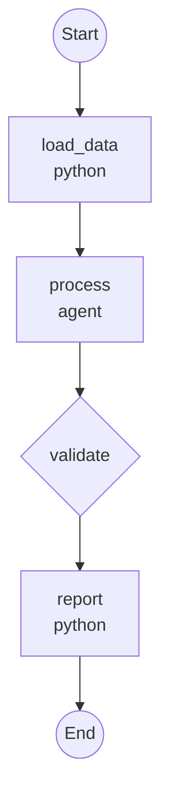

# Quickstart: Workflow Serialization & Visualization

**Feature Branch**: `024-workflow-serialization-viz`
**Date**: 2025-12-20

## Overview

This guide shows how to create, serialize, visualize, and run file-based workflows in Maverick.

---

## 1. Creating a Workflow File

Create a YAML file with your workflow definition:

```yaml
# my-workflow.yaml
version: "1.0"
name: my-workflow
description: A simple example workflow

inputs:
  target:
    type: string
    required: true
    description: Target to process
  verbose:
    type: boolean
    default: false
    description: Enable verbose output

steps:
  - name: load_data
    type: python
    action: myapp.loaders.load
    args:
      - ${{ inputs.target }}

  - name: process
    type: agent
    agent: processor
    context:
      data: ${{ steps.load_data.output }}
      verbose: ${{ inputs.verbose }}

  - name: validate
    type: validate
    stages:
      - format
      - lint
    retry: 2

  - name: report
    type: python
    action: myapp.reporters.generate
    kwargs:
      result: ${{ steps.process.output }}
```

---

## 2. Validating a Workflow

Before running, validate your workflow:

```bash
# Validate workflow file
maverick workflow validate my-workflow.yaml
```

**Output**:
```
✓ Workflow 'my-workflow' is valid
  - 4 steps defined
  - 2 inputs declared
  - All references resolved
```

If there are errors:
```
✗ Workflow validation failed: 1 error

  Error E001 at steps[1].agent:
    Unknown agent 'processor'
    Registered agents: code_reviewer, implementer
```

---

## 3. Visualizing a Workflow

### ASCII Diagram (Terminal)

```bash
maverick workflow viz my-workflow.yaml
```

**Output**:
```
┌─────────────────────────────────────────────────┐
│ Workflow: my-workflow                           │
│ A simple example workflow                       │
├─────────────────────────────────────────────────┤
│ Inputs:                                         │
│   target (string, required)                     │
│   verbose (boolean, default: false)             │
├─────────────────────────────────────────────────┤
│ 1. [python] load_data                           │
│       ↓                                         │
│ 2. [agent] process                              │
│       ↓                                         │
│ 3. [validate] validate                          │
│    └─ retry: 2                                  │
│       ↓                                         │
│ 4. [python] report                              │
└─────────────────────────────────────────────────┘
```

### Mermaid Diagram

```bash
maverick workflow viz my-workflow.yaml --format mermaid
```

**Output**:


Save to file:
```bash
maverick workflow viz my-workflow.yaml --format mermaid --output workflow.md
```

---

## 4. Running a Workflow

### From Command Line

```bash
# Run with inputs
maverick workflow run my-workflow.yaml \
  -i target=./data/input.json \
  -i verbose=true
```

### With Input File

Create an inputs file:
```yaml
# inputs.yaml
target: ./data/input.json
verbose: true
```

Run:
```bash
maverick workflow run my-workflow.yaml --input-file inputs.yaml
```

### Dry Run (Preview)

```bash
maverick workflow run my-workflow.yaml --dry-run -i target=./data/input.json
```

**Output**:
```
Workflow: my-workflow

Inputs:
  target = ./data/input.json
  verbose = false (default)

Execution Plan:
  1. load_data [python]
  2. process [agent]
  3. validate [validate]
  4. report [python]

Total steps: 4
```

---

## 5. Registering Components

Before running workflows, register your components:

### Actions (Python Functions)

```python
# myapp/actions.py
from maverick.dsl.serialization import action_registry

@action_registry.register("myapp.loaders.load")
def load_data(target: str) -> dict:
    """Load data from target path."""
    with open(target) as f:
        return json.load(f)

@action_registry.register("myapp.reporters.generate")
def generate_report(result: dict) -> str:
    """Generate report from result."""
    return f"Processed {len(result)} items"
```

### Agents

```python
# myapp/agents.py
from maverick.agents.registry import register

@register("processor")
class ProcessorAgent(MaverickAgent):
    """Agent that processes data."""
    ...
```

---

## 6. Using Expressions

Expressions reference runtime values in your workflow:

| Expression | Description | Example |
|------------|-------------|---------|
| `${{ inputs.name }}` | Input parameter | `${{ inputs.target }}` |
| `${{ steps.x.output }}` | Step output | `${{ steps.load_data.output }}` |
| `${{ steps.x.output.field }}` | Nested field | `${{ steps.process.output.count }}` |
| `${{ not inputs.x }}` | Boolean negation | `${{ not inputs.dry_run }}` |
| `${{ config.key }}` | Config value | `${{ config.max_retries }}` |

### In Step Arguments

```yaml
- name: process
  type: python
  action: myapp.process
  args:
    - ${{ inputs.data_path }}
  kwargs:
    verbose: ${{ inputs.verbose }}
    prev_result: ${{ steps.load.output }}
```

### In Conditions

```yaml
- name: deploy
  type: python
  action: myapp.deploy
  when: ${{ not inputs.dry_run }}
```

---

## 7. Advanced Step Types

### Validate with Retry

```yaml
- name: check
  type: validate
  stages:
    - format
    - lint
    - test
  retry: 3
  on_failure:
    name: auto_fix
    type: agent
    agent: fixer
    context:
      errors: ${{ steps.check.output.errors }}
```

### Parallel Steps

```yaml
- name: reviews
  type: parallel
  steps:
    - name: arch_review
      type: agent
      agent: architecture_reviewer
      context:
        files: ${{ steps.changes.output }}
    - name: security_review
      type: agent
      agent: security_reviewer
      context:
        files: ${{ steps.changes.output }}
```

### Branch Steps

```yaml
- name: route
  type: branch
  options:
    - when: ${{ inputs.mode == 'fast' }}
      step:
        name: quick_process
        type: python
        action: myapp.quick
    - when: ${{ inputs.mode == 'thorough' }}
      step:
        name: deep_process
        type: agent
        agent: thorough_processor
    - when: "true"  # Default case
      step:
        name: standard_process
        type: python
        action: myapp.standard
```

### Sub-Workflows

```yaml
- name: nested
  type: subworkflow
  workflow: validation-workflow
  inputs:
    target: ${{ steps.build.output.artifact }}
```

---

## 8. Converting Existing Workflows

If you have a Python-decorated workflow, convert it to YAML:

```python
# Before: Python workflow
@workflow(name="example", description="Example workflow")
def example_workflow(target: str, dry_run: bool = False):
    data = yield step("load").python(action=load_data, args=(target,))
    result = yield step("process").agent(agent=processor, context={"data": data})
    return result

# After: Generate YAML
from maverick.dsl.serialization import WorkflowWriter

writer = WorkflowWriter()
yaml_str = writer.to_yaml(example_workflow)
print(yaml_str)
```

---

## 9. Listing Available Workflows

```bash
# List all registered workflows
maverick workflow list
```

**Output**:
```
NAME                    DESCRIPTION                      STEPS
────────────────────────────────────────────────────────────────
fly                     FlyWorkflow - full spec flow     8
refuel                  RefuelWorkflow - tech-debt       6
my-workflow             A simple example workflow        4
```

```bash
# Show workflow details
maverick workflow show fly
```

---

## 10. Best Practices

1. **Use descriptive step names**: Names appear in logs and visualizations
2. **Add input descriptions**: Helps users understand required inputs
3. **Validate before running**: Catch errors early with `workflow validate`
4. **Use expressions for dependencies**: Make data flow explicit
5. **Keep workflows focused**: One workflow per logical task
6. **Version control workflow files**: Track changes alongside code
7. **Document with description fields**: Explain workflow purpose
