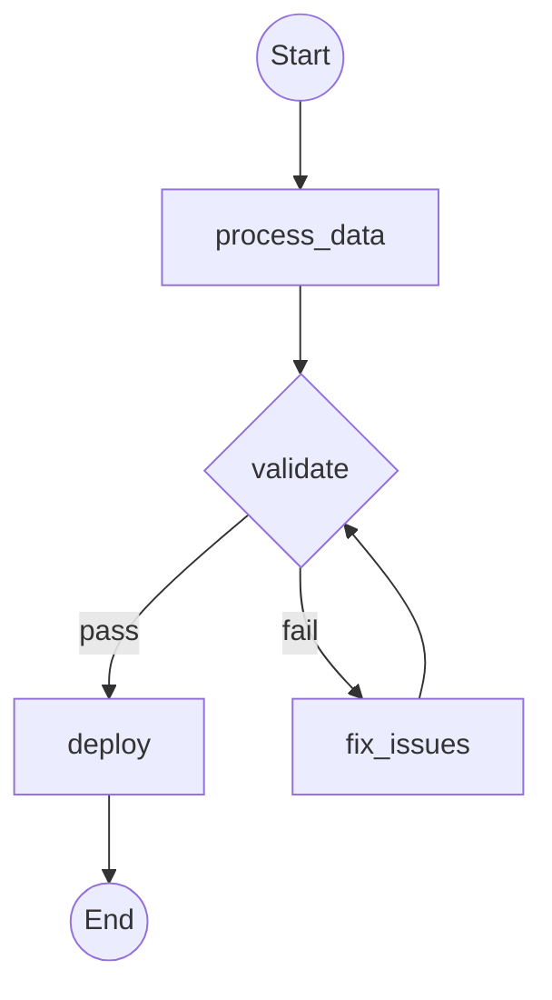

# Research: Workflow Serialization & Visualization

**Feature Branch**: `024-workflow-serialization-viz`
**Date**: 2025-12-20

## Overview

This document consolidates research findings for implementing YAML/JSON workflow serialization, string-based expressions, component registries, and visualization (Mermaid/ASCII) for the Maverick workflow DSL.

---

## 1. YAML Workflow Schema Design

### Decision: Use GitHub Actions-style schema with explicit `type` field discrimination

### Rationale

After analyzing GitHub Actions, GitLab CI, and Argo Workflows patterns:

- **GitHub Actions**: Uses `uses:` vs `run:` to discriminate step types implicitly
- **GitLab CI**: Uses job-level keywords like `script`, `trigger`, `needs`
- **Argo Workflows**: Uses explicit `template` references with a `kind` field for step type

For Maverick, an explicit `type` field is cleaner because:
1. Our 13 step types are too varied for implicit discrimination
2. Explicit types enable better error messages ("unknown step type 'x'")
3. Pydantic's discriminated unions work well with explicit type fields
4. Aligns with existing `StepType` enum in `dsl/types.py`

### Alternatives Considered

| Alternative | Rejected Because |
|-------------|------------------|
| Implicit type detection by key presence | Too many step types; ambiguous when multiple keys present |
| Separate files per step type | Over-engineered; breaks workflow cohesion |
| YAML anchors for reuse | Adds complexity; Python-side composition is cleaner |

### Schema Version Strategy

**Decision**: Use `version: "1.0"` with major.minor format

- **Major version change**: Breaking schema changes (removing fields, changing types)
- **Minor version change**: Additive changes (new optional fields, new step types)
- Parser accepts workflows matching same major version; logs warning for unknown minor features
- Follows semantic versioning principles per spec clarifications

---

## 2. Expression System Design

### Decision: Use `${{ expr }}` syntax with limited operator set

### Rationale

The `${{ }}` syntax is widely adopted (GitHub Actions) and provides:
1. Clear delimiter that doesn't conflict with YAML syntax
2. Familiar to developers
3. Simple to parse with regex for extraction
4. Matches spec FR-011 requirements

### Supported Expressions

| Expression Type | Syntax | Example |
|-----------------|--------|---------|
| Input reference | `${{ inputs.<name> }}` | `${{ inputs.target_branch }}` |
| Step output reference | `${{ steps.<name>.output }}` | `${{ steps.review.output }}` |
| Nested field access | `${{ steps.<name>.output.<field> }}` | `${{ steps.review.output.findings[0] }}` |
| Boolean negation | `${{ not inputs.<name> }}` | `${{ not inputs.dry_run }}` |
| Config reference | `${{ config.<key> }}` | `${{ config.max_retries }}` |

### Parser Design

**Decision**: Implement a simple recursive descent parser, not a full expression language

1. **Tokenize**: Split expression into tokens (identifiers, dots, brackets, operators)
2. **Parse**: Build AST for reference paths
3. **Evaluate**: Traverse AST against `WorkflowContext` at runtime

This is simpler than embedding a full expression language (like Jinja2) and matches the spec's intentional constraint for "predictable behavior and reviewability."

### Missing Value Handling

| Scenario | Behavior |
|----------|----------|
| Missing input (required) | Fail at validation time with clear error |
| Missing input (optional, no default) | Return `None` at runtime |
| Missing step output | Fail at runtime with clear error indicating missing step |
| Missing nested field | Fail at runtime with field path in error message |

### Alternatives Considered

| Alternative | Rejected Because |
|-------------|------------------|
| Jinja2 template engine | Too powerful; exposes full Python execution |
| `{{ }}` (Argo-style) | Conflicts with YAML brace syntax; requires quoting |
| Python f-string style `{x}` | Conflicts with YAML flow mappings |
| CEL (Common Expression Language) | Overkill for reference-only expressions |

---

## 3. Component Registry Design

### Decision: Separate registries per component type with unified facade

### Rationale

Following the existing `AgentRegistry` pattern in `agents/registry.py`:

1. **Separate registries**: `ActionRegistry`, `AgentRegistry` (existing), `GeneratorRegistry`, `ContextBuilderRegistry`
2. **Unified facade**: `ComponentRegistry` that aggregates all registries for workflow parsing
3. **Module-level singletons**: Each registry has a singleton instance for convenience
4. **Decorator-based registration**: `@register_action("name")`, consistent with `@register("agent_name")`

### Registry Interface

```python
class Registry(Protocol[T]):
    def register(self, name: str, component: T | None = None) -> ...: ...
    def get(self, name: str) -> T: ...
    def list_names(self) -> list[str]: ...
    def has(self, name: str) -> bool: ...
```

### Lenient Mode

Per spec FR-016a, support deferred resolution errors:

```python
class ComponentRegistry:
    def __init__(self, strict: bool = True):
        self._strict = strict
        self._deferred_errors: list[str] = []

    def resolve(self, ref_type: str, name: str) -> Component | DeferredRef:
        if self._strict:
            # Raise immediately if not found
        else:
            # Return DeferredRef placeholder; collect error
```

Lenient mode is useful for:
- Development: Edit workflow files without all components registered
- Testing: Validate schema structure before full integration
- Tooling: IDE features that parse without execution context

### Alternatives Considered

| Alternative | Rejected Because |
|-------------|------------------|
| Single unified registry | Loses type safety; harder to query "all agents" |
| Auto-discovery via entry points | Too magical; prefer explicit registration |
| Class-based registration only | Need to register functions for actions |

---

## 4. Visualization Design

### Decision: Separate Mermaid and ASCII generators with shared graph traversal

### Mermaid Diagram Format

Use Mermaid flowchart syntax (`flowchart TD` for top-down):



**Node styles by step type**:
- Regular steps: `[name]` (rectangle)
- Conditional steps: `{name}` (diamond) with condition annotation
- Parallel steps: `[[name]]` (rounded) containing subgraph
- Validate steps: `{name}` with retry loop edge

**Edge annotations**:
- Conditional edges: `-->|condition|` for when clauses
- Retry loops: dashed line back to validate step

### ASCII Diagram Format

For terminal display, use box-drawing characters:

```
┌─────────────────────────────────────┐
│ Workflow: my-workflow               │
├─────────────────────────────────────┤
│ 1. [python] process_data            │
│       ↓                             │
│ 2. [validate] check_format          │
│    ├─ on fail → 2a. fix_format      │
│    │            └─ retry → 2.       │
│    └─ on pass ↓                     │
│ 3. [agent] code_review              │
│    └─ when: inputs.review_enabled   │
│       ↓                             │
│ 4. [python] deploy                  │
└─────────────────────────────────────┘
```

### Graph Traversal

Both generators share:
1. **Node collection**: Traverse step list, unwrap wrappers (ConditionalStep → inner)
2. **Edge collection**: Compute sequential edges, add retry/fix loops, add conditional skips
3. **Rendering**: Format-specific output generation

### Parallel and Branch Visualization

**Parallel steps**: Show as subgraph with parallel lanes
```mermaid
subgraph parallel_reviews
    step2a[lint_review]
    step2b[test_review]
end
```

**Branch steps**: Show as diamond with multiple outgoing edges
```mermaid
route{branch: route}
route -->|type=a| handle_a
route -->|type=b| handle_b
route -->|default| handle_default
```

### Alternatives Considered

| Alternative | Rejected Because |
|-------------|------------------|
| Graphviz DOT format | Requires external tool; Mermaid renders in Markdown |
| PlantUML | Less widely supported in Markdown renderers |
| SVG generation | Over-engineered; Mermaid handles rendering |

---

## 5. CLI Command Design

### Decision: Add `workflow` command group to existing CLI

Following the existing Click pattern in `main.py`:

```python
@cli.group()
def workflow():
    """Manage workflow definitions."""
    pass

@workflow.command("list")
def workflow_list():
    """List registered workflows."""

@workflow.command("show")
@click.argument("name")
def workflow_show(name: str):
    """Show workflow details."""

@workflow.command("validate")
@click.argument("file", type=click.Path(exists=True))
def workflow_validate(file: str):
    """Validate a workflow YAML file."""

@workflow.command("viz")
@click.argument("name_or_file")
@click.option("--format", type=click.Choice(["mermaid", "ascii"]), default="ascii")
def workflow_viz(name_or_file: str, format: str):
    """Visualize a workflow."""

@workflow.command("run")
@click.argument("name_or_file")
@click.option("--input", "-i", multiple=True, help="KEY=VALUE input pairs")
def workflow_run(name_or_file: str, input: tuple[str, ...]):
    """Run a workflow with inputs."""
```

---

## 6. Implementation Priorities

Based on spec user story priorities:

| Priority | Component | Rationale |
|----------|-----------|-----------|
| P1 | Schema + Parser + Writer | Core serialization for file-based workflows |
| P1 | Expression parser | Required for meaningful workflow files |
| P1 | Component registries | Required to resolve references in parsed workflows |
| P2 | Mermaid generator | Primary visualization format |
| P2 | ASCII generator | Terminal-friendly visualization |
| P3 | CLI commands | User-facing interface for workflow management |

---

## 7. Integration with Existing DSL

The new serialization layer integrates with existing DSL:

```
                    ┌─────────────────────┐
                    │   Workflow YAML     │
                    └─────────────────────┘
                             │
                             ▼
                    ┌─────────────────────┐
                    │   Parser (new)      │
                    │   - schema.py       │
                    │   - parser.py       │
                    └─────────────────────┘
                             │
          ┌──────────────────┼──────────────────┐
          ▼                  ▼                  ▼
   ┌─────────────┐    ┌─────────────┐    ┌─────────────┐
   │ Registries  │    │ Expressions │    │ Workflow-   │
   │ (resolve)   │    │ (parse)     │    │ Definition  │
   └─────────────┘    └─────────────┘    │ (existing)  │
          │                  │            └─────────────┘
          └──────────────────┼──────────────────┘
                             ▼
                    ┌─────────────────────┐
                    │ StepDefinition      │
                    │ (existing)          │
                    └─────────────────────┘
                             │
                             ▼
                    ┌─────────────────────┐
                    │ WorkflowEngine      │
                    │ (existing)          │
                    └─────────────────────┘
```

**Key integration points**:
- Parser produces `WorkflowDefinition` and `StepDefinition` objects
- Expressions are stored as strings; evaluated by `ExpressionEvaluator` during engine execution
- Registries are injected into parser; can use existing `AgentRegistry`
- Writer serializes from existing `to_dict()` methods with schema wrapper

---

## 8. File Format Example

Complete workflow file example:

```yaml
version: "1.0"
name: feature-implementation
description: Implement a feature from tasks.md

inputs:
  spec_dir:
    type: string
    required: true
    description: Path to spec directory
  dry_run:
    type: boolean
    default: false
    description: Skip actual commits

steps:
  - name: load_tasks
    type: python
    action: maverick.actions.load_tasks
    args:
      - ${{ inputs.spec_dir }}

  - name: implement
    type: agent
    agent: implementer
    context:
      tasks: ${{ steps.load_tasks.output }}
    when: ${{ not inputs.dry_run }}

  - name: validate
    type: validate
    stages:
      - format
      - lint
      - test
    retry: 3
    on_failure:
      type: agent
      agent: fixer
      context:
        errors: ${{ steps.validate.output.errors }}

  - name: review
    type: parallel
    steps:
      - name: architecture_review
        type: agent
        agent: architecture_reviewer
        context:
          changes: ${{ steps.implement.output.changes }}
      - name: lint_review
        type: python
        action: maverick.actions.run_linter
```

---

## Summary of Decisions

| Topic | Decision |
|-------|----------|
| Schema versioning | `version: "1.0"` with semver major.minor |
| Step type discrimination | Explicit `type` field |
| Expression syntax | `${{ }}` with dot notation |
| Expression operators | Reference + `not` only |
| Registry architecture | Separate registries + unified facade |
| Lenient mode | Deferred resolution with `strict=False` |
| Mermaid format | `flowchart TD` with styled nodes |
| ASCII format | Box-drawing characters with indentation |
| CLI structure | `workflow` command group |
